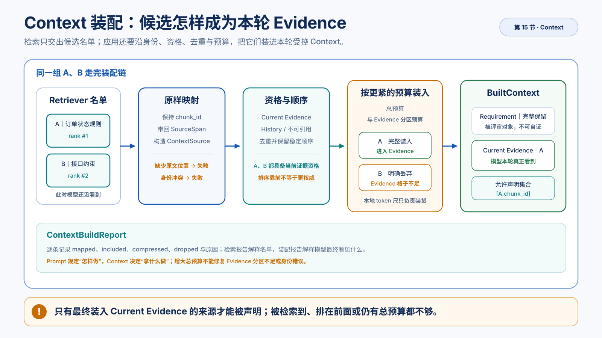

# 检索名单怎样变成模型本轮 Context

> 这是一篇机制篇。模型输入输出契约已经区分 Prompt、Context 和 Schema；固定 Retriever 也已经交出最终名单。本文只回答：同一批候选怎样变成模型这一轮真正看到的 Context。
>
> 学完后，你应该能沿同一组 A、B 讲清谁被原样带入、谁因格子不够被丢掉，以及丢掉的那条为什么不能再被声明为来源。本文不调用生成模型，也不判断某条结论是否真的获得证据支持。完整命令和对照见[配套实验](015.context-engineering.lab.md)。



*图：候选经过身份映射、证据资格、稳定排序和分区预算，只有最终装入 Evidence 的来源进入允许声明集合。*

## 名单有了，模型还不一定看得到

继续使用同一份资料和同一个问题：

```text
资料：order_rules.md
问题：申请售后
```

当前 Chunk 策略仍得到两个真实候选：

| Chunk | 真实业务内容 |
| --- | --- |
| A：当前订单状态规则 | 仅已支付且已完成的订单可申请售后；虚拟商品不进入售后流程 |
| B：接口与客户端约束 | 售后接口 v2 必须提供 `source_channel`；Flutter 客户端使用相同入口可见性规则 |

在干净课程数据库里，两路检索都会成功，A、B 都进入最终名单。这只证明 Retriever 把它们交给了下游，还不证明模型一定能看到两条。

Context 不是一整袋混在一起的文字。装入时要先分格，因为不同材料的职责不同：

- **Requirement** 是本轮被评审的对象。这里就是问题「申请售后」。它告诉模型要评什么，但不能拿来证明自己正确。
- **Evidence** 是本轮允许模型当作外部依据的材料。对需求评审助手来说，就是知识库里那些已经检索到、并且被标成「当前证据」的规则，例如 A 的订单状态条件和 B 的 `source_channel`。后文说 Evidence 格子或 Evidence 预算，指的都是给这些外部依据预留了多少输入空间。它不是「结论已经被证明」，只是 Context 里专门放依据的那一格。

假设 Evidence 格子只能装下 A：

```text
最终名单 = [A, B]
→ A 装入
→ B 因格子不够被丢掉
→ 模型这轮只看到 A
→ 允许声明的来源也只剩 A
```

此时如果后续模型没有谈到 `source_channel`，不能回到数据库盲调 Embedding。B 已经被检索到，只是在装入 Context 时离开了模型输入。

```text
Retriever 找到什么
≠
模型这一轮看到什么
```

## 为什么不能把名单全文直接拼进 Prompt

如果应用把最终名单直接拼进 Prompt，看起来少一步，却会丢掉装入必须回答的问题：

- 这条材料还是原来的 Chunk，还是被临时改成了 `SOURCE-1`？
- 用户能不能回到 `order_rules.md` 的原文位置核对？
- 被评审的需求和外部依据是否挤在同一段文字里？
- 名单太长时，谁被静默截断，谁应该明确丢掉？
- 后面如何解释「模型为什么没引用 B」？

所以需要一次显式装入：保留身份和原文位置，按格子装，并记下谁进谁出。简单拼接省掉的不是步骤，而是诊断。

## 沿着 A、B 走完一次装入

本节只走这一条链。先用自然语言看完去向，再对上实现名字。

```text
检索名单
  → 原样映射
  → 过滤、去重、排序
  → 按总预算、分区预算、单条上限装入
  → 模型本轮 Context
       └── 允许声明的来源 ID
```

### 第一步：原样带入，不换号、不丢位置

名单上的 Chunk 进入装入单元时，继续使用原来的 `chunk_id`，并带上能指回原文的位置。适配层只转换契约，不重新检索，也不重做预算。

同一条内容从入库到后面被声明，必须一直是同一个身份：

```text
数据库 Chunk
↔ 词面 / 向量候选
↔ RRF 融合结果
↔ 检索名单
↔ 装入单元
↔ 允许声明的来源
```

对当前资料，A 仍指向「当前订单状态规则」，B 仍指向「接口与客户端约束」，并且都能回到 `order_rules.md` 的对应标题和行。它们只是换了一张「可以装进 Context」的工牌。若临时改成 `SOURCE-1`、`SOURCE-2`，下次运行编号会漂，检索日志、装入报告和后面的来源声明就对不上。

### 第二步：先看这批材料允许当什么

不是名单里的每条材料都能进 Evidence 格，更不是看见了就能被声明为来源：

| 材料资格 | 装进哪一格 | 装进去后能否被声明为来源 |
| --- | --- | --- |
| 当前证据 | Evidence | 可以 |
| 历史材料 | History | 不可以 |
| 不可用材料 | 明确排除 | 不可以 |

本节真实主路径的 A、B 都是当前证据：订单状态条件和 `source_channel` 都来自知识库，不是被评审的需求本身，因此都走向 Evidence 格。历史材料和不可用材料只用于确定性契约测试，不是 `order_rules.md` 里的新业务事实。

Requirement 始终单独一格，这里仍是「申请售后」。于是「模型看得到」和「模型允许声明为来源」从一开始就是两层判断。

### 第三步：去重并排好装入顺序

映射成功的材料先进入候选池，还不是最终输入：

```text
装入单元
  → 去掉当前策略不允许的类型
  → 相同身份只留一份
  → 正文相同的只留一份
  → 按类型权重、优先级、分数和身份稳定排序
```

被排除的来源会留下原因，实验里常见这三项：

- `source_type_excluded`：这一格不接收该类型；
- `duplicate_source_id`：同一个身份出现了两次；
- `duplicate_content`：身份不同，但正文相同。

相同身份表示重复输入或冲突；不同身份但文本相同表示内容重复。内容去重能省格子，却不能替代文档版本治理：两份文字暂时相同，不代表有效期和来源责任相同。

对当前这份资料，A、B 身份和内容都不同，排序后仍会按融合顺序进入 Evidence 格。干净基线不应靠内容去重让其中一条消失。若真实运行冒出旧的 `chunk_id`，先处理数据准备差异，再研究装入策略。

### 第四步：按更紧的那把尺子装

一次选择同时受三把尺子限制：

```text
可用空间 = min(总剩余预算, 当前格子剩余预算, 单条上限)
```

当前固定 RAG 主路径只用 Requirement 和 Evidence 两格。History 等格子可以空着，但分区规则仍然重要：低优先级材料不能因为总预算有空，就挤占 Evidence 这一格的责任边界。

下面是机制推演，不是新的业务资料，也不是 Provider 计费结果。假设本地格式化后：

```text
Requirement「申请售后」   约 3 tokens
A                        约 302 tokens
B                        约 293 tokens
总预算                    2200
Evidence 格子             350
```

按融合顺序处理：

1. Requirement 完整进入；
2. A 需要约 302，没有超过 Evidence 的 350，因此装入；
3. Evidence 只剩约 48，B 需要约 293；
4. 当前策略不允许压缩，因此 B 被明确丢掉，原因是格子不够。

总预算还剩一大截，B 照样走。真正卡它的是 Evidence 格子，不是 Retriever 漏召回，也不是总窗口耗尽。真实 token 数以实验当前 tokenizer 和格式化结果为准；这里的数字只用于把控制顺序说清楚。

格子不够且策略允许压缩时，当前实现做确定性抽取，不另调一个模型改写：

```text
从 Requirement 提取关键词
→ 按行和句子切开 Source
→ 按与关键词的重合排序
→ 在剩余格子里挑选原文片段
→ 按原文顺序拼回
```

身份和 metadata 会留下，但业务条件不一定还在。若一个较长的接口 Chunk 同时写了 `source_channel`、入口规则和否定条件，抽取可能只留下与「申请售后」词面更近的句子。当前两个真实 Chunk 很短，主路径看不到这一步；压缩契约由受控测试验证，不靠伪造长文制造一次「压缩成功」。

### 第五步：只有装进去的当前证据，才能被声明为来源

装入结束后，从最终留在 Evidence 格里的当前证据产生允许声明的来源：

```text
当前证据
  ├── 完整装入     → 可以声明
  ├── 压缩后装入   → 可以声明，但必须再看格子里还剩什么
  └── 被丢掉       → 不能声明

历史材料 / 不可用材料
  └── 即使模型看见，也不能当本轮来源
```

它只承诺两件事：这条依据确实在本轮 Context 里，以及后续模型可以声明它的身份。它不承诺模型一定会引用，也不承诺内容已经支持某条结论。

在「Evidence 格子 = 350」这条推演里，A 进入允许声明的来源，B 不会。后续可信生成只会先检查模型写出的编号是否属于这个集合。

走到这里，实现里的名字才需要对上，方便阅读代码和后续可信生成：

| 人话 | 实现名 |
| --- | --- |
| 检索名单上的 Chunk | Retrieval Candidate |
| 原样带入后的装入单元 | `ContextSource` |
| 模型本轮真正看到的材料 | `BuiltContext` |
| 允许声明的来源 | Citation Candidate |
| 检索过程为什么剩下这些 | `RetrievalReport` |
| 装入过程为什么留下这些 | `ContextBuildReport` |

`ContextSource` 还是原来那条 Chunk，不是第二种检索结果。`BuiltContext` 里通常有：完整 Requirement、最终 Evidence 文本、其他已允许但当前为空的分区、谁被装入或丢掉，以及装入报告。里面有没有某条规则，不能用「知识库里有」或「名单里有」代替。

## 装的时候有两条不能破的规矩

**身份不能重编。** 从数据库 Chunk 到允许声明的来源，同一条内容必须继续使用同一个 `chunk_id`。额外材料也不能占用某个检索 Chunk 的身份；发生冲突时必须明确失败，不能让后加入的文字静默覆盖真实候选。

**没有原文位置就不能装成可追踪依据。** 身份只回答「是哪条」，位置才回答「在 `order_rules.md` 的哪一段」。候选有 `chunk_id` 但没有原文跨度时，映射失败，不构造「位置未知」的 Evidence。否则后面即使声明了来源编号，用户也无法回到原文核对。

检索过程仍看检索报告；装入决定另记一份报告。二者相邻，不要合成一个含义模糊的调试字段。

## 容易混的几件事

**Prompt 和 Context 不是一层。** Prompt 规定模型怎样使用材料，例如「只能声明本轮允许的来源」。Context 决定模型拿到了哪些材料。Prompt 写得再严，也补不回已经丢掉的 B。

```text
Prompt：怎样做
Context：拿什么做
```

**RRF 只决定先装谁。** 词面排序、向量距离和融合名次回答「为什么排在这里」；证据资格回答「允许怎样使用」。排序靠前不等于事实更权威，也不等于内容已经支持某条结论。

**本地 token 数是装货尺，不是账单。** 实现优先用适配的 tokenizer，不可用时按约定回退。它控制谁被装入，不是 Provider 对最终 messages 的计费结果。Requirement 超过自己的格子时会告警，但当前不会被静默截断。

**装入估算也不是 Provider 硬窗口。** 真实请求还会加入 system message、任务说明和 Schema。要提供硬窗口保证，必须在最终 messages 形成后再按目标 Provider 计数；本节没有伪装完成这层保证。

B 第一次在哪消失，就改哪一层：

| B 第一次消失的位置 | 该查什么 | 不该做什么 |
| --- | --- | --- |
| 检索名单里没有 | 过滤、每路候选、阈值、RRF、最终截断 | 去加 Evidence 预算 |
| 映射失败 | 身份是否被改号、有没有原文位置、资格是不是不可用 | 用更大的格子修复身份错误 |
| 装入时被丢掉 | Evidence 剩余空间、前序来源、是否允许压缩 | 重训 Embedding |
| 已经装入，文本里也有 `source_channel` | Prompt、真实模型和后续生成评估 | 继续盲调检索或预算 |

本文只走到装入这一层。

## 正常边界与失败边界

| 现象 | 应怎样解释 |
| --- | --- |
| A、B 都装入 | 两条当前证据都对模型可见 |
| B 因 Evidence 格子被丢掉 | 检索成功，装入做了明确取舍 |
| Evidence 格子为 0 | 本轮不允许放入外部依据，不是知识库没答案 |
| 来源被压缩 | 身份还在，但必须检查关键条件是否仍在 |
| 候选缺少原文位置 | 契约失败，明确停止，不伪造位置 |
| 额外来源与 Chunk 身份冲突 | 契约失败，明确停止，不静默覆盖 |
| PostgreSQL 或 Embedding 失败 | 还没有可信名单，谈不上装入 |
| Retriever 部分失败 | 可以保留诊断，但不能当作完整成功基线 |
| 出现非当前资料的旧身份 | 先处理数据，不要当成去重策略生效 |

## 在需求评审助手中的位置

本节没有引入 Agent 框架。RAG 适配器负责把检索名单映射成可追踪的装入单元；通用 Context Builder 负责过滤、去重、排序、分格、预算、压缩和报告。当前 Builder 是本地确定性实现，适合把「谁被留下、谁被丢掉」完整暴露出来。

成熟框架可以提供压缩器、Prompt 模板或 token 计数器，但不能替应用决定：哪些材料是当前证据、历史能否引用、原文位置如何贯穿、格子怎么分，以及 Evidence 为空时产品应该怎样处理。

需求评审助手负责提供领域材料、证据资格和格子大小；通用能力不写死某一个售后问题，也不再维护第二套 Retriever。

本节交给可信生成的是：

```text
模型本轮 Context
+ 装入报告
+ 允许声明的来源 ID
```

下一步可以确认模型真实输入，并检查它是否声明了未知编号。编号合法仍不等于内容支持结论。

## 学完后的自检

沿同一个「申请售后」追踪 A、B：

- 最终名单里有没有它们？
- 映射后是否仍是原来的身份，并且能回到原文位置？
- 谁被装入，谁因 Evidence 格子被丢掉？
- 最终 Context 里还有没有 `source_channel`？
- 允许声明的来源里还有没有 B？

能够完成这条追踪，才算理解模型这一轮拿到了什么。
