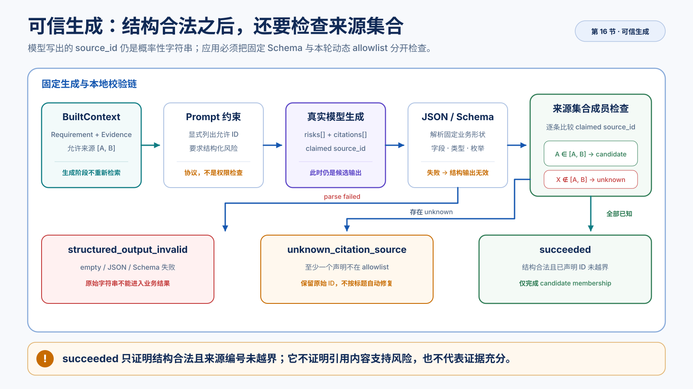

# 模型写了来源编号，为什么还不能直接相信

> Context 装入已经交出模型本轮真正看到的 `BuiltContext`、装入报告和允许声明的来源 ID。现在的问题是：应用怎样调用真实模型生成结构化风险，并确认模型写出的 `source_id` 没有越过本轮允许集合？
>
> 本文交付一条固定生成链：`BuiltContext → Prompt → Structured Output → 本地解析 → 来源声明集合检查 → 生成结果与报告`。学完后应能解释 `succeeded` 为什么只表示“结构合法且已声明 ID 未越界”。本文不判断来源内容是否支持风险，不决定证据是否充分、是否 Refusal 或追问，也不展开流式增量、SSE 和界面状态。操作、真实对照和修改任务见[配套实验](016.trusted-generation.lab.md)。



*图：模型输出先通过 JSON 与 Schema 解析，再逐条检查来源编号是否属于本轮允许集合，并保留三类明确结果。*

## 一个看起来已经成功的结果

继续使用“订单详情页新增申请售后入口”的 Requirement。模型返回：

```json
{
  "risks": [
    {
      "title": "售后接口缺少来源渠道",
      "category": "api",
      "level": "high",
      "rationale": "新入口需要传递 source_channel。",
      "citations": [
        {"source_id": "API-AFTER-SALE-V2"}
      ]
    }
  ]
}
```

它很像可以直接交给界面的成功结果：JSON 能解析，字段齐全，风险也符合直觉，还写了一个像文档名的编号。

但本轮 Context 允许声明的其实是两个真实 Chunk 身份：

```text
A.chunk_id：当前订单状态规则
B.chunk_id：接口与客户端约束
```

`API-AFTER-SALE-V2` 不是 `B.chunk_id`。即使它像标题、接口名或人工简称，应用也不能把它当成本轮来源。

这里至少有三个不同问题：

```text
字段和枚举是否符合业务 Schema？
        ↓
模型声明的 source_id 是否属于本轮允许集合？
        ↓
这个来源的内容是否真的支持当前风险？
```

本文只完成前两个判断。第三个判断必须读取来源内容，并把具体风险和证据片段建立支持关系。它将接收本文的结果继续处理，不能因为模型写了一个合法 ID 就假装已经完成。

因此本节的“可信”不是“模型结论已被证明为真”，而是生成输入、输出形状和来源声明开始受到应用约束，并留下可诊断结果。

## 为什么“有 JSON、有编号”仍然不够

一个简单方案是：让模型输出 JSON，解析成功后直接把 `citations[].source_id` 做成链接。它省掉了一次本地检查，却把一个概率性字符串误当成系统事实。

模型生成 `source_id` 和生成标题、理由没有本质区别。它可能：

- 按自己的习惯缩写一个真实 ID；
- 抄写 Evidence 标题而不是稳定身份；
- 混入另一轮对话见过的编号；
- 在空 Evidence 时编造一个看似合理的来源；
- 输出完全不存在的字符串。

Structured Output 可以把字段限制为字符串，却不能仅凭一个固定 Schema 知道“本轮允许哪几个字符串”。允许集合来自这一次 Context 装入，下一次运行可能不同。

所以必须把两类事实分开：

```text
固定业务形状
→ risk 有哪些字段，level 和 category 有哪些枚举

本轮动态资格
→ 哪些 source_id 真的进入了本轮 Evidence 并允许声明
```

前者由 Schema 表达，后者由 Context 装入报告和生成后的集合检查表达。

## 沿同一份售后 Context 走完生成链

Context 装入已经完成：

```text
Requirement
订单详情页新增申请售后入口的 PRD 片段

Evidence
A：订单状态规则
B：接口与客户端约束

允许声明的来源
[A.chunk_id, B.chunk_id]
```

生成阶段不重新检索，也不重新决定预算。它按固定顺序推进：

```text
BuiltContext
  + ContextBuildReport
  + citation candidate IDs
        ↓
Prompt 显式列出本轮允许 ID
        ↓
真实模型生成结构化响应
        ↓
本地 JSON / Schema 解析
        ↓
逐条检查 claimed source_id 是否属于允许集合
        ↓
TrustedGenerationResult
  + TrustedGenerationReport
```

这仍然是固定 Pipeline。应用预先决定检索、装入、生成和检查顺序；模型没有决定是否调用 Retriever，也没有 Tool、Agent Loop 或动态补检索。

这条链有三道约束。它们不是重复检查，而是分别处理“模型应该怎样做”“输出是不是业务对象”和“本轮声明有没有越界”。

## 第一道约束：Prompt 明确告诉模型允许声明什么

Evidence block 中已经带有来源身份，但只让模型自己从长文本里寻找 ID 不够明确。生成 Prompt 会增加一段：

```text
## Allowed Citation Source IDs
- A.chunk_id
- B.chunk_id
```

如果 Context 中没有可引用 Evidence，则是：

```text
## Allowed Citation Source IDs
（无）
```

Prompt 同时规定：

- 只有依据 Current Evidence 的结论才添加 citation；
- `source_id` 必须逐字选自允许集合；
- Requirement 是被评审对象，不能引用自己证明自己；
- History 只能提醒检查方向，不能证明当前规则；
- 允许集合为空时，所有 citations 必须为空；
- 不确定时减少结论，不生成未知 ID。

这道约束让模型知道应该怎样做，也让实际 messages 可以被回查。但 Prompt 仍是发给概率模型的任务协议，不是权限检查。模型可能遵循，也可能忽略、缩写或改写。

因此：

```text
Prompt 约束
≠
应用已经确认模型遵守
```

### Requirement 风险为什么可以没有 citation

假设 Requirement 自己写着：

```text
失败时需要区分网络错误、业务拒绝和接口不可用。
```

却没有说明三种失败怎样映射到 UI。模型可以指出：

```text
需求没有定义不同失败类型的交互反馈。
```

这条风险来自对 Requirement 自身完整性的评审，不需要伪造外部证据。Requirement 仍不能成为 citation，因为它是待检查对象。

但如果模型声称“现行售后接口要求 `source_channel`”，它是在陈述外部规则，应当声明 B 的稳定身份。

所以“没有 citation”不自动等于错误。本节只记录无 citation 风险数量，还没有语义判断每条风险是否本应依赖外部证据。

## 第二道约束：Schema 只守住固定形状

真实模型输出要进入 `ReviewRiskList`：

```text
ReviewRiskList
└── risks[]
    ├── title: string
    ├── category: interaction | state_flow | api | ...
    ├── level: high | medium | low
    ├── rationale: string
    └── citations[]
        ├── source_id: string
        └── excerpt?: string
```

Provider 支持时，应用可以请求严格 JSON Schema；只支持 JSON object 时，也要在本地继续校验字段、类型和枚举。无论模型侧模式是什么，本地都要经过：

```text
模型返回文本
  ↓
JSON 解析
  ↓
ReviewRiskList 校验
  ↓
ReviewRisk[] 或明确的 parse failure
```

失败阶段必须保留：

| 阶段 | 含义 |
| --- | --- |
| `empty` | Provider 返回的内容为空 |
| `json` | 内容不是支持的 JSON 根结构或 JSON 语法错误 |
| `schema` | JSON 可解析，但字段、类型或枚举不符合业务 Schema |

解析失败时，原始字符串不能继续作为正式评审结果。应用返回空的结构化 risks，并把状态标为 `structured_output_invalid`。

### 为什么不把本轮 ID 直接写成 Schema 枚举

理论上可以为每次调用动态生成 `source_id` 枚举 Schema，但当前实现没有把动态 Evidence 资格混入稳定业务 Schema。它采用两步：

```text
Schema
→ source_id 是不是合法字符串

membership check
→ 这个字符串是不是本轮允许的 ID
```

这种分层让 Review Schema 在不同 Context 间保持稳定，同时把动态集合及其报告放在生成边界。即使未来采用动态枚举，应用仍要保留本轮允许集合、原始声明和最终检查事实，不能只依赖模型侧约束。

## 第三道约束：应用逐条检查来源声明

结构解析成功后，模型输出中的来源编号才第一次成为一个需要检查的对象。可以把它叫作 **Claimed Citation**：模型声称某个来源支持当前风险，但应用还没有接受这个声明。

应用遍历每条 risk 的每个 citation，比较：

```text
claimed source_id ∈ citation candidate IDs ?
```

每次检查保留：

- risk 的位置和标题；
- citation 在该风险中的位置；
- 模型原始 `source_id`；
- `candidate` 或 `unknown_source` 状态。

例如：

```text
risk 1, citation 1
API-AFTER-SALE-V2 → unknown_source
```

`candidate` 的准确含义只有一句：

> 这个原始 ID 属于本轮 Context 允许声明的来源集合。

它不表示 excerpt 存在，不表示来源内容支持当前风险，也不表示证据充分。

### 为什么不能按标题自动修复未知 ID

如果模型写出 `API-AFTER-SALE-V2`，而真实候选是 `B.chunk_id`，应用不能搜索标题或相似文本并自动替换。那会把模型的无效声明篡改成看似合法的 Citation，原始失败也从报告中消失。

正确处理是：

```text
保留 API-AFTER-SALE-V2
→ 标记 unknown_source
→ 本次生成不能成为业务成功结果
→ 回查 Prompt、Context 和模型行为
```

稳定身份的价值就在这里：资料、检索候选、Context Source 和来源声明必须使用同一个 `chunk_id`，不能在生成末端靠人类可读简称重新猜一次身份。

## 三种生成状态怎样得到

来源检查只在结构解析成功后发生：

```text
parse ok?
├── no  → structured_output_invalid
└── yes
    ├── 存在 unknown source → unknown_citation_source
    └── 不存在 unknown      → succeeded
```

| `GenerationStatus` | 当前确定知道什么 | 不能推出什么 |
| --- | --- | --- |
| `structured_output_invalid` | 模型响应没有通过 JSON / Schema 解析 | Retriever、Context 或业务资料一定错误 |
| `unknown_citation_source` | 结构合法，但至少一个声明不在 allowlist | 合法声明的内容已经得到支持 |
| `succeeded` | 结构合法，所有已声明 ID 都属于本轮候选 | 所有需要证据的风险都有 citation，或 Citation 已验证 |

`TrustedGenerationReport` 同时保存 Prompt、模型配置、Structured Mode、allowlist、Evidence 状态、解析阶段、风险数量、无 citation 数量和每个声明的检查。

报告还固定声明边界：

```text
candidate_membership_only_not_support_validation
```

它防止调用方把 `candidate_claim_count=2` 改写成“两条引用正确”。本文交给后续能力的是模型风险、原始声明和成员检查报告；只有内容支持关系确认后，才能形成经过支持性校验的 Citation。

## 三个必须保留的边界反例

### 没有 citation 仍可能 `succeeded`

集合检查只检查已经声明的 citation。如果模型输出两条风险，但 citations 都为空：

```text
claimed_citation_count = 0
unknown_source_count = 0
```

结构合法时，当前状态仍可能是 `succeeded`。

这只表示没有未知来源声明，不表示应用已经证明这些风险都不需要外部证据。判断“某条外部事实是否遗漏 citation”需要理解风险内容和证据需求，超出了集合成员检查。

### 空 allowlist 不自动等于 Refusal

当 Context 没有可引用 Evidence 时：

```text
evidence_state = no_citation_candidates
allowlist = []
```

上游可能是 Retriever 没有候选，也可能是候选在 Context 装入时全部被丢掉，还可能只有不可引用的 History。生成层不会重新猜测原因，只把空集合明确交给 Prompt。

空集合下：

- 模型仍可以指出 Requirement 自身明确缺失；
- 任何 claimed source ID 都会成为 `unknown_source`；
- 一条无 citation 的外部事实可能暂时逃过 membership 检查。

所以：

```text
NO_CITATION_CANDIDATES
≠ 自动 Refusal
≠ 没有任何风险可输出
≠ 所有无 citation 结论都合理
```

是否拒绝强结论、提出什么补充问题，需要独立的证据充分性策略。

### 合法 ID 搭配错误内容仍可能 `succeeded`

假设 B 的真实内容是：

```text
售后接口 v2 必须提供 source_channel。
```

模型却输出：

```json
{
  "source_id": "B.chunk_id",
  "excerpt": "售后接口允许省略 source_channel。"
}
```

ID 属于 allowlist，因此 membership 可以通过。但 excerpt 不在原文中，含义也与真实规则相反。

当前机制没有检查：

- excerpt 是否能回到来源原文；
- 证据是否支持、反驳或只与风险主题相关；
- 文档版本和定位是否仍有效；
- 一条风险是否获得足够证据；
- 多条证据之间是否冲突。

这个例子不是集合检查的代码 bug，而是它刻意保留的责任边界。

## 从未知声明反向定位第一次偏离

假设最终状态是 `unknown_citation_source`，模型写了 `API-V2`。不要直接修改 Prompt，也不要从数据库重新调 Embedding。按相反方向回查同一条链：

```text
claim check
→ 本轮 allowlist
→ rendered messages
→ ContextBuildReport
→ RetrievalReport
```

第一步看原始声明和具体位置，确认不是 UI 改写或丢字段。

第二步看 allowlist。若真实候选只有 A、B 的稳定 `chunk_id`，那么把 `API-V2` 判为未知是正确结果。

第三步看最终 messages：候选报告里有 B，但 Allowed Citation Source IDs 没有 B，问题在变量装配或模板渲染；messages 已明确列出 B，但模型仍缩写，问题更接近 Prompt 遵循或模型能力。

第四步才看 Context 装入。原本期待的来源没有进入 allowlist，可能因为它被映射成 History、因 Evidence 预算被丢掉、被去重或不具备当前证据资格。

只有 Context 候选池里从未出现该来源时，才继续回查 Retriever。模型写出的字符串不能反向证明 Retriever 曾经找到它。

## 结果失败和真实依赖失败不是一层

三种 `GenerationStatus` 都以 Provider 已经返回响应为前提。下面这些失败发生得更早：

- Chat key 缺失或鉴权失败；
- 限流、网络超时或 Provider 5xx；
- endpoint 或 model 不存在；
- 配置角色不是 chat；
- Provider 不支持所选 Structured Output 模式。

因此完整异常边界是：

```text
模型调用没有完成
  → LLMError / dependency failure

模型返回内容但不能进入业务对象
  → structured_output_invalid

业务对象合法但来源声明越界
  → unknown_citation_source

结构与已声明 ID 通过当前边界
  → succeeded
```

把鉴权失败转换成 `risks=[]`，会伪装成“模型认为没有风险”；把 parse failure 的原始字符串显示成正式报告，会绕过业务 Schema。真实失败必须继续向调用方暴露。

## 当前实现怎样承载这条机制

本节没有引入 Agent 框架。实现使用成熟 Provider SDK 发出结构化 Chat 请求，使用 Pydantic Schema 完成本地解析，再由 `rag_core` 的确定性代码做动态集合检查。

职责分层是：

| 层次 | 当前责任 | 不替应用决定什么 |
| --- | --- | --- |
| Provider / SDK | 鉴权、请求传输、结构化响应能力、原始响应 | Requirement、Evidence 资格和未知 ID 业务后果 |
| `llm_core` | 模型配置、Prompt 渲染、Structured Output 和错误转换 | 哪些 Chunk 是本轮 Citation Candidate |
| Context Builder | 分区、预算、included/dropped 和允许声明的来源 | 模型是否真的遵循来源要求 |
| `rag_core` 生成边界 | 组合已有对象、逐条检查声明、形成结果与报告 | 内容支持性、充分性和 Refusal 策略 |
| 需求评审助手领域 | Review Schema、Prompt、证据与后续拒答规则 | Provider 的底层协议实现 |

成熟框架或 SDK 可以帮助发送 messages、请求 JSON Schema、解析对象和保留 usage、latency，却不知道 Requirement 为什么不能引用自己、History 为什么不能证明当前规则、未知 ID 是否应让整次结果失败，以及空 Evidence 时产品应回答、拒绝还是追问。

本地实现只补充这些应用契约，不重写 Provider SDK，也不建立第二套 RAG 或 Agent Runtime。

## 固定 RAG 核心链到这里闭环

现在可以沿同一份售后资料画出完整主链：

```text
外部资料
→ 可定位的 DocumentElement
→ 带稳定身份和 Metadata 的 Chunk
→ Lexical / Dense 两路候选
→ RRF 融合
→ 带过程报告的 RetrievalResult
→ 受 Evidence 预算控制的 BuiltContext
→ 真实结构化生成
→ 模型声明是否属于本轮允许集合
```

这条链已经回答：一条业务规则怎样从文件进入可检索单位，怎样成为最终候选，怎样进入模型本轮输入，以及模型写出的来源身份有没有越界。每一步都保留了能向前或向后追踪的身份、状态和报告。

但核心链闭环不等于固定 RAG 产品已经完成，更不等于所有 RAG 能力已经掌握。当前交货仍停在：

```text
结构化风险
+ 模型原始来源声明
+ Citation Candidate membership report
+ 明确的 citation_boundary
```

合法 ID 之后还要判断内容是否支持风险；部分引用正确之后，还要判断证据是否足以形成强结论；产品还要把这些结果、缺口和真实错误通过稳定 API 与界面交付。这些能力继续建立在同一条身份和证据链上，而不是回头重做另一套 Retriever。

向后指引：第 17 节会把本节的生成 Schema 从“声明 `source_id`”扩展为“声明 `source_id` + 逐字引文”，先用确定性匹配挡住编造引文、再判断支持性；产品层随后对 Finding 做的“目标必须属于当前需求版本的条目集合”校验，是本节“来源必须属于本轮允许集合”这一技巧的领域应用，不是新的机制。

## 学完后的自检

选模型输出中的一条 citation，只追踪它：

1. 在 `BuiltContext` 的允许集合中找到真实 `chunk_id`；
2. 在渲染后的 Prompt 中确认它被逐字列出；
3. 在模型原始结构化输出中找到 Claimed Citation；
4. 在逐条检查中确认它是 `candidate` 还是 `unknown_source`；
5. 根据 parse 与 unknown 数量推出 `GenerationStatus`；
6. 最后说清这条声明距离“内容真正支持风险”还缺什么。

如果能够完成这条追踪，并且不会把 `succeeded` 解释成“引用已经验证”或“证据已经充分”，就掌握了固定 RAG 核心链最后一段的机制。
