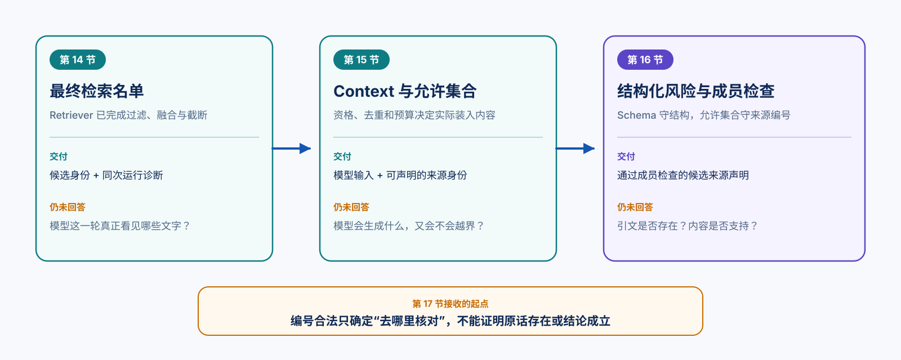
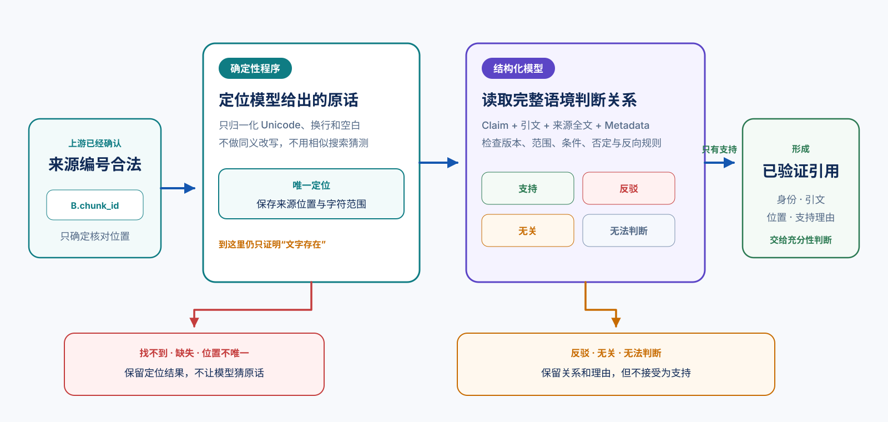
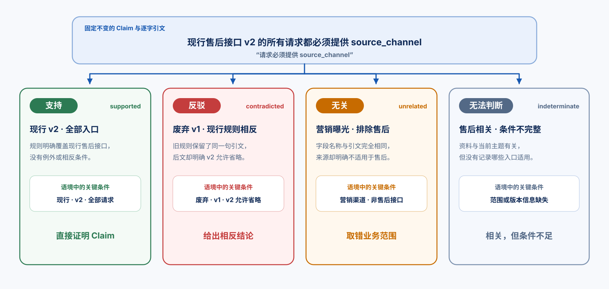
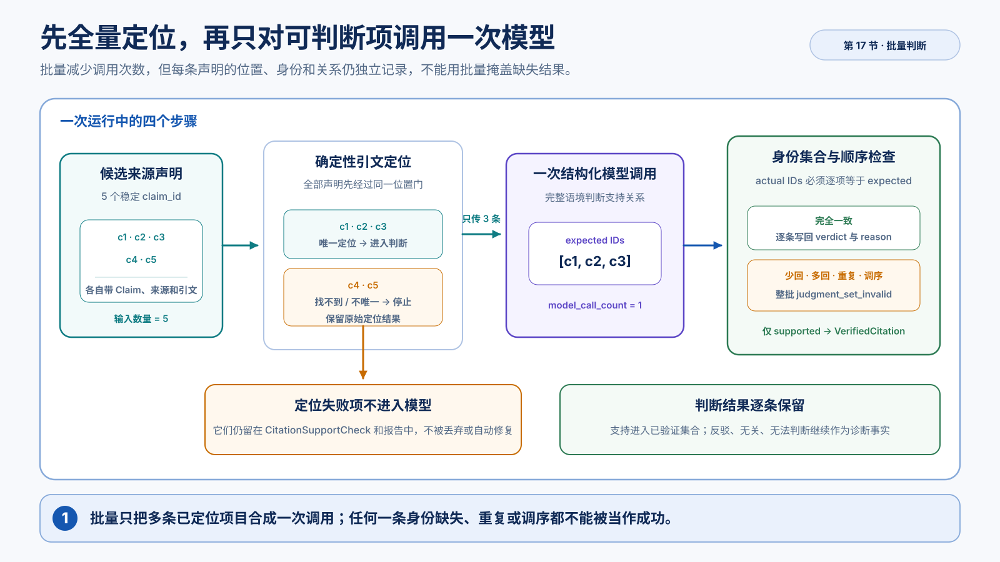

# 引文真的支持这条结论吗

> [来源声明集合检查](016.trusted-generation.mechanism.md)已经让结构化风险中的每个 `source_id` 接受本轮允许集合检查。现在继续追一条已经通过成员检查的来源声明：模型写出的引文真的在对应资料里吗？即使在，它说的是当前规则吗，又是否支持这条具体结论？
>
> 本文交付一条两段校验链：先由确定性程序把逐字引文定位回来源原文，再用一次结构化模型调用判断原文与具体说法的支持关系。学完后应能区分来源编号合法、引文存在、内容支持和证据充分四个不同结论。本文不决定整份回答是否应该 Refusal；完整命令、真实模型观察、排查与修改任务见[配套实验](017.citation-support.lab.md)。

## 前文回顾

本节只追第 16 节已经通过成员检查的来源声明。读下去之前，先把前三节交出来的东西对齐：它们不是同一份“检索结果”换了三个名字，而是每一节都补上前一项交付物还回答不了的问题。



*图：前三项交付沿同一个来源身份逐步收紧范围，但“编号合法”之后仍欠缺引文定位与内容支持。*

### 最终检索名单

前面的检索机制已经分别得到词面候选、向量候选和两路融合榜。融合榜可以解释同一条资料在两路各排第几，却还没有同一次调用的固定控制顺序。

第 14 节把这些零件收成 Retriever 契约：依次执行过滤、每路条数、两路原生阈值、RRF 和最终截断，并留下同一次运行的诊断。

- **输入**：两路召回形成的融合榜。
- **交付**：关完门的最终检索名单，以及“候选第一次消失在哪一层”的报告。
- **还欠缺**：名单怎样变成模型在这一轮真正看见的文字。

这一步确定的是“应用最终选中了哪些候选”，不是“模型已经看见了哪些候选”。名单中的 A、B 仍可能因为证据资格、去重或预算，在装入 Context 时得到不同结果。

### Context 与允许集合

最终名单是给应用的检索结果，还不是已经发给模型的输入。第 15 节按资格、去重和预算把名单装进分格的 Context：

- **Requirement 格**：被评审的需求。用户问题在这里，不能引用自己证明自己。
- **Evidence 格**：本轮允许当作外部依据的材料。有的 Chunk 会因资格或预算离开；进入和丢弃都记录在装入报告中。
- **Prompt**：任务协议，说明怎样使用材料。它不是用户问题的别名，也不是另一个证据分区。

进入 Evidence 的身份仍是原来的 `chunk_id`。后面模型应抄写的 `source_id` 就是这个身份，不再另编简称。允许声明集合也在这里出生：只有真正装进本轮 Evidence 的来源，才允许被模型声明。

- **输入**：最终检索名单。
- **交付**：模型本轮看见的文字，以及允许声明的来源身份。
- **还欠缺**：模型基于这些材料生成结论，以及它写下的编号是否落在允许集合中。

### 结构化风险与成员检查

第 16 节才第一次把本轮 Context 交给真实模型。模型写 `source_id` 和写标题、理由是同一类动作：都是在生成字符串，不是在允许集合里查表。真实身份长得像 `chunk_` 加哈希，Evidence 正文却在讲“售后接口 v2”，所以模型可能写出 `API-AFTER-SALE-V2` 这种像文档名的编号。

三层约束都面向这次模型输出，但各自责任不同：

- **Prompt** 列出允许 ID：告诉模型应该抄哪些编号，模型仍可能不遵循。
- **Schema** 守住风险列表和 Citation 的结构，不判断编号是否真实。
- **成员检查**：逐个确认模型已写出的编号是否属于本轮允许集合。

第 15 节如果把允许集合记错，第 16 节检查的仍是那份错误集合，不能反向补救。

- **输入**：Context 与允许集合。
- **交付**：结构合法，并且已声明编号属于允许集合的风险。
- **还欠缺**：逐字引文是否真在对应来源里，以及它是否支持当前说法。

到这里，身份链已经连续，却还没有完成内容链。这正是本节的起点。

## 一个合法编号仍然引用了不存在的话

继续使用“订单详情页新增申请售后入口”的 Requirement。模型生成了一条风险：

```text
风险：需求没有说明怎样传递 source_channel
理由：现行售后接口 v2 的所有请求都必须提供 source_channel
source_id：B.chunk_id
excerpt：售后接口允许省略 source_channel
```

本轮允许集合确实包含 `B.chunk_id`。按照第 16 节的边界，这个编号是 `candidate`：它没有指向另一轮资料，没有使用文档标题冒充稳定身份，也不是模型新编的 ID。

但 B 的真实内容是：

```text
售后接口 v2 必须提供 source_channel。
Flutter 客户端必须使用相同的入口可见性规则。
```

模型写出的“允许省略”根本不在原文中，而且含义与真实规则相反。如果应用看到合法编号就生成链接，它会把一条编造的引文包装成可回查证据。

第 16 节没有漏做自己的工作。它只回答：

```text
B.chunk_id ∈ 本轮允许来源集合？
```

现在需要继续回答两个新问题：

1. “允许省略”这段引文是否真的来自 B？
2. 如果引文存在，把它放回完整语境后，是否支持“所有请求都必须提供”这条说法？



*图：两段校验各守一道边界；第一段不猜模型想引用什么，第二段不把文字相同误当作内容支持。*

两段不能颠倒。引文本身不存在时，没有必要让另一个模型猜它可能想引用哪句话；引文能够定位时，也不能仅凭字符串相同直接宣布支持成立。

## 先回到对应来源找这句话

第一段最直接的做法不是再问一次模型，而是拿模型给出的 `excerpt` 回到 `source_id` 对应的原文中查找。

对当前反例：

```text
source_id = B.chunk_id
excerpt = 售后接口允许省略 source_channel

B 原文中查找 excerpt
→ 找不到
```

引文不存在时，应用已经得到一个确定结论：模型没有逐字引用这个来源。正确的推进是保留原始 `excerpt`，标记引文未找到，停止这条声明的内容支持判断，并且不形成经过支持性校验的 Citation。

不能使用相似搜索替模型猜测它“可能想引用哪一句”。如果应用把“允许省略”自动改成“必须提供”，失败看起来消失了，但风险结论已经被应用悄悄改写，原始模型行为也无法回查。

当前定位器接收四项输入：稳定的 `claim_id`、要核对的具体说法、已经通过成员检查的 `source_id`，以及模型给出的逐字 `excerpt`。它按 `source_id` 取得对应来源，再返回以下结果之一：

| 定位结果 | 确定知道什么 | 后续动作 |
| --- | --- | --- |
| `located` | 引文在对应来源中恰好出现一次 | 保存位置，进入支持判断 |
| `quote_not_found` | 有引文，但有限归一化后仍找不到 | 停止，不调用判断模型 |
| `ambiguous_quote` | 同一句在来源中出现多次 | 保留歧义，不擅自选第一次 |
| `missing_excerpt` | 模型没有给出可定位引文 | 停止，不把整段来源当成引文 |
| `source_not_allowed` | 来源不在允许集合或没有对应原文 | 停止，不扩大证据范围 |

### 排版不同不应制造假失败

逐字定位不能要求底层字符排列在所有格式中完全相同。DOCX、PDF 或 Markdown 解析后，同一句话可能出现这些排版差异：

```text
请求必须提供 source_channel。

请求
必须提供 source_channel。

请求必须提供 ｓｏｕｒｃｅ＿ｃｈａｎｎｅｌ。
```

换行、连续空白和全角字符不应该让同一句话变成“找不到”。因此定位前可以执行有限、可解释的归一化：

- 使用固定 Unicode 兼容归一化处理全角与兼容字符。
- 把连续空白和换行折叠成一个空格。
- 去掉引文首尾不影响内容的空白。

归一化不能做这些事情：

- 把“必须”换成“应当”。
- 把“不能省略”换成“必须提供”。
- 忽略版本号、数字或否定词。
- 用向量相似度寻找语义接近句子。
- 从同义句中自动选择一条作为引用。

前一组变化只处理排版，后一组变化已经改变文字或语义。确定性定位的价值正是边界清楚：能找到就是能找到，找不到时不猜。

### 找到后还要留下原文位置

假设模型给出的引文是：

```text
请求必须提供 source_channel。
```

应用在 B 中找到后，不能只返回 `true`。还要保留：

```text
来源身份：B.chunk_id
文档位置：order_rules.md · 接口与客户端约束
Chunk 内字符范围：start → end
模型原始引文：请求必须提供 source_channel。
匹配次数：1
```

文档位置让人能回到业务资料，字符范围说明本次校验究竟使用了哪一段文字。若同一句在一个 Chunk 中重复出现多次，当前位置就不再唯一；当前机制把它作为可见歧义，不擅自选择第一次出现的位置。

如果 Context 中装入的是压缩副本，调用方可以另外提供未压缩的权威来源内容。字符范围应指向权威原文，而不是为了生成而裁剪的副本。

这一步只回答“原文里有没有这句话”。它还没有回答“这句话能不能证明风险理由”。

## 引文存在，仍然可能断章取义

现在把模型引文固定为：

```text
请求必须提供 source_channel。
```

它可以在下面三份资料中逐字出现。

### 当前规则直接支持

```text
本规则适用于现行售后接口 v2 的全部入口和全部请求。
请求必须提供 source_channel。
```

这段资料直接支持“现行售后接口 v2 的所有请求都必须提供 `source_channel`”。版本、业务范围和约束强度都与要证明的说法一致。

### 文字相同，但属于无关业务范围

```text
本规则只描述营销活动曝光上报，不适用于售后接口。
请求必须提供 source_channel。
这里的 source_channel 表示营销投放渠道。
```

逐字引文真实存在，关键词也高度重合，但它没有说明售后接口的要求。把它用于售后风险，只能证明模型找到了一句相似的话，不能证明当前结论。

### 文字相同，但已经被现行规则反驳

```text
以下是已经废弃的售后接口 v1 规则，不适用于现行 v2：
请求必须提供 source_channel。
现行售后接口 v2 允许省略 source_channel，由服务端按入口推断。
```

如果只截取中间一句，模型看起来引用正确；读完版本和适用条件后，来源反而明确反驳“现行 v2 所有请求都必须提供”。

三个例子说明，引文存在不等于它适用于当前业务范围，不等于它描述当前版本，更不等于它支持当前说法。决定语义关系的限制条件，往往就在引文前后。



*图：图中对齐的是相同 Claim 和相同引文，真正改变结果的是来源的版本、范围、条件和反向规则。*

## 到这里才需要给具体说法一个稳定位置

一条风险可能同时包含产品判断、外部事实和影响推断。支持性校验不能笼统地问“这份资料是否支持整条风险”，否则无法判断来源究竟在证明哪一句。

当前例子中，需要外部资料支持的具体说法是：

```text
现行售后接口 v2 的所有请求都必须提供 source_channel。
```

后文把这种可以单独判断、需要证据支持的说法称为 **Claim**。Claim 不是整份评审报告，也不等于 Requirement；它只是本次要拿资料核对的那句话。

一次支持判断至少同时读取：

- Claim。
- 模型给出的逐字引文。
- 引文所在的来源全文或必要上下文。
- 来源版本、范围等 Metadata。

只把 Claim 和孤立引文交给判断器仍然不够。前面的废弃规则已经证明，决定含义的版本和适用条件可能就在引文前后。

## 四种结果不是一开始要背的枚举

沿刚才的资料判断，自然会得到四种不同关系：

| 看到的关系 | 自然语言结论 |
| --- | --- |
| 当前规则在适用条件下直接证明 Claim | 支持 |
| 当前规则明确给出与 Claim 相反的结论 | 反驳 |
| 引文存在，但属于另一个主题或业务范围 | 无关 |
| 来源相关，但缺少范围、条件或版本，暂时无法下结论 | 无法判断 |

实现需要稳定记录这些结果时，才把它们写成：

```text
supported
contradicted
unrelated
indeterminate
```

不能把后三种都压成 `false`：反驳是一条有方向的证据，无关表示取错了材料，无法判断则说明材料可能相关但还缺条件。它们会让后续证据充分性机制采取不同解释。

`indeterminate` 也不能承载校验器自身失败。模型鉴权失败、超时、返回非法 JSON 或漏回一条 Claim，表示支持判断没有完成；它们不是“资料含义无法判断”。

## 为什么第二段不能只靠字符串或相似度

引文定位可以由确定性程序完成，支持关系却要理解自然语言中的：

- 否定与反事实。
- 当前规则和废弃规则。
- 全部、部分和例外条件。
- 接口 v1 与 v2 等版本范围。
- 售后渠道与营销渠道等同名字段。
- 原文只是描述现象，还是明确规定约束。

关键词包含看不懂这些关系。Embedding 相似度可以发现文本主题接近，但“必须提供”和“允许省略”也会非常相似。用一组不断增长的正则表达式处理所有业务资料，则会把自然语言判断藏进不可维护的特例。

因此主路径采用组合方式：确定性程序负责确认引文存在并给出位置；结构化模型读取 Claim、引文、完整来源和适用条件，返回四种关系之一与简短理由。

模型不是权威来源。它只能判断输入材料之间的关系，不能补充外部知识；输出还必须经过固定 Schema 校验，并且按照输入身份完整返回，不能漏掉、重复或调换一条结果后仍被接受。

### 这里的模型不是后续评估 Judge

本节模型属于产品运行中的业务校验链。它的结果决定一条候选引用能否继续作为已验证支持关系流转。

后续的 LLM-as-Judge 用于评价模型、Prompt 或 Agent 的整体质量，需要人工校准和评估数据集。二者都可能使用模型做判断，但输入、责任和结果用途不同，不能因为名字相似就混成同一层。

## 多条声明合并成一次判断

一次生成可能包含多条风险，每条风险又可能声明多个来源。若每条 Citation 单独调用一次模型，调用次数会随声明数量增长。例如 5 条风险、每条 2 个 Citation，最多需要 10 次支持判断调用。

当前机制先完成全部确定性定位，只把定位成功的项目按稳定顺序合并为一次结构化请求：

1. 本轮全部来源声明先经过引文定位。
2. 定位失败的项目保留原结果，不进入模型。
3. 唯一定位成功的项目合并为一次模型调用。
4. 模型结果按照原始 `claim_id` 映射回来。



*图：批量减少的是模型调用次数，不是逐条校验要求；模型返回身份必须与输入集合和顺序完全一致。*

模型少回、多回、重复或调换一个 `claim_id`，整批结果都会成为 `judgment_set_invalid`。应用不能只消费“看起来正确”的几条，也不能把缺失项目默认为支持。

当本轮没有任何项目唯一定位成功时，支持判断模型不会被调用，报告仍以确定性定位结果完成。只要有可判断项目，模型调用次数就是一次，而不是 Citation 数量。

批量报告同时保留：

- 输入声明数量和定位成功数量。
- 未找到、位置歧义和未进入判断的数量。
- 支持、反驳、无关、无法判断的数量。
- Prompt、配置、Structured Mode 和模型身份。
- 模型调用次数、Token、成本和延迟。
- JSON、Schema 或结果身份集合失败。

只有判断为 `supported`、并且已经得到唯一原文位置的项目，才形成经过支持性校验的 Citation。反驳、无关、无法判断和失败同样作为诊断事实保留。

## 两段校验最终怎样连起来

完整链路可以按一条候选来源声明追踪：

1. 接收已经通过成员检查的 `source_id`、Claim 和逐字 `excerpt`。
2. 按 `source_id` 取得本轮允许来源的权威原文。
3. 对引文执行有限归一化和精确定位。
4. 找不到、缺失或不唯一时，保留明确结果并停止这条声明。
5. 唯一定位成功时，保存来源位置和字符范围。
6. 把全部成功项合并为一次结构化支持判断。
7. 逐条保留支持、反驳、无关或无法判断；只有支持项形成 `VerifiedCitation`。

成员资格和支持性使用同一份本轮允许集合。校验器不关心集合是第一阶段由一次 Context 装入形成，还是以后由运行级证据登记簿形成；它只接受调用方明确交付的来源身份和可回查原文，不自己重新检索或扩大证据范围。

## 三类失败不能互相伪装

### 引文定位失败

`source_id` 合法，但 `excerpt` 不存在、为空或在来源中出现多次。应用保留定位结果，不进入模型判断。

这是业务内容校验结果，不是 Provider 失败。它可以和其他定位成功项目一起出现在同一份报告中。

### 支持判断输出无效

模型已经响应，但 JSON、Schema、枚举或返回身份集合不符合契约。应用保留原始响应与失败阶段，不产生任何经过验证的 Citation。

它不能被改写成 `indeterminate`，因为资料还没有得到有效判断；也不能只接受整批输出中碰巧正确的部分，否则身份映射契约失去意义。

### 真实依赖失败

鉴权、额度、限流、超时、模型能力不支持或 Provider 5xx 发生在模型判断完成之前。错误继续作为真实依赖错误向上暴露，不能返回一个全是 `unrelated` 或空结果的成功报告。

例如当前环境若返回额度耗尽，实验应该明确失败。定位边界仍可用不进入模型的探针和确定性测试单独验证，但不能临时用 Fake 模型生成四个漂亮结果来证明真实支持判断可用。

三类失败分别说明“资料声明没有通过定位”“模型返回不能进入业务对象”和“真实判断没有完成”。只有分层暴露，调用方才能知道应该检查内容、输出契约还是外部依赖。

## 当前实现怎样承载这条机制

本节仍然是固定 RAG Pipeline，没有 Agent、Tool Call 或动态补检索。

| 层次 | 当前责任 | 不负责什么 |
| --- | --- | --- |
| Provider / SDK | 发送结构化请求，返回响应、usage、延迟和错误 | 判断来源身份、原文位置和产品后果 |
| `llm_core` | Prompt、模型配置、任意 Pydantic 响应模型的 Structured Output 与解析阶段 | 决定哪份资料可以支持哪条 Claim |
| `rag_core` | 接收允许集合与原文，定位引文，批量判断支持关系，形成报告 | 判断整份回答是否证据充分 |
| 产品领域层 | 把经过支持性校验的 Citation 绑定到具体 Finding | 改写 Provider 响应或绕过证据规则 |

第 16 节仍使用 `review.risk_review@5.0.0` 观察 `source_id` 是否越界。本节把风险生成契约升级到 `review.risk_review@6.0.0`：只要声明 Citation，就必须同时给出逐字 `excerpt`。旧 Prompt 不被覆盖，因此前一节实验仍能复现当时的边界。

支持性判断使用另一份固定 Prompt `review.citation_support@1.0.0` 和独立 Schema。生成模型负责提出 Claim 和来源声明，校验模型负责判断给定材料之间的关系；两步可以独立观察、独立失败，不能让生成模型在同一次输出中给自己的引用打分。

实现中的结果名称只在这里出现：每一条定位和判断保存在 `CitationSupportCheck`；只有唯一定位且判断为 `supported` 的项目进入 `VerifiedCitation`。这些名字帮助调用方消费结果，不是理解前半篇内容的前置术语。

校验器只接受调用方明确交付的允许集合和可回查原文，不自己重新检索或扩大证据范围。因此，同一机制以后可以接收运行级证据登记簿形成的允许集合，而不用改变“先定位、再判断”的语义。

## 它仍然不能决定证据是否充分

假设本轮有三条具体说法：

```text
A：现行接口要求 source_channel
   → 有一条 supported Citation

B：失败时必须区分网络错误和业务拒绝
   → 没有任何外部资料

C：Flutter 与 Web 必须使用相同展示条件
   → 只有一条 indeterminate Citation
```

本节可以准确报告每一条 Citation 与对应 Claim 的支持关系，却不能把整份评审直接判成“可以回答”或“应该拒答”。那还需要判断：形成强结论所需的关键事实是否都已覆盖，缺口影响哪些结论，应该向用户补什么。

本节向后交付三类信息：

- 全部 Citation 支持性检查。
- 已经得到支持的 Citation。
- 未支持、无法判断和执行失败的诊断。

支持性回答的是“一条来源与一条具体说法之间是什么关系”；证据充分性回答的是“这些已经成立的关系加在一起够不够，以及缺口应该怎样转成 Refusal 或补充问题”。两者不能合并。

## 学完后的自检

从模型输出中任选一条已经通过来源成员检查的 Citation，只追踪它：

1. 写出它要支持的具体 Claim，不要笼统使用整条风险。
2. 按 `source_id` 找到本轮允许来源的权威原文。
3. 判断 `excerpt` 能否在有限归一化后唯一定位。
4. 记录原文位置和字符范围，不按语义自动修复引文。
5. 阅读引文前后的版本、范围、否定和适用条件。
6. 判断它是支持、反驳、无关还是无法判断，并说明理由。
7. 判断失败时，说明它属于定位结果、输出契约失败还是真实依赖失败。
8. 最后说明为什么这个结果仍不能推出整份回答证据充分。

如果能够完成这条追踪，并且不会把编号合法、文字存在、内容支持和证据充分混成一次“引用正确”，就掌握了 Citation 支持性校验。
