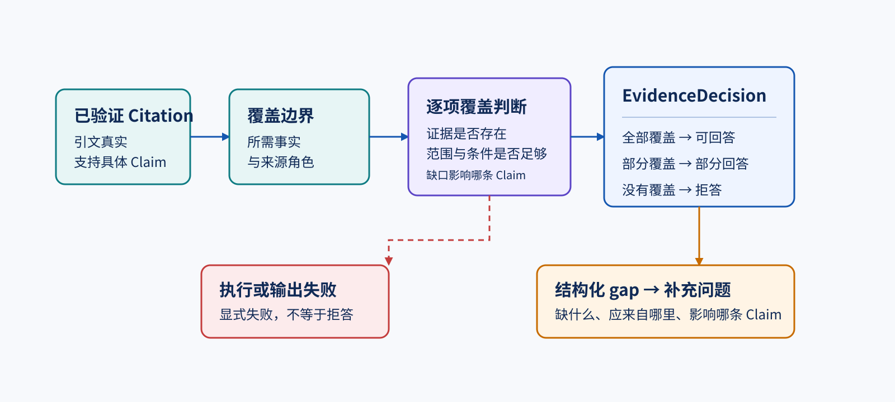

# 证据充分性、Refusal 与补充问题

> [引文真的支持这条结论吗](017.citation-support.mechanism.md)已经逐条确认了引文真实、位置唯一，并且在完整来源语境中支持对应 Claim。但三条局部支持关系相加，不会自动变成一份可以完整交付的强结论：它可能仍遗漏某个必要事实或适用条件。
>
> 本文交付 `EvidenceDecision`：可回答、部分回答或拒答，以及每个未覆盖事实形成的结构化 gap 和补充问题。本文不重新检索、不重做单条 Citation 支持性判断，也不把资料程度结论解释成产品对象的状态或人的裁决；完整运行、日志、排查和修改见[配套实验](018.evidence-sufficiency.lab.md)。

## 已支持的关系，为什么还不能直接回答

继续使用“订单详情页新增申请售后入口”的评审。第 17 节交付的不是笼统的“引用正确”，而是能逐条回查的 `VerifiedCitation`：每一项都知道它支持哪个 Claim、引自哪里、原文位置在哪，以及为什么得到 `supported`。

假设当前评审想给出三条结论：

```text
A：现行售后接口 v2 的全部请求都必须提供 source_channel。
B：失败时必须区分网络错误和业务拒绝。
C：Flutter 与 Web 必须使用相同的入口可见性规则。
```

现在已有的上游结果是：

```text
A → 一条 supported Citation，来自现行接口规则
B → 没有已验证 Citation
C → 引文存在，但支持性判断为 indeterminate
```

第 17 节已经正确完成了自己的边界：A 的 Citation 可以进入 `VerifiedCitation`；B 没有经过支持性验证的证据；C 不能把“范围未知”说成支持。可是，应用还不能把这三项一起标为“可以回答”。

简单的“只要有一条 supported Citation 就继续回答”会把 A 的局部事实偷换成整份评审的充分证据；反过来，“只要有一个缺口就删掉所有结论”又会丢掉 A 已经可以交代的内容。这里需要的不是第五种 Citation 支持档位，而是另一条问题：**形成当前强结论所需的事实，哪些已经覆盖，哪些仍然缺失？**



*图：单条 Citation 的支持性是充分性判断的输入；只有把它放回结论所需事实的覆盖边界，才能得到整体资料程度与可操作的缺口。*

图前已经确定每条 Citation 的局部支持关系。图后要解决的是“什么叫当前结论所需的事实”，以及为什么空证据与执行失败必须走不同分支。

## 充分性先要知道“还缺什么”

只把 `VerifiedCitation` 列表交给模型，模型只能看到已经拿到的材料，无法可靠地推断这次强结论本来还需要哪些事实。比如只有接口规则时，它可能看不见“失败如何呈现”本来也是用户问题的一部分；此时说“证据充分”不是判断，而是遗漏。

所以充分性判断除了接收第 17 节的交付，还要接收本次评审已经明确的覆盖边界。一个覆盖要求用自然语言表达三件事：

```text
缺少什么事实：网络错误与业务拒绝的展示差异
应由哪类来源覆盖：错误契约
它影响哪些 Claim：B
```

覆盖边界来自当前评审问题、固定业务材料和调用方已经定义的审查范围；它不是模型在证据不足时临时编出的新需求，也不是产品的 Finding 或 Decision。它只是说清：若要把 B 说成强结论，至少要有哪一类事实。

这个对象补上了两种常被混淆的信息：

- `VerifiedCitation` 回答“现有的某段引文支持哪条 Claim”。
- 覆盖要求回答“形成当前结论还必须验证哪类事实，以及它应由什么来源角色承担”。

两者缺一不可。若没有前者，来源正文尚未经过第 17 节的支持性校验；若没有后者，应用无法分辨“眼前的几条 Citation”与“本次回答已经足够”。

## 逐项判断覆盖，而不是给整份回答打分

充分性仍有必须交给真实模型的语义部分：一段已经支持某条 Claim 的引文，是否在版本、适用范围和条件上覆盖某个更具体的所需事实。当前能力把所有仍有候选证据的覆盖要求合并为一次结构化调用，让模型逐项返回：

```text
覆盖要求 1 → covered 或 gap
覆盖要求 2 → covered 或 gap
……
```

`covered` 不是模型的一句泛泛保证。它必须回指受影响 Claim 中、来自预期来源角色的 `VerifiedCitation`。调用方随后确定性检查：

1. 返回的覆盖要求身份是否完整、唯一且保持输入顺序；
2. `covered` 是否至少指出一条允许的 Claim；
3. 这条 Claim 的已验证 Citation 是否真的来自覆盖要求指定的来源角色；
4. `gap` 是否没有伪造一条 Citation 让它看起来已经解决。

模型只负责阅读语境与条件的语义判断；身份、关联范围和聚合仍由程序守住。若模型把“错误契约”的 Citation 拿去覆盖“接口规则”，即使文字看起来很合理，也不能进入业务结果。

### 没有候选证据时不必让模型猜

有些 gap 已经可以确定：当前 `knowledge_scope` 中根本没有来自预期来源角色的 `VerifiedCitation`。例如 B 没有任何“错误契约”来源的已验证 Citation，模型不需要猜测这是否足够；应用直接形成可见 gap。

这不是用确定性逻辑替代语义判断。它只是在“不存在合格证据”这个已经明确的边界上停止一次没有信息增益的模型调用。仍有候选 Citation 时，范围、否定、版本和条件是否覆盖所需事实，依然需要真实模型判断。

## 从覆盖结果聚合为资料程度

每个覆盖要求都有结果后，整体 `EvidenceDecision` 由确定性聚合形成：

| 覆盖情况 | `EvidenceDecision` | 当前应怎样表达 |
| --- | --- | --- |
| 全部覆盖 | `answerable` | 可以给出当前范围内的强结论，并保留 Citation。 |
| 一部分覆盖 | `partial` | 保留已覆盖结论，同时逐项说明不能断言的部分。 |
| 没有覆盖 | `refusal` | 不给出所请求的强结论；说明现有资料不足。 |

`partial` 特别重要。它不是模糊的“请谨慎参考”：A 仍可以说“现行接口要求 `source_channel`”，B 和 C 则必须明确标为尚不能确认。用户不需要从一条总警告里猜哪些话还能使用。

`refusal` 也不是“系统没有任何输出”。它是一个正常的资料结论：系统能明确说明自己还缺什么，因此拒绝把无依据的推断包装为结论。空的候选范围、过滤后没有合格 Citation，或所有覆盖要求都缺证据，都可以得到这个结果。

## gap 先于补充问题出现

“请补充更多资料”没有告诉用户该补什么，也无法让后续能力定位哪个结论受影响。充分性机制先保留结构化 gap：

```text
requirement_id：error-contract
missing_fact：网络错误与业务拒绝的展示差异
expected_source_role：错误契约
affected_claim_ids：[B]
reason：当前范围内没有来自错误契约的已验证 Citation
```

补充问题只是这个 gap 的可读渲染：

```text
请补充来自“错误契约”的网络错误与业务拒绝展示差异，
以判断 Claim B。
```

这样做有两个约束。第一，问题不会被生成成与缺口无关的开放式追问；第二，不需要为了写一个问题再建立第二条模型生成链。措辞可以由稳定模板承载，缺什么、影响什么和期待什么来源始终以 gap 为准。

## 资料不足与执行失败不能互相伪装

`refusal` 的前提是充分性链已经完成，应用确实知道合格证据不足。下面三类情况不能偷换为它：

| 情况 | 说明 | 正确结果 |
| --- | --- | --- |
| 空 `knowledge_scope` | 没有可用来源，因而没有合格 Citation | 完成；`refusal` 与每项 gap。 |
| 模型输出无法解析 | 充分性判断没有形成合法结构 | 显式输出契约失败；没有 `EvidenceDecision`。 |
| 返回的身份、Claim 或来源角色关联错误 | 模型结果不能安全绑定回输入 | 显式业务校验失败；没有 `EvidenceDecision`。 |
| 鉴权、限流、超时或 Provider 失败 | 真实语义判断根本没有完成 | 真实依赖失败向上暴露；没有 `EvidenceDecision`。 |

尤其不能把“模型超时”改写为“拒答”。前者说明应用不知道本轮资料能支撑到哪里，后者说明应用已完成判断并知道资料不足。两种结果会导致完全不同的排查方向。

## 当前实现怎样承载这条机制

本节仍是固定 RAG Pipeline：没有 Agent、Tool Call、动态补检索或产品对象写入。

| 层次 | 当前责任 | 不负责什么 |
| --- | --- | --- |
| Provider / SDK | 对仍有候选证据的覆盖要求完成一次真实结构化判断，返回 usage、延迟和错误 | 重新检索、补全外部事实或决定产品后果 |
| `llm_core` | 固定 Prompt、模型配置、Structured Output 与解析阶段 | 决定来源角色是否合格，或把 gap 写成产品对象 |
| `rag_core/evidence` | 接收 Claim、`VerifiedCitation`、覆盖要求和限定范围；校验关联；聚合决定；渲染 gap 问题 | 重做第 17 节引文定位与支持性，或改变知识范围 |
| 产品领域层 | 在后续章节把 gap 映射进需求评审工作流 | 把资料程度悄悄改成人的裁决 |

实现中，`review.evidence_sufficiency@1.0.0` 只读取本次提供的 Claim、已验证 Citation、覆盖要求和 active sources。`rag_core` 不在校验器内部重新调用 Retriever，也不从另一次运行取来源；这样同一份 `EvidenceDecision` 才能解释为同一范围、同一组上游证据的结果。

## 本文交付与后续边界

本文向后交付：

- 全部覆盖要求的 `covered / gap` 结果；
- `answerable / partial / refusal` 三种资料程度；
- 每个 gap 的缺失事实、预期来源角色、受影响 Claim、理由与补充问题；
- 与资料不足分开的输出契约和真实依赖失败诊断。

它不交付需求的持久对象、运行状态、界面、补充内容回填或批准资格。后续能力可以消费 gap，但不能倒过来让产品动作篡改本次证据结论。

## 学完后的自检

给定 A、B、C 三条 Claim 和一组 `VerifiedCitation`，你应能：

1. 写出每条强结论还需要覆盖的事实，而不是只数 Citation 数量；
2. 说明为什么一条来自错误来源角色的 Citation 不能补接口规则的缺口；
3. 在 A 覆盖、B 缺失时解释为什么结果是 `partial` 而不是全部成功或全部拒答；
4. 把一个 gap 变成指向具体事实与来源角色的补充问题；
5. 区分空证据范围产生的 `refusal`，与模型输出无效或 Provider 超时产生的失败。

如果这些判断都能回到“Claim、已验证 Citation、覆盖边界、gap”这条证据流，而没有把 `refusal` 当成错误或裁决，就掌握了证据充分性机制。
