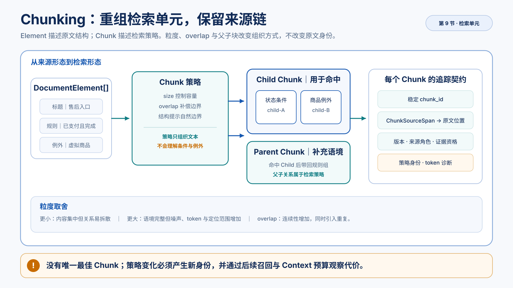

# Chunking、父子块与 Metadata

> 机制篇：理解为什么解析得到的文档元素还不能直接作为检索单元，以及应用怎样在检索粒度、上下文完整性、来源回查和更新语义之间作出可观察的取舍。
>
> 课程位置：[标准学习路径](../learning-path.md)。必要前置是 [文档内容识别、解析路由、结构还原与来源保留](document-loading-and-cleaning.md)。本文产生可追踪 Chunk，但不建立 Embedding、全文索引、向量索引或 Retriever，也不使用最终回答判断策略质量。



*图：Chunking 重组检索单元，父子块、Metadata 和 SourceSpan 共同保留检索语境与原文回查路径。*

## 文档解析阶段已经得到 Element，为什么还要继续加工

文档解析阶段把 `order_rules.md` 解析成七个 `DocumentElement`：

```text
标题：售后入口与订单状态
标题：当前订单状态规则
列表项：仅已支付且已完成的订单可申请售后。
列表项：虚拟商品不进入售后流程。
标题：接口与客户端约束
列表项：售后接口 v2 必须提供 source_channel。
列表项：Flutter 客户端必须使用相同的入口可见性规则。
```

这些元素忠实表达了 Markdown 的原文结构，但如果直接把每个元素放进索引，会出现新的问题：

- 标题可以单独被匹配，却没有完整业务事实。
- “哪些订单允许申请售后”与“虚拟商品除外”属于同一规则组，却位于两个列表项。
- DOCX Parser 可能把整张表格保存为一个 Element，而检索只需要其中一行。
- PDF 当前按页保存 Element，一页可能同时包含多组规则。
- TXT 的一个连续文本块也可能比一次查询需要的范围更大。

`DocumentElement` 回答的是：

> 原文件中可靠恢复出了什么结构？

检索单元要回答的是：

> 用户提出一个问题时，应用应该用多大范围的文字参与匹配，并在命中后带回多少语境？

两个问题的目标不同，所以 Element 不能天然等同于 Chunk。Chunking 阶段要完成的不是“把长字符串切短”，而是把来源形态的结构重新组织成检索形态的单元，同时不丢失回到原文的路径。

## 五个对象承担不同责任

先区分本文会遇到的五个对象：

| 对象 | 主要责任 |
| --- | --- |
| `DocumentElement` | 保存原格式中真实恢复出的标题、段落、列表、表格、页面及 locator |
| Retrieval Chunk | 作为后续匹配和排名的候选单元 |
| Parent Chunk | 在 child 命中后提供更完整的相邻语境 |
| Context Source | 经过 Retriever 和 Context Builder 选择后，真正进入模型的材料 |
| `ChunkSourceSpan` | 记录 Chunk 的每段文字来自哪个 Element 和哪个字符范围 |

它们不能相互冒充。

父子 Chunk 是检索策略建立的关系，不是原文结构树。Context Source 还要经过检索、过滤、预算和上下文装配才能形成，Chunking 阶段不会因为生成了 Chunk 就宣称内容已经进入模型。

完整位置关系是：

```text
File
→ KnowledgeDocument
→ DocumentElement[]
→ Chunk[] / Parent + Child
→ 后续 Retrieval Hit
→ 后续 Context Source
```

## 先观察最简单的两种粒度

### 每个 Element 一个 Chunk

Element baseline 最容易实现，也最容易回查来源：

```text
DocumentElement[0] → Chunk[0]
DocumentElement[1] → Chunk[1]
...
```

它适合观察“解析结构”和“检索结构”的差别，但不能自动解决：

- 标题与正文的组合。
- 相邻规则之间的条件和例外关系。
- 超长表格、段落或页面的内部粒度。

当前实现仍会对超过 token 上限的单个 Element 做二次切分，避免一个超长元素绕过策略预算。

### 整篇文档一个 Chunk

另一个极端是直接使用 `KnowledgeDocument.text`：

```text
整个文档 → 一个 Chunk
```

这样不会拆散文档内的关系，但所有查询都要匹配同一大段文字。文档增长后，关键词密度、向量表示、上下文预算、引用范围和更新成本都会受到影响。

这两个极端说明 Chunking 的核心没有唯一答案：

```text
单元更小
→ 内容更集中
→ 关联事实更容易分开

单元更大
→ 语境更完整
→ 噪声、token 和定位范围增加
```

## size 只控制容量，不理解业务关系

固定窗口策略给定 `max_tokens`，从文档文本中依次形成 Chunk。当前实现使用明确的 `tiktoken` encoding 计数，并优先在空白、换行或句末标点附近结束，避免有自然边界时仍从单词中间切开。

即使如此，size 仍然只知道容量，不知道：

- 哪一句是条件。
- 哪一句是例外。
- 哪个标题约束后面的列表。
- 表格的第一行是不是表头。
- 相邻两段是否共同回答一个问题。

所以增大或减小 size 时，学习者应先预测内容怎样重新组合，而不是直接问“准确率会不会提高”。

例如：

```text
max_tokens 较小
→ 状态条件和虚拟商品例外可能位于不同块

max_tokens 较大
→ 两条规则可能共处一个块
→ 也可能同时带入 API、客户端或其他无关规则
```

只有后续接入 Retriever 和固定评估集后，才能判断这种变化对真实召回有什么影响。

## overlap 是边界补偿，不是语义理解

固定窗口在某个位置结束后，下一块可以从前一块末尾之前重新开始：

```text
Chunk A: [--------------------]
Chunk B:                 [--------------------]
                         ↑ overlap
```

这样做能让边界附近的短语同时出现在相邻 Chunk，降低一句话刚好跨窗口时的信息缺口。

代价也会同时出现：

- 索引文本重复。
- Embedding 调用量增加。
- 相似候选更容易成组出现。
- 后续需要按稳定 ID、来源关系或父块关系处理重复。
- 相同证据可能多次占用 Context 预算。

因此 overlap 不是越大越安全。它只用重复换取边界连续性，不能识别“已支付”和“虚拟商品除外”是否属于同一个业务判断。

`ChunkReport` 会记录源文档 token、全部 Chunk token、增加的 token 和 repetition ratio。父子策略会同时保存 parent 和 child，增加量可能超过源文档的 100%；这不是程序异常，而是该组织方式的真实存储与处理成本。

## 已经恢复出的结构可以帮助确定边界

文档解析阶段为不同格式保留了不同结构：

| 格式 | Chunking 阶段可以使用的可靠信息 |
| --- | --- |
| TXT | 文本块、行范围和原始顺序 |
| Markdown | 标题、标题路径、段落、列表、代码和行范围 |
| DOCX | 标题样式、段落、表格和文档顺序 |
| PDF | 页面、页码和提取后的文本顺序 |

structure-aware 策略优先按标题节和 Element 边界组合内容。当前实现会：

- 将章节标题和它下面的正文放在一起。
- 章节需要形成多个 Chunk 时重复必要的标题上下文。
- 优先保持一个 Element 完整。
- Element 超过上限时再按 token 边界切分。
- 保留每次重复和截取对应的来源跨度。

结构感知不能恢复 Parser 已经丢失的关系。PDF 只有页面信息时，Chunker 不能根据字体大小自行宣称恢复了可靠标题树；DOCX Parser 若没有读取图片文字，Chunker 也不能猜出图片中的规则。

```text
Parser 提供可靠结构
→ Chunker 可以利用

Parser 没有提供结构
→ Chunker 不应推测为来源事实
```

## 父子块在什么问题出现后才有价值

结构感知 Chunk 仍可能面对一个矛盾：

```text
小块更适合精确候选匹配
但理解完整规则需要更大范围
```

父子策略把两个责任分开：

```text
Parent Chunk
├─ Child Chunk A
├─ Child Chunk B
└─ Child Chunk C
```

- Child 作为后续 retrieval unit。
- Parent 保存同一章节或相邻元素的完整语境。
- 后续 Retriever 命中 Child 后，可以按 `parent_chunk_id` 决定是否扩展 Parent。

Chunking 阶段只建立并观察这种关系，不实现“命中 Child 后取回 Parent”的 Retriever 流程。

父子块也不是默认更高级的答案：

- Parent 和 Child 都要保存，会增加 token 与索引映射。
- 多个 Child 可能指向同一个 Parent，需要去重。
- Parent 过大会重新引入噪声和预算问题。
- 如果普通结构 Chunk 已经同时适合匹配和上下文，父层没有额外价值。

实验默认参数下，订单资格与虚拟商品例外位于不同 Child，但属于同一 Parent。这只证明父层保留了共同语境，不证明未来 Retriever 一定能先命中正确 Child，也不证明把 Parent 放入 Context 后回答一定正确。

## Chunk 改变文本组织，但不能切断来源

一个 Chunk 可能：

- 完整使用一个 Element。
- 合并多个 Element。
- 截取一个 Element 的一部分。
- 因 overlap 重复一段原文。
- 作为 Parent 或 Child 再次组织相同来源。

因此单个 `SourceLocator` 不足以表达 Chunk 来源。真实契约让每个来源片段保存元素身份、原文定位、字符起止位置和对应文本。它建立一个可测试的不变量：片段文本必须等于原始 Element 在同一字符范围内的内容。

只要这个关系成立，应用就能从 Chunk 回到真实 Element，再利用 Element 的行号、标题路径、段落号、表格号或页码定位原文。

Chunk 可以拥有多个 span，不需要把跨段、跨表格或跨页面的内容伪装成一个不存在的位置。

## Metadata 要按责任分层

Chunk 独立进入后续索引后，必须携带文档身份和过滤信息。但把所有字段塞进一个字典，会让来源事实、业务配置和运行统计互相覆盖。

当前契约分为四层。

### 来源事实

强类型保存在 Chunk 上：

- `document_id`
- `document_version`
- `original_filename`
- `file_format`
- `source_role`
- `evidence_eligibility`
- `source_spans`

这些字段来自 Loader 和调用者建立的文档契约，不能由 Chunker 或模型推测。

### 业务过滤 Metadata

例如：

```text
knowledge_scope=after_sale
```

它从 `KnowledgeDocument.metadata` 继承到 `business_metadata`，供后续可见范围和检索过滤使用。业务 Metadata 不能覆盖 `document_id`、`source_role`、策略版本等保留字段。

### 策略信息

Chunk 强类型保存：

- `policy_name`
- `policy_version`
- `policy_fingerprint`
- `parent_chunk_id`
- Chunk kind

这些信息解释当前文本单元是怎样产生的。

### 运行诊断

`ChunkReport` 保存：

- Chunk、Parent、Child 数量。
- token 的 min、median、p95 和 max。
- source span 数量。
- 源文档 token。
- 全部 Chunk token。
- 重复增加量和比例。

诊断描述一次运行，不是原文事实，因此不进入业务 Metadata。

## 为什么有效策略变化后不能复用旧 chunk_id

`chunk_id` 不是数据库自增 ID，也不能只对 Chunk 文本做哈希。

假设同一段文字先由 fixed-window 产生，后来由 structure-aware 产生。即使文本偶然相同，它们的策略语义、来源跨度和后续更新批次仍可能不同。

当前 ID 输入包括：

```text
document_id
+ document_version
+ effective policy fingerprint
+ Chunk kind
+ Chunk text
+ ordered source spans
```

有效策略 fingerprint 又包括 name、version、strategy、size、overlap、parent size 和 tokenizer。

因此：

- 相同文档和相同有效策略重复运行，ID 可预测。
- 文档版本变化，ID 改变。
- size、overlap、策略或 tokenizer 变化，ID 改变。
- Parent 和 Child 即使文本相同，也不会共享 ID。

这只能保证新旧 Chunk 可以区分。旧索引删除、Embedding 重建、数据库事务和 Citation 失效属于后续知识治理机制。

## 用实验把策略差异变成可观察事实

对照实验应固定文档和下游观察方式，只改变 Chunk 策略，比较数量、边界、重复、来源定位和 Metadata。运行命令、输出字段、调试与读码路径见[配套实验](../labs/chunking-and-metadata.md)。机制正文只负责解释为什么这些差异会影响召回、Context 和引用。

## 没有一种策略同时消除所有代价

本节使用的都是有效输入和正常策略，不需要人为损坏 Chunk 来观察边界：

| 观察到的现象 | 优先检查 |
| --- | --- |
| 条件和例外位于不同 retrieval chunk | size、原始 Element 边界、是否需要结构或 Parent |
| 标题在多个 Chunk 重复 | structure-aware 的标题前缀和重复成本 |
| overlap 后相邻 Chunk 高度相似 | overlap 参数、后续候选去重和 Context 预算 |
| Child 内容集中但语境不足 | Parent 是否保留必要范围、后续是否值得扩展 |
| Parent 包含过多内容 | parent size、section 边界和实际上下文需要 |
| Chunk 无法回到原文 | SourceSpan 组装和 Element 字符范围不变量 |
| 重切分后仍出现旧 ID | policy fingerprint、文档版本和索引治理 |

前五项通常是策略取舍，不应直接转成程序异常。后两项破坏来源和身份契约，应由确定性测试阻止。

## 本节交付和边界

本节真实交付：

```text
KnowledgeDocument
+ ChunkPolicy
→ Chunk[] / Parent + Child
+ ChunkSourceSpan[]
+ ChunkReport
```

第一阶段后续机制仍要完成：

- 使用真实 Embedding 服务表示 Chunk。
- 建立 PostgreSQL FTS 和 pgvector 索引。
- 比较 lexical 与 dense 候选。
- 用 RRF 融合排名。
- 使用 Metadata Filter、阈值和 Top-k。
- 把候选映射成 Context Source。
- 用检索评估证明策略是否适合真实问题。

Chunking 阶段不声称：

- structure-aware 一定优于 fixed-window。
- parent-child 一定改善召回。
- overlap 越大越可靠。
- 受控 fixture 能代表生产文档分布。
- Chunk 可回查就等于 Citation 已验证。

## 判断是否已经掌握

1. 为什么 Markdown 标题、DOCX 表格和 PDF 页面都不能天然等同于检索 Chunk？
2. Retrieval Chunk、Parent Chunk 和 Context Source 的责任分别是什么？
3. size 变小时，信息集中度和关系完整性为什么可能向相反方向变化？
4. overlap 补偿了什么，又增加了哪些成本？
5. structure-aware 能使用哪些结构，为什么不能猜测 Parser 没有恢复的关系？
6. 什么情况下父子块有价值，什么情况下只增加复杂度？
7. 一个跨越两个 Element 的 Chunk 应怎样返回原文？
8. 来源事实、业务 Metadata、策略信息和运行诊断为什么不能放在一个无约束字典中？
9. 为什么只对 Chunk 文本做哈希不足以表达重新切分语义？
10. 修改 `max_tokens` 或 overlap 后，你能否在运行前预测 Chunk 数量、重复量和相关事实位置的变化？

完成后回到 [标准学习路径](../learning-path.md)，由唯一课表决定后续内容。
