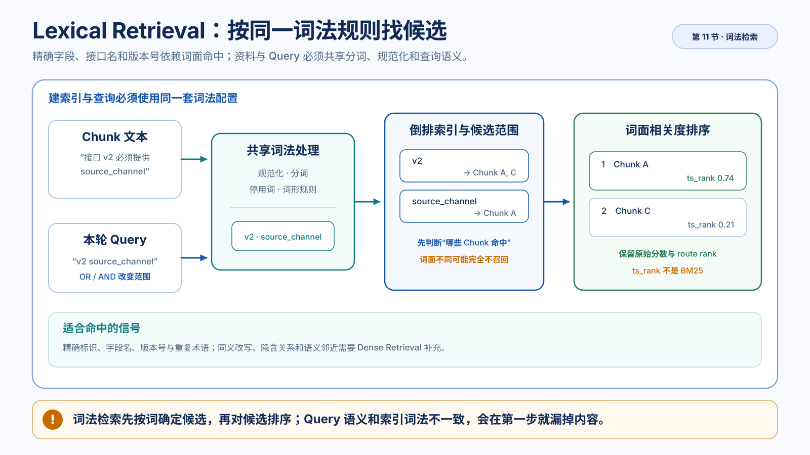

# Lexical Retrieval、BM25 边界与 PostgreSQL 全文检索

> 文档解析与 Chunking已经把资料切成 Chunk，Embedding 阶段让你观察了 Embedding。现在换一个更容易验证的问题：用户输入一句话时，怎样先从已有资料中找出可能相关的片段？
>
> 本文先建立“按词找”的直觉，再逐步认识 PostgreSQL 用来实现它的名称。数据库安装和实验命令见[Lexical Retrieval 实验篇](../labs/lexical-retrieval.md)；若尚未通过学习路径中的 PostgreSQL 必备基础检查，先阅读[PostgreSQL 零基础](../concepts/postgresql-for-ai-applications.md)。

Embedding 阶段只比较几段已知文本在 Embedding 空间中是否接近；本节把用户问题真正拿去和一批 Chunk 做词面候选检索；Dense Retrieval会沿用同一批 Chunk 和问题，用向量距离再做一次候选检索。这样后面比较 lexical、dense 和 RRF 时，变化来自检索路线，而不是偷偷更换资料。



*图：资料与 Query 共享词法配置，倒排索引先确定候选范围，再按词面相关度排序。*

## 先学会按词找候选

假设资料中有两段话：

```text
Chunk A：售后接口 v2 必须提供 source_channel。
Chunk B：仅已支付且已完成的订单可申请售后。
```

用户问：

```text
Query：source_channel 什么时候必填？
```

我们希望先找到 A。最直接的办法不是让模型猜，而是：

```text
资料 → 拆出可检索的词
问题 → 拆出可检索的词
比较两边有没有共同词
共同词相同的片段进入候选
```

这种按词寻找候选的办法叫 **Lexical Retrieval**。它擅长字段名、接口名、订单状态等原样标识，也能找到两边使用相同表达的资料。

它不会自动理解“发起逆向服务”和“申请售后”意思相近。如果两边没有共同词，返回 0 条是这个办法的正常边界。

还要先分开三件事：

```text
匹配：哪些片段有资格进入候选？
排序：候选中谁排在前面？
证据：候选内容能不能支持最终结论？
```

按词找到 A，不等于 A 已经证明了最终风险。

## 资料和 Query 必须使用同一套词法规则

如果资料把一个词切成两块，而问题保留成一块，两边就可能匹配不上。因此应用会让资料和问题经过同一套预处理：统一大小写和字符形式，切分中文，保留技术标识，过滤少量没有区分力的填充词。

例如字段名：

```text
source_channel → sourcechannel → techidsourcechannel
```

`techidsourcechannel` 不是额外资料，而是应用为技术标识生成的稳定备份词。它可以避免下划线被切开后只剩下过于普通的 `source` 和 `channel`。

同一段文字会经历三个不同阶段：刚切出的碎片、应用决定保留的词、数据库最终保存的词。区分它们是为了排查“词在什么时候消失了”，而不是为了增加术语。

当前规则由 `LexicalConfig` 标识。它记录分词版本、停用词、领域词和 PostgreSQL 配置，并生成 `lexical_config_ref`。规则改变后，旧资料和新问题可能不在同一个词空间，应用会拒绝混用并要求重新写入。

## 倒排索引：一个词出现在哪些 Chunk

如果每次查询都把全部资料取回 Python 再逐行比较，资料变多后会越来越慢。数据库会建立一种反向索引：先记录某个词出现在哪些 Chunk 中。

```text
词项                     → 出现在哪些 Chunk
售后                     → Chunk A、Chunk B
techidsourcechannel      → Chunk A
```

这里的 A、B 是上面资料中的两个 Chunk，不是两个 Query。倒排索引把“词”映射到“包含这个词的 Chunk”；Query 先被拆成词，再用这些词查回候选。例如 `售后` 可以查回 A、B，而 `techidsourcechannel` 只能查回 A。

PostgreSQL 用 GIN 索引加速这种“按词找行”的查询。GIN 只负责让查找更快，不决定你应该使用 AND 还是 OR，也不理解同义词、否定或业务证据。

在表中同时保留三种内容：

- `content`：给人阅读、回源和后续上下文使用的原文。
- `lexical_text`：应用已经拆好、用空格分隔的词。
- `search_vector`：PostgreSQL 根据这些词生成的词袋。

这里的 `search_vector` 类型叫 `tsvector`。它保存词和位置信息，不是Embedding 阶段的 Embedding 向量；名字里都有 vector，但一个表示词面，一个表示语义空间。

PostgreSQL 把整套“在文本中按词查询”的能力叫 **FTS**，全称是 Full-Text Search。它不是另一种数据库，而是 PostgreSQL 内置的文本搜索能力。

当前表使用生成列：

```sql
search_vector TSVECTOR GENERATED ALWAYS AS (
    to_tsvector('pg_catalog.simple', lexical_text)
) STORED
```

应用写入 `lexical_text`，数据库自动计算 `search_vector`。词法规则仍由应用控制，数据库不会替你判断中文业务词是否合理。

## FTS 查询：OR 和 AND 怎样改变候选范围

用户问题经过同一套分析后，应用把词交给 PostgreSQL。PostgreSQL 将这些词编译成查询条件，这个查询条件的类型叫 `tsquery`。

整个过程可以先用人话理解：

```text
问题
→ 应用拆词
→ PostgreSQL 生成查询条件
→ 检查资料词袋是否满足条件
→ 返回匹配的 Chunk
```

SQL 中的 `@@` 就是“是否匹配”的操作符：

```sql
search_vector @@ tsquery
```

它只回答是或否，不回答哪个候选更相关。

当前实验默认使用 **OR**：查询词中任意一个匹配，Chunk 就有资格进入候选。切换成 **AND** 后，所有词都要出现，结果通常更窄。

例如：

```text
OR：source_channel | techidsourcechannel | 必填
AND：source_channel & techidsourcechannel & 必填
```

在 FTS 里，OR 表示“任意一个词匹配即可”，AND 表示“所有词都匹配才可以”。这里的 `|` 和 `&` 是 `tsquery` 的查询运算符，不要直接等同于编程语言中的 `||` 和 `&&`。OR 通常召回更多候选，AND 通常更严格；它们只改变查询条件，不需要重新写入 Chunk。

OR 可能带来更多噪声，AND 可能错过使用“必须提供”而没有写“必填”的资料。它们是检索配置，不需要重新生成资料的词袋。

数据库还需要决定最多返回多少条候选，这就是 `candidate_k`。它不是“答案最多有几条”，而是这一条检索路线交给后续融合或 Context Builder 的候选上限。当前查询按 `ts_rank DESC, chunk_id ASC` 排序；第二个排序键让 rank 并列时结果仍然稳定，便于实验复现和后续 RRF 对齐。

## 命中后如何排序：`ts_rank` 做什么

查询可能匹配多个 Chunk。数据库还需要给它们排序，例如同时包含“虚拟商品”和“售后”的片段，通常应排在只包含“售后”的片段前面。

PostgreSQL 用 `ts_rank` 计算这种词面排序分数。`ts_rank` 是 PostgreSQL 的一个函数，不是独立的检索产品。它会根据词频、位置和权重给匹配结果排序；分数越高，表示在当前函数和当前查询下越靠前。

当前产品会明确记录：

```text
rank_name = postgresql_ts_rank
higher_is_better = true
```

高 rank 只说明词面排序靠前，不能说明资料是当前有效版本，也不能说明它理解了否定，更不能说明它足以支持最终评审结论。

真实搜索结果不是一串文本，而是两部分：

```text
LexicalSearchResult
├── hits: LexicalHit[]
└── diagnostics: LexicalDiagnostics
```

`LexicalHit` 说明“哪些 Chunk 被返回”；`LexicalDiagnostics` 说明“这次查询到底做了什么”。当前诊断包括原始查询、规范化查询、应用词项、PostgreSQL query terms、`tsquery`、词法配置身份、可见 Chunk 数、匹配 Chunk 总数、实际返回数、`candidate_k`、rank 名称、方向和延迟。看到 0 条时，必须依靠这些字段判断是词没对上、资料不可见、候选上限太小，还是数据库失败。

## BM25 是相近但不同的词面排序算法

当人们讨论“按词匹配后如何排序”时，常会提到 BM25。BM25 是一种具体的词面排序算法，它通常考虑三件事：

- 越少见的词，区分度通常越高。
- 一个词重复出现有帮助，但重复到一定程度后收益会变小。
- 长文本天然包含更多词，需要考虑文档长度。

它的常见形式是：

```text
BM25(q, d)
= Σ IDF(term)
  × TF(term, d) × (k1 + 1)
    / (TF(term, d) + k1 × (1 - b + b × |d| / avgdl))
```

学习者不需要先手算公式，但应该能用它预测：稀有字段名往往比“规则”更有区分度，堆砌关键词不会无限增加相关性。

BM25 和 `ts_rank` 都属于词面排序，但不是同一个算法。PostgreSQL 还提供 `ts_rank_cd`，它更关注匹配词在文本中是否靠近；这仍然不等于 BM25。

因此：

```text
FTS 是 PostgreSQL 的全文检索能力
BM25 是一种词面排序算法
ts_rank 是 PostgreSQL 当前使用的排序函数
```

第一阶段使用真实 PostgreSQL FTS 和 `ts_rank`，不把结果字段命名为 `bm25_score`，也不为了这个名称额外引入 BM25 扩展。以后可以用固定数据集比较 BM25 与 `ts_rank`，但那是新的扩展实验。

## 一次词面查询经过哪些机制步骤

同一套词法规则先作用于资料与 Query，资料词项进入倒排索引，Query 形成可执行的词面条件，数据库完成匹配与排序，再由候选深度截断结果。每条候选仍须保留稳定 Chunk 身份、来源和原生 rank；它只是词面候选，不是最终 Context 或 Citation。

过滤发生在匹配之前，因此“数据库里有”不等于“本轮允许检索到”。连接、事务和 SQL 异常属于依赖失败，不能与成功空结果混为一类。

## 动手做对照：每次只改变一个变量

操作顺序、安装、启动、Role、Database、`.env`、migration 和固定资料入库见[Lexical Retrieval 实验篇](../labs/lexical-retrieval.md)。正文只保留观察问题：

| 查询 | 先做预测 |
| --- | --- |
| `source_channel` | 技术标识应命中接口规则 |
| `申请售后` | 共同词面应产生候选 |
| `发起逆向服务` | 可能成功返回 0 条 |
| `虚拟商品 售后` | 可能命中否定规则，但 rank 不理解否定 |

一次只改变一个变量，例如只切换 OR/AND 或 `candidate_k`。观察应用词、PostgreSQL 查询词、`tsquery`、命中数、rank 和候选内容是否一起变化。

至少区分三种结果：

1. 命中：查询成功并返回候选。
2. 成功空结果：查询成功，有可观察的 `tsquery`，但没有共同词。
3. 依赖失败：`connection_failed`、`auth_failed`、`migration_required` 或 `permission_denied`。它们不能伪装成空候选。

排查顺序应与数据流一致：

```text
连接层 → migration / 表结构 → 可见范围 → 应用词项 → tsquery → 匹配数 → rank / candidate_k
```

有 `tsquery` 但 `matched_chunk_count=0`，优先检查词项和可见范围；有匹配总数但返回数较少，检查 `candidate_k`；如果连 `tsquery` 都没有，先检查应用分析；如果错误发生在连接或 SQL 执行阶段，则按结构化错误排查，不归因于词面质量。

## 学完后的修改题

接口新增枚举 `AFTER_SALE_V3`，资料和查询大小写可能不同。修改词法规则和测试，验证：

1. 大小写变化仍得到兼容的分析结果。
2. 技术标识仍被当成一个稳定单位。
3. 配置变化会更新 `lexical_config_ref`，旧数据需要重新写入。
4. 真实 PostgreSQL 查询仍返回 `postgresql_ts_rank`，不是伪造的 BM25。

## 本节边界

本节建立“按词找候选”的机制、PostgreSQL FTS 的基本实现、`ts_rank` 与 BM25 的边界，以及真实数据库错误的可见性。

本节不建立向量检索、pgvector、RRF、Context、可信 Citation 或产品 Review API。读完后回到[标准学习路径](../learning-path.md)进入Dense Retrieval：使用同一批 Chunk 和同一批查询，观察 Embedding 生成向量、pgvector 计算距离，再与本节保留的词面排名并列比较。两路原始分数不能直接相加，RRF 才是后续的融合机制。

## 官方参考

- [PostgreSQL：Full Text Search](https://www.postgresql.org/docs/current/textsearch.html)
- [PostgreSQL：Text Search Functions and Operators](https://www.postgresql.org/docs/current/functions-textsearch.html)
- [PostgreSQL：GIN Indexes](https://www.postgresql.org/docs/current/gin.html)
- [Psycopg 3：Basic module usage](https://www.psycopg.org/psycopg3/docs/basic/usage.html)
- [jieba：中文分词与搜索引擎模式](https://github.com/fxsjy/jieba)
