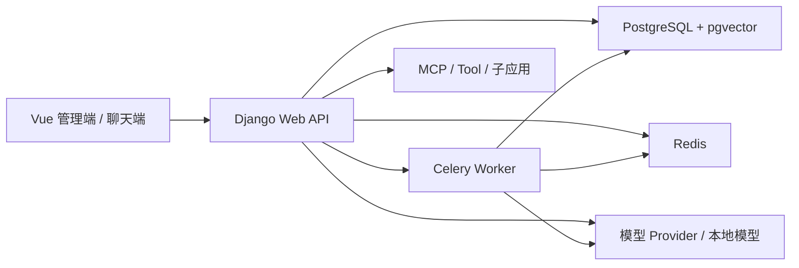
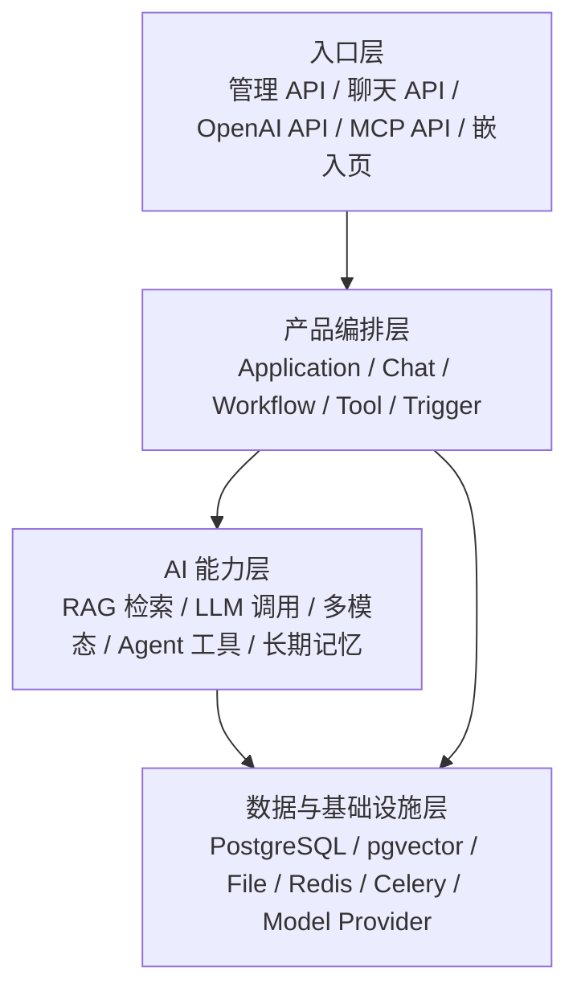

# MaxKB 代码架构与领域模型拆解

## 1. 项目定位

MaxKB 的定位不是单一的知识库问答系统，而是“企业级智能体平台”。它从 RAG 问答起步，但产品边界已经扩展到应用发布、Workflow 编排、工具调用、MCP、语音、多模态、长期记忆、访问控制、对话统计和嵌入式集成。

用一句话概括：

> MaxKB 把“知识库问答”产品化为“可发布、可嵌入、可编排、可调用工具、可运营”的企业 AI 应用平台。

它的核心价值有三层：

| 层级 | 解决的问题 | 对业务的价值 |
| --- | --- | --- |
| RAG 层 | 企业资料难以被大模型可靠使用 | 把文档、网页、表格、FAQ 转成可检索知识，让回答可控、可追溯 |
| 应用层 | Prompt Demo 难以变成真实业务入口 | 把模型、知识库、会话、权限、API、嵌入页、统计、语音打包成应用 |
| Agent / Workflow 层 | 单轮问答无法承载复杂业务流程 | 用节点图把检索、LLM、工具、子应用、表单、变量、循环、多模态串成流程 |

这也是 MaxKB 最值得学习的地方：它没有停在“我有一个 RAG pipeline”，而是继续往企业落地方向补齐产品能力。

## 2. 技术栈与运行时

MaxKB 的后端主体是 Python / Django，前端是 Vue，核心基础设施是 PostgreSQL + pgvector + Redis + Celery。

| 能力 | 技术选择 | 设计含义 |
| --- | --- | --- |
| Web API | Django 5 + DRF | 统一承载管理端、聊天端、OpenAI 兼容 API、MCP 对外协议 |
| 前端 | Vue | 管理端、应用配置、Workflow 画布、聊天页 |
| 数据库 | PostgreSQL | 用关系模型承载复杂业务状态 |
| 向量能力 | pgvector | 向量和业务数据共库，便于权限、状态、删除、事务协同 |
| 关键词检索 | PostgreSQL SearchVector | 支持 embedding / keywords / blend 三种检索模式 |
| 异步任务 | Celery + django-celery-beat | 文档向量化、分词、网页同步、记忆提取等后台任务 |
| 缓存与锁 | Redis | 会话缓存、任务锁、并发控制 |
| 模型适配 | LangChain + 多模型 provider | 支持公有模型、私有模型、本地模型、Embedding、LLM、多模态 |
| Agent 工具 | LangGraph / deepagents / MCP | 把工具、MCP server、技能包、工作流工具纳入模型调用 |

运行时可以理解为五个进程或服务面：

`main.py` 里可以看到项目启动时会做静态资源收集、数据库迁移、服务启动，并按 `web`、`task`、`local_model` 等模式启动不同组件。这说明作者把“单机部署可用”和“生产拆分服务”都考虑进去了。

## 3. 仓库目录地图

MaxKB 的主体代码在 `apps/` 下。它不是按纯技术层分包，而是按业务域分包。

| 目录 | 职责 | 学习重点 |
| --- | --- | --- |
| `apps/maxkb` | Django settings、urls、启动配置 | 管理 API、聊天 API、静态 UI、OpenAPI 文档如何统一挂载 |
| `apps/application` | 应用、发布版本、会话、简单 RAG pipeline、Workflow、长期记忆 | MaxKB 的产品核心 |
| `apps/chat` | 聊天入口、匿名认证、API Key、OpenAI 兼容接口、嵌入脚本、MCP 对外工具 | AI 应用如何对外开放 |
| `apps/knowledge` | 知识库、文档、段落、问题、向量、文件、标签、知识库 Workflow | RAG 数据面核心 |
| `apps/models_provider` | 模型、provider、凭据、模型实例化 | 模型中立能力 |
| `apps/tools` | 工具、工具执行记录、工具 Workflow、MCP/Skill/数据源工具 | Agent 行动层 |
| `apps/system_manage` | 资源映射、系统配置等 | 应用依赖资源的治理 |
| `apps/oss` | 文件上传、读取、资源代理 | 文档和多模态文件支撑 |
| `apps/trigger` | 触发器、定时或事件入口 | 从人工问答走向自动化任务 |
| `apps/common` | 认证、异常、数据库查询、事件监听、锁、切分、工具执行、配置 | 横切基础设施 |
| `apps/users` | 用户与权限 | 多用户、多工作空间基础 |
| `ui` | Vue 前端 | Workflow 画布和管理端体验 |
| `installer` | 安装部署材料 | 开源项目交付形态 |

一个重要经验：MaxKB 没有把 RAG、Workflow、Tool 都塞进一个“service”目录，而是让每个业务域拥有自己的模型、序列化器、视图、任务和辅助函数。对于复杂 AI 应用，这是比“按 controller/service/dao 分层”更容易维护的组织方式。

## 4. 分层架构

可以把 MaxKB 拆成四层：

四层的边界很清楚：

- 入口层处理认证、请求参数、响应格式，包括系统流式响应和 OpenAI 兼容响应。
- 产品编排层决定“这是简单应用还是 Workflow 应用”“是否发布”“是否有访问次数限制”“是否启用工具和记忆”。
- AI 能力层负责检索、生成、模型调用、工具调用、节点执行。
- 数据与基础设施层承载业务状态、向量、文件、异步任务和锁。

这套分层的可迁移经验是：不要让模型调用直接暴露给业务入口。业务入口应该调用“应用”，应用再根据配置选择 RAG pipeline、Workflow、工具或子应用。

## 5. 核心领域模型

### 5.1 应用域

| 模型 | 作用 |
| --- | --- |
| `Application` | AI 应用本体，保存名称、描述、模型、知识库设置、模型参数、工具、MCP、长期记忆、语音、文件上传、Workflow JSON 等 |
| `ApplicationVersion` | 应用发布快照，几乎复制应用的关键配置，保证发布后运行稳定 |
| `ApplicationKnowledgeMapping` | 应用和知识库的绑定关系 |
| `Chat` | 一次会话，记录应用、用户、来源、摘要、访问者、统计信息 |
| `ChatRecord` | 单轮问答记录，保存问题、回答、token、耗时、节点详情、引用段落、反馈 |
| `ChatShareLink` | 分享链接 |
| `ApplicationLongTermMemory` | 按应用和用户保存长期记忆文本 |

`Application` 的字段很多，但这些字段不是堆砌，而是在表达一个产品事实：

> 一个真实可用的 AI 应用，不只是 prompt + model_id，而是包含模型、知识、工具、渠道、安全、记忆、文件、语音、发布版本和运行记录的一组配置。

这对自己的业务很有启发。不要把 AI 应用配置设计成一个 JSON 字段草草了事。应该把能运营、能发布、能回滚、能授权的部分显式建模。

### 5.2 知识库域

| 模型 | 作用 |
| --- | --- |
| `Knowledge` | 知识库本体，绑定 embedding 模型、文件限制、作用域、文件夹 |
| `KnowledgeWorkflow` | 知识库导入或处理流程的 Workflow |
| `KnowledgeWorkflowVersion` | 知识库 Workflow 版本快照 |
| `Document` | 文档，包含状态、来源、字数、命中处理策略、元数据 |
| `Paragraph` | 段落，是 RAG 检索与引用的主要内容单元 |
| `Problem` | 扩展问题或关联问题，用来提升召回 |
| `ProblemParagraphMapping` | 问题和段落的映射关系 |
| `Embedding` | 向量数据，关联知识库、文档、段落、来源类型，同时保存 pgvector 和全文索引 |
| `File` | 文件存储，使用 PostgreSQL large object，支持压缩和 sha256 去重 |
| `Tag` / `DocumentTag` | 文档标签 |
| `Termbase` | 词库，用于关键词检索和分词增强 |
| `KnowledgeAction` | 知识库 Workflow 执行记录 |

MaxKB 的知识库不是简单的 `document -> chunk -> embedding` 三张表。它额外引入了：

- `Problem`：把“用户可能问法”作为可召回对象。
- `Document.status` / `Paragraph.status`：用压缩字符串记录多个任务状态。
- `hit_handling_method`：命中后可以走模型优化，也可以直接返回。
- `File`：把源文件、文档文件、聊天文件等统一管理。
- `Termbase`：让关键词检索具备领域词增强能力。

这说明作者在解决真实业务问题：召回不准、任务会失败、用户会取消、文件要追溯、问答要直接命中、关键词和向量要混合。

### 5.3 工具与 Agent 域

| 模型 | 作用 |
| --- | --- |
| `Tool` | 工具定义，支持自定义代码、内部工具、Skill、MCP、数据源、Workflow 工具 |
| `ToolWorkflow` | 工具本身也可以是一个 Workflow |
| `ToolWorkflowVersion` | 工具 Workflow 的版本快照 |
| `ToolRecord` | 工具执行记录，记录输入、输出、状态、耗时、来源 |

工具被建模为一等资源，而不是某个 Agent 节点里的临时函数。这是 MaxKB 从 RAG 平台进化到 Agent 平台的关键。

它支持几类工具化方式：

- 自定义 Python 代码工具。
- MCP 工具。
- Skill 压缩包工具。
- 已发布应用作为工具。
- Workflow 工具。
- 数据源工具。

这一点可以迁移到自己的业务：把“能力”抽象成可治理资源，而不是写死在某个链路里。工具需要有权限、版本、执行记录、初始化参数、输入输出 schema 和来源追踪。

### 5.4 模型域

| 模型 | 作用 |
| --- | --- |
| `Model` | 模型实例配置，包含 provider、model_type、model_name、凭据、默认参数、工作空间 |

MaxKB 用 `models_provider` 把 LLM、Embedding、语音、多模态等模型统一成可配置资源。业务对象只引用 `model_id`，实际调用时再通过 provider 和默认参数生成 LangChain 模型实例。

这个设计避免了两个问题：

- 应用代码里到处写 OpenAI、Qwen、Ollama、私有模型的分支。
- 模型换供应商时要改业务逻辑。

### 5.5 资源映射

MaxKB 用 `ResourceMapping` 记录应用、Workflow、工具、知识库、模型之间的依赖关系。比如应用引用了哪些知识库、模型、工具，Workflow 节点里引用了哪些资源。

这是一类经常被忽略但很重要的生产化设计。没有资源映射，就很难做：

- 删除前依赖检查。
- 权限过滤。
- 发布快照。
- 导入导出。
- 影响面分析。
- 资源迁移。

## 6. 两类应用形态

MaxKB 的应用有两种类型：

| 类型 | 适合场景 | 代码路径上的核心 |
| --- | --- | --- |
| `SIMPLE` | 标准知识库问答、客服、政策问答、内部文档助手 | Chat pipeline：问题优化 -> 知识检索 -> prompt 组装 -> LLM 回答 |
| `WORK_FLOW` | 多步骤业务、分支判断、工具调用、表单中断、子应用协作 | Workflow 图执行器：Node -> Edge -> NodeResult -> Stream chunk |

这是一种很成熟的产品设计：

- 用简单应用覆盖 80% 的 RAG 问答需求。
- 用 Workflow 承接更复杂、更低频、更定制的业务。
- 两者共用应用发布、会话、认证、模型、知识库、工具和统计能力。

自己的业务也可以这样做：不要一上来就让所有用户画 Workflow。先给用户一个简单模式，再给高级用户开放编排模式。

## 7. 业务场景判断

MaxKB 适合的场景：

| 场景 | 为什么适合 |
| --- | --- |
| 企业内部知识助手 | 文档入库、权限、RAG、嵌入门户、API 调用都齐全 |
| 客服与售后问答 | 直接返回、引用段落、访问限制、会话记录、反馈统计可用 |
| 政策、制度、办事指南问答 | 知识库可按文档、标签、网页同步组织 |
| 医院、学校、政务、工业知识服务 | 典型长文档、制度类、流程类知识问答 |
| 业务流程自动化助手 | Workflow 节点能组合表单、条件、工具、子应用 |
| 多模型与私有化部署场景 | 模型 provider 抽象和本地模型服务较完整 |
| Agent 工具调用平台 | MCP、Workflow 工具、Skill、子应用工具都被纳入 |

不太适合的场景：

- 只想要一个极简 SDK，不需要平台化管理。
- 需要极端低延迟、高并发的在线推理服务，但不需要 RAG 和 Workflow。
- 需要高度定制的搜索引擎能力，比如复杂权限倒排索引、跨库分布式召回、大规模实时索引。
- 已经有完整业务中台，只需要一个轻量模型网关。

## 8. 可以迁移的架构经验

### 8.1 把 AI 应用作为产品对象

MaxKB 的 `Application` 是产品中心，而不是技术配置中心。它持有模型、知识库、工具、MCP、语音、文件、记忆、Workflow、发布等能力。

迁移建议：

- 先定义自己的 `AIApplication` 表。
- 让所有聊天入口都通过应用运行。
- 每次发布生成版本快照。
- 聊天时优先读取发布版本，而不是直接读取草稿配置。

### 8.2 把知识处理拆成长期状态机

文档导入不是一次函数调用，而是带状态的后台任务。MaxKB 在 `Document` 和 `Paragraph` 中记录 embedding、生成问题、同步、分词等任务状态。

迁移建议：

- 文档、段落、向量不要只在任务内存中流转，要落库。
- 每个异步任务都要能取消、重试、失败可见。
- UI 上展示文档级状态，内部按段落级聚合。

### 8.3 把工具作为可治理资源

工具不是 Agent 的内部函数，而是有表、有权限、有版本、有执行记录。

迁移建议：

- 工具要有 input schema、初始化参数、执行日志。
- 工具调用要记录来源，是应用、知识库流程还是工具流程触发。
- 自定义代码工具要有安全校验和沙箱边界。

### 8.4 给简单模式和编排模式不同入口

MaxKB 没有强迫所有问答都进 Workflow。简单问答走轻量 pipeline，复杂场景再走 Workflow。

迁移建议：

- 第一版用固定 RAG pipeline 快速上线。
- 第二版把可变逻辑抽成 Workflow 节点。
- 不要让 Workflow 成为所有用户的唯一入口。

## 9. 参考代码位置

本篇主要参考：

- `README_CN.md`
- `README.md`
- `USE-CASES.md`
- `main.py`
- `pyproject.toml`
- `apps/maxkb/settings/base/web.py`
- `apps/maxkb/urls/web.py`
- `apps/application/models/application.py`
- `apps/application/models/application_chat.py`
- `apps/knowledge/models/knowledge.py`
- `apps/models_provider/models/model_management.py`
- `apps/tools/models/tool.py`
- `apps/tools/models/tool_workflow.py`
