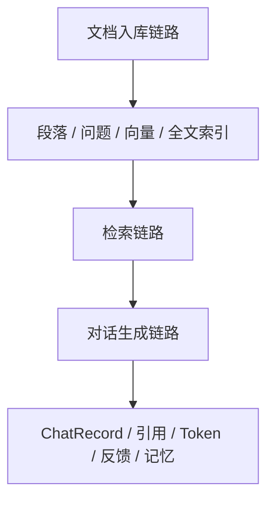
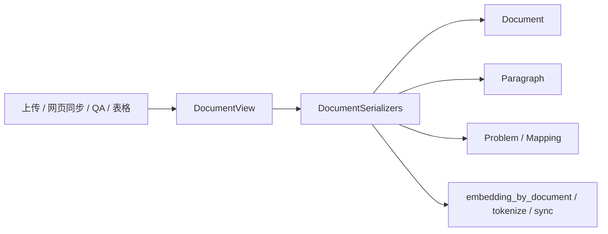
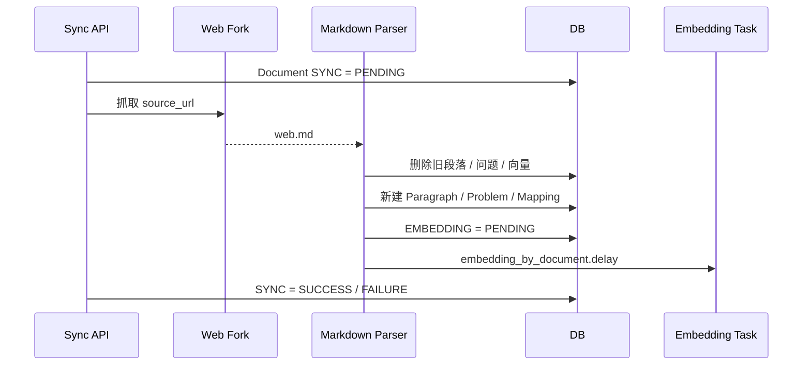
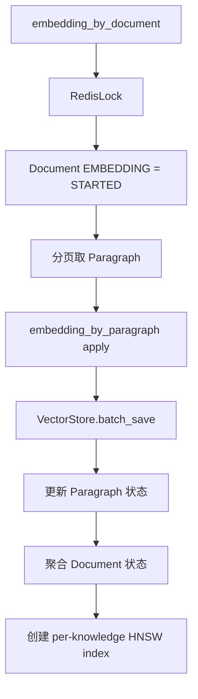
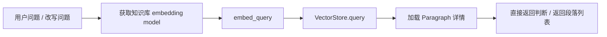
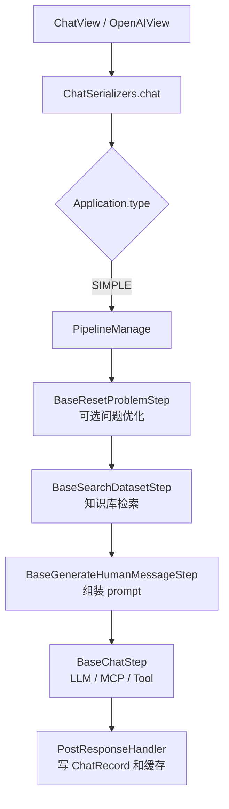
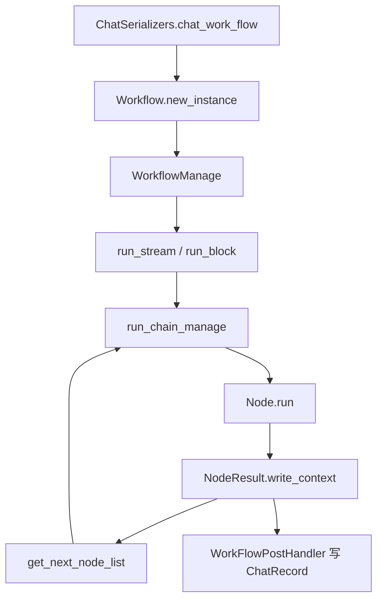

# MaxKB 核心链路拆解：知识入库、检索与对话

## 1. 总览

MaxKB 的核心链路可以拆成三条：



这三条链路对应了 RAG 产品从数据到回答的完整闭环：

1. 文档如何变成可召回知识。
2. 用户问题如何召回可靠上下文。
3. 上下文如何进入模型，并把结果沉淀为可运营数据。

MaxKB 值得学习的地方是，它没有把 RAG 当成一个黑盒函数，而是把每个中间状态都建模、落库、可重试、可取消、可观测。

## 2. 文档入库链路

### 2.1 入口

知识库文档入口集中在 `DocumentView` 和 `DocumentSerializers`：



支持的来源大致包括：

| 来源 | 处理方式 |
| --- | --- |
| 普通文件 | 先解析成段落，再保存 Document 和 Paragraph |
| QA 文件 | 解析成问答型文档，问题进入 `Problem` |
| 表格文件 | 表格解析后形成可检索段落 |
| 网页 | 异步抓取，生成 `web.md`，再切分入库 |
| ZIP | 作为批量文档入口 |
| Workflow 知识写入 | 通过知识库 Workflow 生成文档并写入 |

解析器通过 handle list 组织，例如 HTML、Doc、PDF、Xlsx、Csv、Zip、Text，以及 QA 和 Table 的专用解析 handle。这个设计的好处是新增一种文档类型时，只需要新增一个 handle，而不必重写入库主链路。

### 2.2 入库对象

文档入库后会生成几个核心对象：

| 对象 | 含义 |
| --- | --- |
| `Document` | 文档本体，记录名称、类型、字数、状态、来源元数据 |
| `Paragraph` | 检索最主要的内容单元 |
| `Problem` | 关联问题或扩展问法 |
| `ProblemParagraphMapping` | 问题与段落的关联 |
| `File` | 源文件或文档文件 |
| `Embedding` | 后续向量化生成 |

`DocumentSerializers.Create.save()` 的典型逻辑是：

1. 校验知识库存在。
2. 根据传入 paragraphs 创建 `Document` 和 `Paragraph` 模型。
3. 从段落中提取问题关系，生成 `Problem` 和 mapping。
4. 保存文档、段落、问题、映射。
5. 触发 `DocumentSerializers.Operate.refresh()`。
6. `refresh()` 将文档和段落 embedding 状态置为 pending。
7. 异步派发 `embedding_by_document.delay()`。

这条链路体现了一个重要经验：文档入库和向量化解耦。文档先落库，向量化作为可重试任务异步执行。

### 2.3 网页同步链路

网页文档的同步逻辑更接近真实生产：



这里有几个成熟设计：

- 同步前更新 `SYNC` 状态。
- 重新同步时删除旧段落、旧问题、旧向量，避免脏数据。
- 同步成功后重新触发 embedding。
- 失败状态写入 `status_meta`，便于 UI 反馈。

## 3. 任务状态设计

MaxKB 的 `Document.status` 和 `Paragraph.status` 用一个字符串同时表达多个任务状态。任务类型包括：

| TaskType | 含义 |
| --- | --- |
| `EMBEDDING` | 向量化 |
| `GENERATE_PROBLEM` | 生成关联问题 |
| `SYNC` | 同步 |
| `TOKENIZE` | 分词 / 全文索引更新 |

状态包括：

| State | 含义 |
| --- | --- |
| `PENDING` | 等待 |
| `STARTED` | 执行中 |
| `SUCCESS` | 成功 |
| `FAILURE` | 失败 |
| `REVOKE` | 请求取消 |
| `REVOKED` | 已取消 |
| `IGNORED` | 忽略 |

这个设计的优点是字段少，能在一个对象上表达多个后台任务。缺点是可读性弱，维护者必须理解 `Status` 的索引规则。

迁移建议：

- 如果任务类型固定且数量少，可以学习这种压缩状态设计。
- 如果任务会不断扩展，建议改成独立 `TaskStatus` 表，可读性和扩展性更强。

## 4. 向量化链路

### 4.1 Celery 任务入口

向量化任务在 `apps/knowledge/task/embedding.py` 中定义，核心任务包括：

| 任务 | 作用 |
| --- | --- |
| `embedding_by_document` | 向量化单个文档 |
| `embedding_by_document_list` | 批量文档向量化 |
| `embedding_by_paragraph` | 向量化单段落 |
| `embedding_by_paragraph_list` | 批量段落向量化 |
| `embedding_by_knowledge` | 重建整个知识库向量 |
| `tokenize_by_document` | 更新全文检索向量 |

任务使用 `QueueOnce` 避免重复入队，并在文档级使用 RedisLock，比如 `embedding:<document_id>`。这解决了用户重复点击“重新向量化”或多个任务同时处理同一文档的问题。

### 4.2 ListenerManagement

实际任务编排主要在 `ListenerManagement`：



关键点：

- 文档级任务分页处理段落，每页 5 条。
- 段落任务开始前会检查是否被取消。
- 每段向量化成功或失败都会更新状态。
- 文档状态通过段落状态聚合得到。
- 知识库级重建会先删除旧向量、删除旧索引，再逐文档向量化。

这套设计解决了 RAG 系统最常见的生产问题：文档多、任务慢、用户重复操作、模型报错、中途取消、状态不一致。

## 5. 向量存储与检索索引

### 5.1 Embedding 表

`Embedding` 表不是只保存向量，还保存：

- `source_id`
- `source_type`
- `knowledge_id`
- `document_id`
- `paragraph_id`
- `embedding`
- `search_vector`
- `is_active`
- `meta`

`source_type` 可以区分段落、问题、标题。这样一个段落可以有多种召回入口：

- 段落正文召回。
- 关联问题召回。
- 标题召回。

这对业务很有用，因为用户提问常常并不直接命中文档原文，而是命中一个“问法”。

### 5.2 chunk_data

`BaseVectorStore.chunk_data()` 会根据来源类型处理文本：

- 如果来源是 `PARAGRAPH`，优先使用 `paragraph.chunks`，否则自动切 chunk。
- 如果来源是 `PROBLEM` 或 `TITLE`，通常作为单条文本保存。

这说明 MaxKB 不是把 `Paragraph` 等同于 `Embedding`。一个段落可能产生多个向量行，这让长段落也能被更细粒度召回。

### 5.3 pgvector + PostgreSQL 全文检索

`PGVector` 支持三种检索模式：

| 模式 | 说明 |
| --- | --- |
| `embedding` | 向量相似度检索 |
| `keywords` | PostgreSQL 全文检索 |
| `blend` | 向量与关键词混合检索 |

关键词检索会使用 `Termbase` 领域词，向量检索会按知识库分别查询再合并结果。每个知识库还可以创建局部 HNSW index：

```text
WHERE knowledge_id = '<knowledge_id>'
```

这样做的好处是：同一个 `Embedding` 表承载多个知识库时，查询可以利用特定知识库的部分索引，减少全表向量检索压力。

迁移建议：

- 中小规模 RAG 可以优先学习 MaxKB 的 PostgreSQL + pgvector 方案，业务一致性强。
- 大规模多租户、高 QPS 场景可以保留同样领域模型，但把向量存储替换为独立向量数据库或搜索引擎。

## 6. 检索链路

简单应用和 Workflow 应用最终都调用类似的检索逻辑。

### 6.1 简单应用检索

简单应用使用 `BaseSearchDatasetStep`：



关键逻辑：

- 多个知识库必须使用同一个 embedding 模型，否则抛错。
- 对聊天用户会先过滤授权知识库。
- `re_chat` 时会排除同一问题已经召回过的段落，尝试换一批答案。
- 如果命中文档配置为 `directly_return`，且相似度超过阈值，则只返回最高分段落。
- 如果向量表里存在已删除段落的脏数据，会顺手删除对应向量。

### 6.2 Workflow 检索

Workflow 中的 `search-knowledge-node` 逻辑更灵活：

- 可以直接选择知识库。
- 可以引用上游节点输出的知识库或文档。
- 可以选择检索范围。
- 输出 `paragraph_list`、`data`、`directly_return`，供后续节点引用。

这个设计说明 Workflow 节点不是只返回 UI 文本，而是返回结构化上下文。后续 AI 节点、条件节点、变量节点可以继续使用这些字段。

## 7. 简单应用对话链路

简单应用的对话入口在 `ChatSerializers.chat_simple()`。它构造一个 pipeline：



如果未开启问题优化，则 pipeline 从检索步骤开始。

### 7.1 问题优化

`BaseResetProblemStep` 会取最近几轮历史，把用户的追问补全为完整问题。

例如用户问：

```text
那这个怎么申请？
```

它会结合历史上下文改写为：

```text
XX 政策补贴如何申请？
```

这是 RAG 问答里很实用的步骤，因为向量检索需要完整语义。

### 7.2 Prompt 组装

`BaseGenerateHumanMessageStep` 会把历史对话、检索段落、用户问题组装成 LangChain message list。

关键模板变量：

- `{data}`：检索到的段落内容。
- `{question}`：用户问题或优化后的问题。

如果没有引用段落，会根据 `no_references_setting` 决定：

- 继续让 AI 回答并追问。
- 使用指定回答。
- 或者将空上下文传给模型。

### 7.3 模型回答

`BaseChatStep` 支持：

- 流式和非流式输出。
- 直接返回命中段落。
- 无引用时指定回答。
- LLM 调用。
- MCP 工具调用。
- 自定义工具转 MCP。
- 已发布应用作为工具。
- Skill 工具。
- 工作流工具。
- 长期记忆注入。
- 推理内容 `<think>` 解析。
- token 统计和 `ChatRecord` 写入。

这就是 MaxKB 的对话链路从普通 RAG 变成 Agent 的关键位置。

## 8. Workflow 应用对话链路

当 `Application.type = WORK_FLOW` 时，聊天入口走 `chat_work_flow()`：



Workflow 链路和简单 pipeline 的区别：

| 维度 | 简单应用 | Workflow 应用 |
| --- | --- | --- |
| 执行结构 | 固定线性步骤 | 图结构，节点和边决定执行 |
| 输出 | 主要是模型回答 | 多节点、多视图、多段输出 |
| 上下文 | pipeline context | workflow global / chat / node context |
| 续跑 | 不强调 | 支持从 runtime node 继续 |
| 表单中断 | 不支持 | 支持 form-node 中断等待用户提交 |
| 子应用 | 工具化调用 | application-node 可嵌套调用 |

## 9. ChatRecord 的价值

`ChatRecord` 保存的不只是问答文本，还包括：

- `answer_text_list`
- `message_tokens`
- `answer_tokens`
- `details`
- `improve_paragraph_id_list`
- `run_time`
- `source`
- `ip_address`
- 反馈信息

其中 `details` 是核心。简单应用会记录问题优化、检索、prompt、模型回答的详情；Workflow 应用会记录每个节点运行详情。

这使 MaxKB 可以做：

- 对话回放。
- 问答导出。
- 用户反馈统计。
- 引用段落分析。
- 节点调试。
- token 成本分析。
- 重新从某个节点执行。

迁移建议：AI 应用的日志不要只存 request/response。应该存“运行时结构化详情”，否则后续很难调优。

## 10. 生产化能力

MaxKB 在主链路中体现了很多生产化设计：

| 能力 | 体现 |
| --- | --- |
| 幂等 | Celery `QueueOnce`、RedisLock |
| 取消 | Document/Paragraph 状态置为 `REVOKE`，任务执行中检查 |
| 重试 | 任务失败后状态可重新置 pending 再 refresh |
| 状态聚合 | 段落状态聚合为文档状态 |
| 脏数据清理 | 检索时发现段落不存在会删除向量 |
| 权限过滤 | 检索前过滤授权知识库和工具 |
| 文件追溯 | `File` 保存源文件、文档文件、聊天文件 |
| 直接命中 | 高置信段落可绕过 LLM 直接返回 |
| 多检索策略 | embedding / keywords / blend |
| 成本记录 | token、耗时、模型名写入 details |
| API 兼容 | OpenAI 风格聊天接口 |
| 嵌入集成 | chat embed API 和匿名访问 token |

这些能力都说明：RAG 平台的难点不只是“召回 + 生成”，而是围绕这条链路补齐可运营、可恢复、可集成、可治理的工程能力。

## 11. 迁移到自己业务的建议

### 11.1 第一版不要做太复杂

可以先学习 MaxKB 的简单应用链路：

```text
Application
Knowledge
Document
Paragraph
Embedding
Chat
ChatRecord
```

主流程：

```text
上传文档 -> 切分段落 -> 异步向量化 -> 用户提问 -> 检索 -> 组 prompt -> LLM 回答 -> 写 ChatRecord
```

这已经能覆盖很多内部知识助手和客服问答场景。

### 11.2 第二版补生产能力

优先补：

- 文档任务状态。
- 失败重试。
- 取消任务。
- 检索详情记录。
- 反馈与人工标注。
- 应用发布版本。
- 访问权限和 API key。

### 11.3 第三版再做 Workflow 和 Agent

当业务出现以下需求，再引入 Workflow：

- 需要分支判断。
- 需要表单收集。
- 需要调用多个系统工具。
- 需要子应用协作。
- 需要多步骤审批或生成。
- 需要把知识写回知识库。

不要为了“看起来像 Agent”而过早上图编排。MaxKB 的经验恰好说明，简单 pipeline 和 Workflow 应该同时存在。

## 12. 参考代码位置

本篇主要参考：

- `apps/knowledge/views/document.py`
- `apps/knowledge/serializers/document.py`
- `apps/knowledge/task/embedding.py`
- `apps/common/event/listener_manage.py`
- `apps/common/event/common.py`
- `apps/knowledge/vector/base_vector.py`
- `apps/knowledge/vector/pg_vector.py`
- `apps/knowledge/serializers/common.py`
- `apps/application/chat_pipeline/pipeline_manage.py`
- `apps/application/chat_pipeline/I_base_chat_pipeline.py`
- `apps/application/chat_pipeline/step/reset_problem_step/impl/base_reset_problem_step.py`
- `apps/application/chat_pipeline/step/search_dataset_step/impl/base_search_dataset_step.py`
- `apps/application/chat_pipeline/step/generate_human_message_step/impl/base_generate_human_message_step.py`
- `apps/application/chat_pipeline/step/chat_step/impl/base_chat_step.py`
- `apps/chat/views/chat.py`
- `apps/chat/serializers/chat.py`
