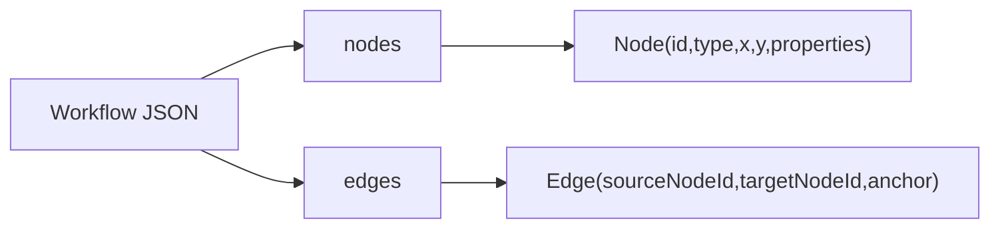
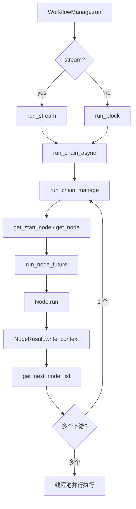
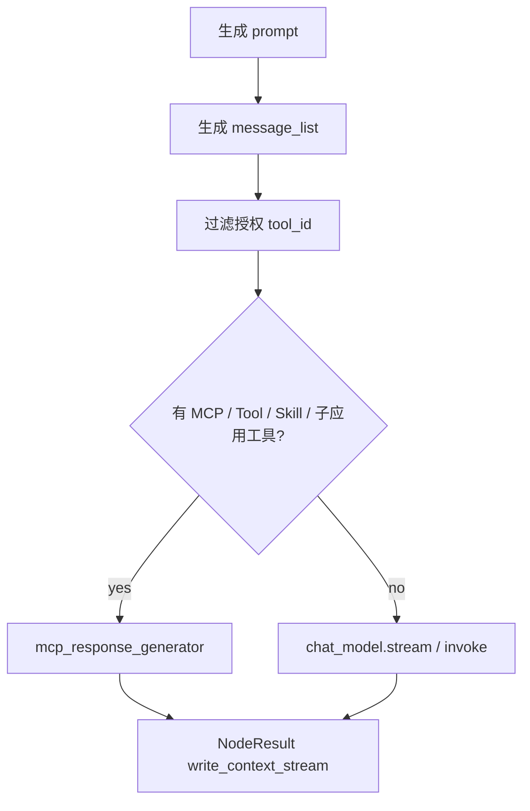
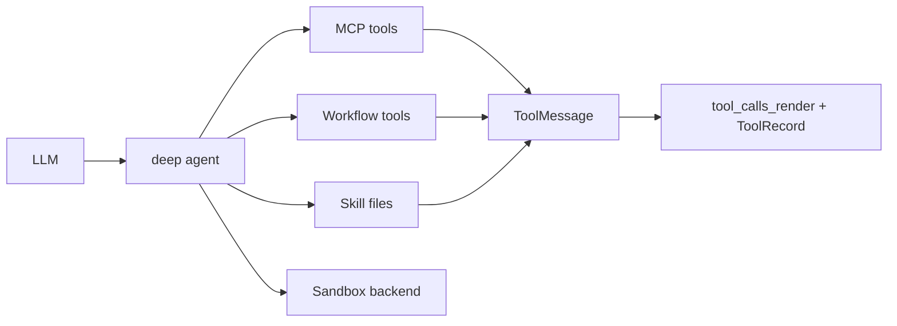
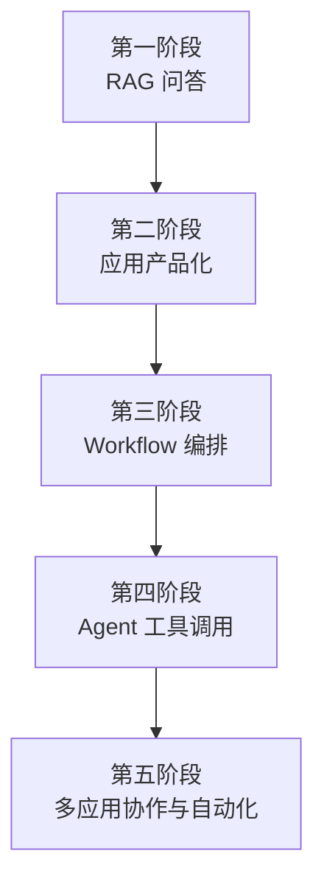

# MaxKB Workflow、Agent 编排与业务迁移手册

## 1. 为什么第三份文档重点看 Workflow / Agent

MaxKB 的第一层价值是 RAG，第二层价值是应用产品化，第三层价值是 Workflow / Agent。

如果只学它的文档问答，会错过更重要的经验：

> MaxKB 把 LLM、知识库、工具、MCP、子应用、表单、变量、循环、多模态都统一到同一个节点执行协议里，让复杂业务可以被“编排”而不是“硬编码”。

这就是它从“知识库问答系统”变成“企业智能体平台”的关键。

## 2. Workflow 的数据结构

MaxKB 的 Workflow 本质是一个图：



`Workflow.new_instance()` 会把 JSON 转成：

- `node_map`
- `up_node_map`
- `next_node_map`

这样执行器可以快速找到某个节点的上游和下游。

Workflow 有多种模式：

| 模式 | 作用 |
| --- | --- |
| `APPLICATION` | 应用工作流 |
| `APPLICATION_LOOP` | 应用循环体内部工作流 |
| `KNOWLEDGE` | 知识库处理工作流 |
| `KNOWLEDGE_LOOP` | 知识库循环体内部工作流 |
| `TOOL` | 工具工作流 |
| `TOOL_LOOP` | 工具循环体内部工作流 |

这是一处很值得学习的抽象：同一套节点协议复用于应用、知识库和工具，只通过 `WorkflowMode` 控制支持范围和上下文差异。

## 3. Workflow 执行器

核心执行器是 `WorkflowManage`。

### 3.1 执行主流程



几个关键点：

- 图执行不是简单 for-loop，而是按边寻找下游节点。
- 多个下游节点会用线程池并行执行。
- 节点执行结果通过 `NodeResult` 写入节点上下文和全局上下文。
- 流式输出由 `NodeChunkManage` 汇聚。
- 执行完成后由 `WorkFlowPostHandler` 统一写入 `ChatRecord`。

### 3.2 流式输出模型

每个节点都有一个 `NodeChunk`。节点产生内容时，不是直接返回 HTTP，而是把 chunk 放进自己的 `NodeChunk`。

`NodeChunkManage` 负责从多个节点的 chunk 队列里取数据，并转换成统一流式响应。

这个设计让 Workflow 可以做到：

- 多节点流式输出。
- 节点进度提示。
- 节点结束事件。
- 子应用节点透传内部节点输出。
- 最终答案按 `answer_text_list` 结构化保存。

### 3.3 runtime_node_id

每个节点运行时会生成 `runtime_node_id`，它由上游节点路径和当前节点 id 计算而来。

它解决的问题是：

- 同一个节点在循环或不同路径下可能运行多次。
- 前端需要知道这次运行的是哪个“运行实例”。
- 重新执行或表单提交时，需要从某个运行节点恢复。

这是复杂 Workflow 产品必须考虑的细节。不要只用静态 `node_id` 代表运行节点。

## 4. Node 协议

所有节点继承 `INode`，核心协议可以概括为：

```text
valid_args()
run()
execute()
NodeResult
save_context()
get_details()
get_answer_list()
```

节点运行后返回 `NodeResult`：

| 字段 | 作用 |
| --- | --- |
| `node_variable` | 写入当前节点上下文 |
| `workflow_variable` | 写入全局上下文 |
| `_write_context` | 定制如何把结果写入上下文和流式输出 |
| `_is_interrupt` | 判断是否中断执行 |

这套协议的价值是：不同节点可以执行完全不同的事情，但对 Workflow 执行器来说都是同一种结果。

## 5. 上下文与变量系统

MaxKB Workflow 有三类上下文：

| 上下文 | 含义 |
| --- | --- |
| `node.context` | 单个节点的运行结果 |
| `workflow.context` | 全局变量 |
| `workflow.chat_context` | 会话级变量 |

节点配置里可以声明字段，`WorkflowManage.init_fields()` 会收集：

- 普通节点字段。
- 全局字段。
- 会话字段。

`generate_prompt()` 通过 Jinja2 模板把这些字段渲染进 prompt。也就是说，用户在画布上写的 prompt 不是静态字符串，而可以引用其他节点的输出。

迁移经验：

- Workflow 的核心不是“节点多”，而是“节点输出能被后续节点稳定引用”。
- 变量引用要有字段声明和运行时上下文，而不是让用户随意拼字符串。
- Prompt 模板要和上下文系统绑定，否则很难维护。

## 6. 节点能力地图

MaxKB 的节点很多，可以按能力家族理解。

| 家族 | 节点 | 能力 |
| --- | --- | --- |
| 起点 | `start-node` | 接收用户问题和初始变量 |
| LLM | `ai-chat-node`, `question-node`, `intent-node`, `parameter-extraction-node` | 对话、问题补全、意图识别、参数抽取 |
| RAG | `search-knowledge-node`, `search-document-node`, `reranker-node` | 知识检索、文档检索、重排 |
| 工具 | `tool-node`, `tool-lib-node`, `tool-workflow-lib-node`, `mcp-node` | 自定义代码、工具库、工作流工具、MCP |
| 子应用 | `application-node` | 调用另一个已发布应用 |
| 控制流 | `condition-node`, `loop-node`, `loop-break-node`, `loop-continue-node` | 分支、循环、跳出、继续 |
| 人机交互 | `form-node`, `reply-node` | 表单中断、直接回复 |
| 变量 | `variable-assign-node`, `variable-aggregation-node`, `variable-splitting-node` | 变量赋值、聚合、拆分 |
| 多模态 | `image-understand-node`, `image-generate-node`, `video-understand-node`, `text-to-video-node`, `image-to-video-node`, `speech-to-text-node`, `text-to-speech-node` | 图像、视频、语音能力 |
| 文档处理 | `document-extract-node`, `document-split-node`, `knowledge-write-node` | 文档抽取、切分、写入知识库 |
| 数据源 | `data-source-local-node`, `data-source-web-node` | 知识库数据源流程 |

这个节点地图说明 MaxKB 的 Workflow 并不只是“LLM chain 可视化”，而是在做业务自动化平台。

## 7. AI Chat 节点

`ai-chat-node` 是 Agent 能力最集中的节点。

它支持：

- 引用模型 id。
- 自定义模型参数。
- 系统 prompt 和用户 prompt。
- 引用历史对话。
- 多模态输入图片和视频。
- MCP server。
- MCP 工具。
- 自定义工具转 MCP。
- Workflow 工具。
- Skill 工具。
- 已发布应用作为工具。
- reasoning content 解析。
- 流式和非流式输出。

关键链路：



这里的经验很重要：Agent 工具调用不是另一个独立系统，而是 AI Chat 节点的一种执行分支。普通聊天和工具增强聊天共用同一个节点协议。

## 8. MCP 与 deepagents

MaxKB 的 MCP 调用集中在 `application.flow.tools`：

1. 构造 MCP server config。
2. 初始化 Skill 文件到临时目录。
3. 创建 `MultiServerMCPClient`。
4. 获取 MCP tools。
5. 加入额外的 Workflow tools。
6. 使用 `create_deep_agent()` 创建 Agent。
7. 使用 `MemorySaver` 做 LangGraph checkpoint。
8. 用 `SandboxShellBackend` 提供受限文件环境。
9. 流式处理 AIMessageChunk 和 ToolMessage。
10. 将工具输入输出渲染成 `<tool_calls_render>`。
11. 保存 `ToolRecord`。



值得学习的细节：

- 工具调用结果不只是给模型继续推理，也会转成可视化消息给前端。
- 工具执行记录保存来源，知道是应用、知识库还是工具流程触发。
- 对流式工具调用做了大量兼容处理，尤其是 Qwen/OpenAI 兼容接口的 tool_call chunk 合并问题。
- Skill 是文件包，运行前解压到临时目录，并注入 `.env` 参数。

迁移经验：

- MCP 可以作为统一工具协议，但要补权限、参数、记录、前端展示。
- Agent 工具调用必须有运行目录和安全边界。
- 多模型 tool call 流式格式差异很大，生产系统需要兼容层。

## 9. 工具系统

MaxKB 的工具有多种类型：

| ToolType | 含义 |
| --- | --- |
| `INTERNAL` | 内部工具 |
| `CUSTOM` | 自定义 Python 代码工具 |
| `SKILL` | Skill 文件包 |
| `MCP` | MCP server 配置工具 |
| `DATA_SOURCE` | 数据源工具 |
| `WORKFLOW` | 工作流工具 |

工具执行时会记录 `ToolRecord`，包含：

- tool_id
- workspace_id
- source_type
- source_id
- meta
- state
- run_time

`tool-lib-node` 会执行自定义代码工具，并把初始化参数、输入参数合并后执行。数据源工具还支持下载文件并上传到知识库。

`get_tools()` 会把 `ToolType.WORKFLOW` 转成 LangChain `StructuredTool`，这意味着一个 Workflow 可以被 LLM 当作工具调用。

这是非常强的抽象：

> Workflow 既可以是应用的主流程，也可以被 Agent 当作工具，还可以作为工具本身被发布。

如果自己的业务要做 Agent 平台，可以优先学习这个思路。

## 10. 子应用编排

`application-node` 可以调用另一个已发布应用。

核心设计：

- 禁止子应用调用当前应用，避免递归。
- 用父 chat_id + 子 application_id 生成稳定子 chat_id。
- 子应用输出的内部节点会被透传到父 Workflow。
- 如果子应用内部出现 `form-node`，父流程会中断等待用户提交。
- 子应用节点保存 `application_node_dict`，用于后续回放和续跑。

这让 MaxKB 可以形成“多 Agent 协作”的雏形：

- 主应用负责路由和编排。
- 子应用负责专业领域问答或流程。
- 子应用也可以继续调用工具和知识库。

迁移建议：在自己的业务里，子应用比“一个超级 Agent 管所有能力”更容易治理。每个子应用有自己的知识库、工具、权限、版本和统计。

## 11. 表单中断与人工参与

`form-node` 的特殊性在于它会让 Workflow 暂停。`is_interrupt()` 会判断：

```text
node.type == 'form-node' and not is_submit
```

这意味着 MaxKB 的 Workflow 不只是自动执行，还能中途要求用户补充结构化信息。

典型场景：

- 办事指南：先问用户身份、地区、材料情况。
- 工单创建：让用户补充联系方式、问题类别。
- 医疗咨询：收集年龄、症状、既往史。
- 企业审批：收集预算、部门、申请理由。

迁移经验：企业 AI 应用不能只靠自由文本对话。很多业务必须在中途收集结构化字段，表单节点是把 AI 和传统业务系统连接起来的关键。

## 12. 长期记忆

MaxKB 在简单聊天和 Workflow 聊天结束后都会异步触发 `extract_long_term_memory`。

长期记忆按：

```text
application_id + chat_user_id
```

保存到 `ApplicationLongTermMemory`。后续模型调用时，系统 prompt 可以把 `{memory}` 替换成用户长期记忆。

这个设计适合：

- 长期客户服务。
- 学习助手。
- 企业员工助手。
- 个性化业务顾问。

但要注意：长期记忆涉及隐私和可解释性。迁移到自己业务时应该补：

- 用户可查看和删除记忆。
- 敏感信息过滤。
- 记忆更新策略。
- 记忆来源记录。

## 13. 业务能力迁移图谱

可以把 MaxKB 的经验迁移成自己的 AI 应用平台路线：



### 第一阶段：RAG 问答

目标是解决“资料问答”。

应该做：

- 知识库。
- 文档。
- 段落。
- 向量。
- 检索。
- 引用。
- ChatRecord。

不要急着做：

- 复杂 Agent。
- 多层 Workflow。
- 自定义工具市场。

### 第二阶段：应用产品化

目标是让 RAG 能被业务使用。

应该做：

- 应用配置。
- 发布版本。
- API Key。
- 嵌入页面。
- 访问限制。
- 对话统计。
- 反馈。
- 模型 provider。

### 第三阶段：Workflow 编排

目标是承载复杂流程。

应该做：

- Node / Edge DSL。
- NodeResult 协议。
- 上下文变量。
- 条件分支。
- 表单中断。
- 流式输出。
- 节点详情记录。

### 第四阶段：Agent 工具调用

目标是让模型能行动。

应该做：

- Tool 表。
- Tool schema。
- ToolRecord。
- MCP 适配。
- Workflow 工具化。
- 权限过滤。
- 工具输出可视化。

### 第五阶段：多应用协作

目标是把专业能力拆成多个可治理应用。

应该做：

- 子应用节点。
- 应用 API key。
- 子应用调用记录。
- 防递归。
- 跨应用上下文传递。
- 子应用表单续跑。

## 14. 可直接复用的方案

| MaxKB 方案 | 可以怎么复用 |
| --- | --- |
| `Application` + `ApplicationVersion` | AI 应用草稿和发布态分离 |
| 简单 pipeline + Workflow 双模式 | 低门槛问答和高级编排并存 |
| `ChatRecord.details` | 结构化记录每一步执行细节 |
| `ResourceMapping` | 做资源依赖、权限、发布、导入导出 |
| `NodeResult` | 统一不同节点的输出协议 |
| `runtime_node_id` | 支持循环、多路径、续跑、表单提交 |
| `ToolRecord` | 治理工具调用和审计 |
| Workflow 工具化 | 让可视化流程也能成为 Agent tool |
| 子应用节点 | 用多个专业应用组合成复杂助手 |
| `directly_return` | 高置信知识直接返回，降低幻觉和成本 |

## 15. 不建议盲目照搬的地方

| 设计 | 风险 | 建议 |
| --- | --- | --- |
| 状态压缩字符串 | 可读性弱，扩展成本高 | 小系统可用，大系统可用独立 task 表 |
| PostgreSQL 同时承载业务和向量 | 简化部署，但大规模检索压力可能大 | 中小规模照搬，大规模拆搜索服务 |
| 自定义 Python 代码工具 | 灵活但安全风险高 | 必须加沙箱、白名单、资源限制 |
| Workflow 节点很多 | 功能强，但学习成本高 | 自己业务先做 8 到 12 个核心节点 |
| 工具和 MCP 入口多 | 能力丰富，但治理复杂 | 先统一工具 schema 和执行记录 |
| 长期记忆自动提取 | 体验好，但隐私风险高 | 增加用户可见、可删、可关闭 |

## 16. 业务场景蓝图

### 16.1 企业内部知识助手

可以学习：

- 知识库 + 文档标签。
- 应用发布。
- 访问限制。
- 对话反馈。
- 引用段落。

不必一开始做：

- MCP。
- 子应用。
- 多模态视频。

### 16.2 客服与售后机器人

可以学习：

- `directly_return` 用于标准答案。
- 问题优化解决多轮追问。
- ChatRecord 导出分析。
- 工具调用工单系统。
- 表单节点收集用户信息。

### 16.3 政务 / 医疗 / 教育问答

可以学习：

- 文档状态和重试。
- 网页同步。
- 引用内容展示。
- 高置信直接返回。
- 多知识库权限。

需要额外补：

- 更严格的审核。
- 敏感问题拒答。
- 答案来源强制展示。

### 16.4 业务流程助手

可以学习：

- Workflow 条件节点。
- 表单节点。
- 工具节点。
- 子应用节点。
- 变量赋值和聚合。

适合流程：

- 工单创建。
- 报销咨询。
- IT 支持。
- 合同初审。
- 销售线索分级。
- 项目立项助手。

### 16.5 数据源自动入库

可以学习：

- 数据源工具。
- 知识库 Workflow。
- 文档抽取、切分、写入。
- KnowledgeAction 记录状态。

适合：

- 定时同步网页。
- 同步内部系统公告。
- 从业务系统导出文件入库。

## 17. 学习 MaxKB 后应该沉淀的知识

可以把 MaxKB 归纳成几个自己的方法论：

### 17.1 AI 应用不是模型调用

AI 应用至少包含：

- 配置。
- 发布。
- 会话。
- 记录。
- 权限。
- 资源依赖。
- 观测。
- 反馈。

### 17.2 RAG 不是检索函数

RAG 至少包含：

- 文档入库。
- 文件追溯。
- 切分。
- 向量化任务。
- 关键词索引。
- 检索策略。
- 引用展示。
- 失败重试。
- 删除清理。

### 17.3 Agent 不是一个超大 prompt

Agent 至少包含：

- 工具 schema。
- 权限。
- 工具执行记录。
- 工具结果展示。
- 模型 tool call 兼容。
- 沙箱。
- 资源映射。

### 17.4 Workflow 不是画布 UI

Workflow 至少包含：

- 图 DSL。
- 节点协议。
- 变量系统。
- 运行时 id。
- 流式事件。
- 中断恢复。
- 运行详情。
- 结果聚合。

## 18. 参考代码位置

本篇主要参考：

- `apps/application/flow/common.py`
- `apps/application/flow/i_step_node.py`
- `apps/application/flow/workflow_manage.py`
- `apps/application/flow/step_node/__init__.py`
- `apps/application/flow/step_node/ai_chat_step_node/impl/base_chat_node.py`
- `apps/application/flow/step_node/search_knowledge_node/impl/base_search_knowledge_node.py`
- `apps/application/flow/step_node/tool_lib_node/impl/base_tool_lib_node.py`
- `apps/application/flow/step_node/application_node/impl/base_application_node.py`
- `apps/application/flow/tools.py`
- `apps/chat/mcp/tools.py`
- `apps/chat/serializers/chat.py`
- `apps/application/models/application.py`
- `apps/tools/models/tool.py`
- `apps/tools/models/tool_workflow.py`
