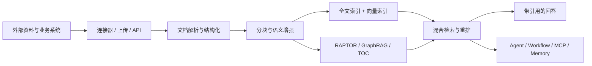
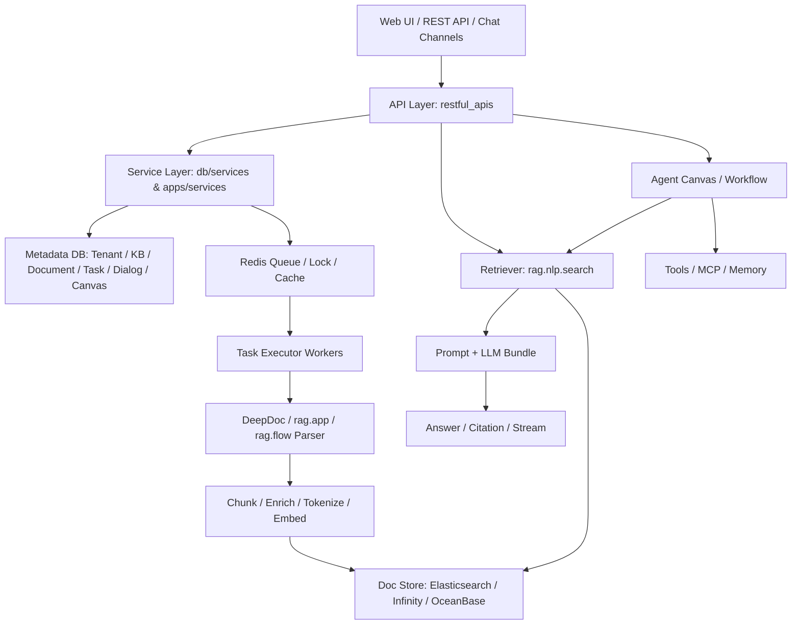

# RAGFlow 代码架构与领域模型拆解

## 阅读定位

这份文档回答三个问题：

1. RAGFlow 的代码架构是怎样分层的？
2. 项目里的核心领域对象是什么，它们如何协作？
3. 从业务角度看，这套架构为什么能支撑复杂 RAG 和 Agent 场景？

它不是逐行源码注释，而是源码级架构拆解。读完后，你应该能知道一条请求大概会进入哪些模块、哪些对象负责状态、哪些模块负责执行、哪些设计值得迁移到自己的业务。

## 一句话定位

RAGFlow 不是一个“上传文档后聊天”的简单项目，而是一个面向企业复杂资料的 RAG 平台，正在向 Agent Context Engine 演进。

它的核心价值链是：

项目的主线不是“模型调用”，而是“知识资产生产、治理、检索、消费”的闭环。

## 仓库目录职责

| 目录 | 主要职责 | 你应该怎么看 |
| --- | --- | --- |
| `api/` | Web API、数据库模型、Service、会话、渠道、鉴权、任务服务 | 控制面入口，负责把外部请求转成领域操作 |
| `rag/` | RAG 核心能力，包含分块模板、检索、任务执行、RAPTOR、GraphRAG、flow pipeline | 数据面核心，文档如何变成可检索知识主要在这里 |
| `deepdoc/` | PDF、Office、表格、图片等复杂文档解析能力 | RAGFlow 区别于普通 RAG demo 的关键基础 |
| `agent/` | Canvas DSL、工作流组件、Agent 组件、工具、MCP 调用 | Agent 和 Workflow 编排核心 |
| `memory/` | 长期记忆存储、检索和消息索引 | 面向长期个性化 Agent 的上下文层 |
| `common/` | 通用设置、常量、文档存储抽象、数据源连接器、Redis、对象存储工具 | 横向基础设施 |
| `web/` | 前端应用 | 用户操作知识库、聊天、Agent 画布等入口 |
| `docs/` | 产品和开发文档 | 理解设计目标和使用场景 |
| `internal/` | Go 相关内部模块和演进中的能力 | 项目工程化演进方向，可后置阅读 |

一个实用阅读顺序是：先看 `api` 的入口和服务，再看 `rag/svr/task_executor.py`、`rag/nlp/search.py`、`api/db/services/dialog_service.py`，最后看 `agent/canvas.py` 和 `agent/component`。

## 分层架构

RAGFlow 的代码大致可以按下面分层理解：

这张图里最关键的分界是：

- `api` 和 `Service` 管业务状态。
- `task_executor` 管异步执行。
- `deepdoc`、`rag.app`、`rag.flow` 管知识生产。
- `rag.nlp.search` 管知识召回。
- `dialog_service` 管问答生成。
- `agent.canvas` 管工作流和 Agent 编排。

## 运行时组件

RAGFlow 上线后不是一个单进程就能解释的系统。它通常包含这些运行时角色：

| 运行时 | 职责 |
| --- | --- |
| API Server | 接收 UI/API 请求，维护业务实体，发起聊天、搜索、任务 |
| Task Executor | 从 Redis 拉任务，执行文档解析、分块、embedding、索引写入 |
| Metadata DB | 保存用户、租户、知识库、文档、任务、对话、画布、模型配置 |
| Redis | 任务队列、取消标记、分布式锁、日志缓存、ID 生成 |
| Object Storage | 保存原文件、图片、缩略图、解析中间产物 |
| Doc Store | 保存 chunk、全文索引、向量字段、聚合字段 |
| Model Providers | chat、embedding、rerank、OCR、image2text、ASR、TTS |
| Langfuse / Logs | 观测模型调用、检索、任务耗时、工具调用轨迹 |

业务启发：企业 RAG 不应该被设计成“同步调用一个向量库”。解析、索引、检索、生成、观测都应该有独立边界。

## 核心领域对象

RAGFlow 的核心领域模型主要在 `api/db/db_models.py`。下面是最需要理解的一组对象。

### Tenant / User

租户和用户是权限、模型配置、知识资产归属的根。

关键作用：

- 决定用户能访问哪些知识库、画布、记忆。
- 决定默认模型配置。
- 隔离索引命名空间。

业务启发：多租户或多部门场景下，权限和模型配置不能只放在 UI 层。

### TenantModelProvider / TenantModelInstance / TenantModel

这是模型提供商抽象。

它把模型拆成：

- provider：如 OpenAI、Azure、SiliconFlow、Builtin。
- instance：同一个 provider 下的不同 API key/base url。
- model：具体模型名和模型类型。

支持的角色包括：

- chat
- embedding
- rerank
- OCR
- image2text
- ASR
- TTS

业务启发：RAG 系统不是一个模型，而是一组模型角色。embedding 模型尤其要和知识库绑定，不能随意混用。

### Knowledgebase

Knowledgebase 是 RAGFlow 的核心知识资产对象，也常被产品层叫 dataset。

它不仅保存名称，还保存：

- `embd_id`：默认 embedding 模型
- `parser_id`：默认解析模板
- `parser_config`：分块、元数据、父子块、表格上下文等配置
- `similarity_threshold`
- `vector_similarity_weight`
- `doc_num`、`token_num`、`chunk_num`
- `permission`
- `graphrag_task_id`、`raptor_task_id`、`mindmap_task_id`

业务启发：知识库不是 collection，而是一个带配置、统计、权限和生命周期的业务产品。

### Document / File / File2Document

`File` 表示文件系统或外部文件对象，`Document` 表示进入知识库后的知识文档，`File2Document` 连接二者。

`Document` 保存：

- 所属知识库
- parser 和 parser_config
- source_type
- 文件名、类型、位置、大小
- token/chunk 数
- 解析进度和进度消息
- content_hash
- run 状态

业务启发：文件不等于知识文档。同一个文件可能被不同知识库、不同解析配置加工成不同知识资产。

### Task

Task 是文档入库和高级索引的执行单元。

关键字段：

- `doc_id`
- `from_page` / `to_page`
- `task_type`
- `priority`
- `progress`
- `retry_count`
- `digest`
- `chunk_ids`

业务启发：文档解析必须任务化。PDF 分页、表格分批、取消、重试、复用、清理都依赖这个对象。

### Dialog / Conversation / API4Conversation

Dialog 是聊天应用配置，Conversation 是会话历史。

Dialog 保存：

- LLM 配置
- prompt_config
- empty_response
- similarity_threshold
- vector_similarity_weight
- top_n/top_k
- rerank_id
- kb_ids
- meta_data_filter
- do_refer

业务启发：问答应用的配置不应该硬编码在 prompt 里，而应该独立成可审计、可评估、可复用的业务对象。

### UserCanvas / CanvasTemplate / UserCanvasVersion

这些是 Agent/Workflow 画布对象。

核心字段是 `dsl`，里面描述组件、上下游、变量、路径和运行状态。

业务启发：Agent 应用一旦进入业务流程，就需要版本、发布、模板和 DSL，而不是一段脚本。

### Memory

Memory 用于长期记忆。

关键字段：

- memory_type：raw、semantic、episodic、procedural 等
- storage_type
- embd_id
- llm_id
- memory_size
- forgetting_policy
- system_prompt / user_prompt

业务启发：长期记忆应该和聊天历史分开。聊天历史是上下文窗口，Memory 是可检索、可淘汰、可治理的用户/Agent 资产。

### Connector / Connector2Kb / SyncLogs

Connector 表示外部数据源，Connector2Kb 把连接器挂到知识库，SyncLogs 记录同步过程。

业务启发：知识库不是只靠上传文件。企业知识通常来自网盘、协作系统、代码仓库、客服系统和数据库。

### Search / EvaluationDataset / EvaluationCase / EvaluationRun

Search 是独立搜索配置，Evaluation 相关表说明项目已经把检索和回答评估作为平台能力考虑。

业务启发：RAG 质量不能只靠主观试问。需要固定问题集、期望文档、检索结果和指标。

## 核心链路总览

RAGFlow 主要有四条链路：

| 链路 | 入口 | 核心模块 | 产物 |
| --- | --- | --- | --- |
| 知识库管理链路 | Dataset API | dataset service、knowledgebase service | Knowledgebase 配置 |
| 文档入库链路 | Document API / Connector | document service、task service、task executor、parser/chunker | chunk 索引 |
| 问答检索链路 | Chat API / Dialog API | dialog service、retriever、prompt generator、LLMBundle | answer + citation |
| Agent 编排链路 | Canvas API / Agent runtime | agent.canvas、components、tools、memory、MCP | workflow events + message |

这四条链路共享同一套知识库、模型、任务和检索能力。

## 控制面与数据面

理解 RAGFlow 时，我建议区分控制面和数据面。

### 控制面

控制面负责“配置和状态”：

- 创建知识库
- 设置 parser_config
- 绑定 embedding/rerank/chat 模型
- 上传和更新文档
- 创建 Dialog
- 创建 Canvas DSL
- 配置 Connector
- 配置 Memory

主要代码在：

- `api/apps/restful_apis`
- `api/apps/services`
- `api/db/services`
- `api/db/db_models.py`

### 数据面

数据面负责“真正处理数据”：

- 解析文件
- 分块
- LLM 增强
- embedding
- 写入 doc store
- 检索和重排
- prompt 组装
- 流式生成
- 工具调用

主要代码在：

- `rag/svr/task_executor.py`
- `rag/app`
- `deepdoc`
- `rag/flow`
- `rag/nlp/search.py`
- `api/db/services/dialog_service.py`
- `agent/canvas.py`
- `agent/component`
- `agent/tools`

业务启发：如果自己做业务系统，控制面和数据面不要混在一起。否则调试、扩容、重试都会变复杂。

## RAGFlow 的平台型设计

RAGFlow 能支撑复杂场景，靠的是这些平台型抽象：

| 抽象 | 解决的问题 |
| --- | --- |
| Knowledgebase | 把知识资产配置化 |
| Document | 把文件加工状态显式化 |
| Task | 把耗时处理异步化 |
| Parser / Chunker | 把文档类型差异显式化 |
| DocStoreConnection | 把搜索引擎和向量库差异抽象掉 |
| LLMBundle | 把多模型角色统一封装 |
| Dialog | 把问答应用配置化 |
| Canvas DSL | 把 Agent 流程图结构化 |
| Tool / MCP | 把外部能力工具化 |
| Memory | 把长期上下文资产化 |
| Connector | 把外部知识源标准化 |

这些抽象比某个具体算法更值得学习。

## 业务价值与适用场景

业务经验需要和架构拆解放在一起看。这样能更清楚地判断：哪些价值来自产品包装，哪些价值来自底层架构能力。

| 业务场景 | 核心痛点 | RAGFlow 对应架构能力 |
| --- | --- | --- |
| 企业内部知识问答 | 制度、流程、SOP 分散且版本多 | Knowledgebase、Document、metadata、citation |
| 客服与售后 Copilot | 回答不一致，资料更新快 | Connector、Dialog、retrieval、empty_response、引用 |
| 合同/法务/合规审查 | 条款长、追溯要求高 | DeepDoc、条款分块、页码坐标、父子块、引用 |
| 研发知识库 | 代码、文档、Issue、API 分散 | Connector、Markdown/代码解析、混合检索 |
| 论文/研报研究 | 长文档、多跳、多章节总结 | RAPTOR、GraphRAG、TOC、rerank |
| Excel/报表问答 | 表格既要检索又要计算 | table chunker、field_map、SQL path |
| 多源知识中台 | 数据在网盘、Notion、Confluence、Slack 等 | common/data_source、checkpoint、sync logs |
| Agent 工作流 | 不只是回答，还要调用工具和保存状态 | Canvas DSL、Tools、MCP、Memory |

## 不适合或需要谨慎的场景

| 场景 | 原因 |
| --- | --- |
| 只是闲聊机器人 | RAGFlow 的平台能力会显得过重 |
| 纯结构化 BI | 传统数仓、指标系统、BI 仍应是主系统 |
| 强事务核心系统 | RAGFlow 更适合作为上下文和辅助决策层 |
| 超小规模 FAQ | 几十条 FAQ 可能轻量搜索即可 |
| 极高合规隔离 | 需要额外设计脱敏、审计、模型边界和权限同步 |

## 架构学习路线

如果你想系统学习这个项目，我建议这样读：

1. 先读 `api/db/db_models.py`，建立对象地图。
2. 再读 dataset/document/chat 的 API 和 service，理解外部入口。
3. 读 `rag/svr/task_executor.py`，理解文档如何变成 chunk。
4. 读 `rag/app` 和 `deepdoc`，理解解析和分块策略。
5. 读 `rag/nlp/search.py`，理解检索如何融合。
6. 读 `api/db/services/dialog_service.py`，理解回答如何生成。
7. 读 `agent/canvas.py`、`agent/component`、`agent/tools/retrieval.py`，理解 Workflow/Agent 编排。
8. 最后读 `common/data_source` 和 `memory`，理解多源同步和长期记忆。

## 本篇参考代码

- `api/db/db_models.py`
- `api/ragflow_server.py`
- `api/apps/restful_apis/dataset_api.py`
- `api/apps/restful_apis/document_api.py`
- `api/apps/restful_apis/chat_api.py`
- `api/apps/services/dataset_api_service.py`
- `api/db/services/document_service.py`
- `api/db/services/dialog_service.py`
- `rag/svr/task_executor.py`
- `rag/nlp/search.py`
- `rag/app`
- `rag/flow`
- `deepdoc`
- `agent/canvas.py`
- `agent/component`
- `agent/tools`
- `memory`
- `common/data_source`
- `common/doc_store/doc_store_base.py`
