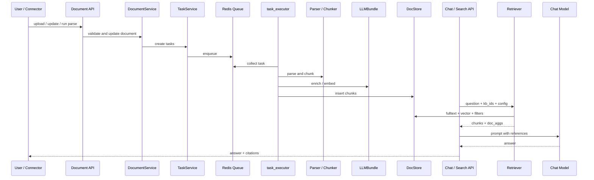
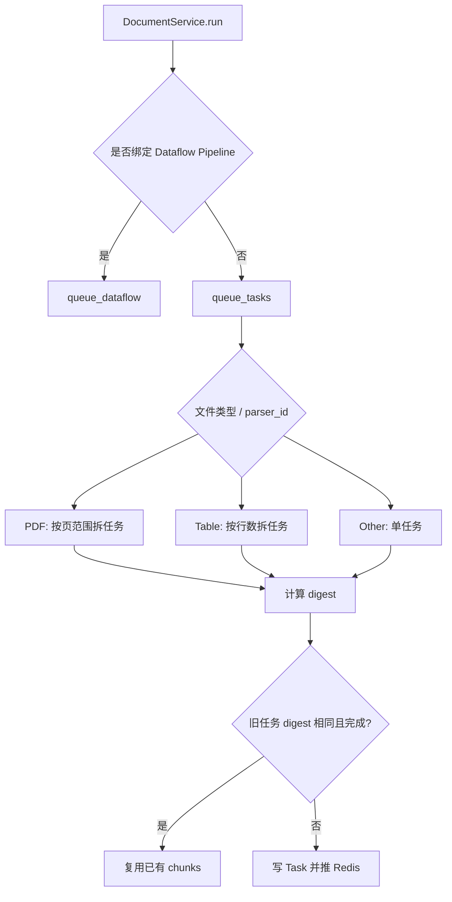
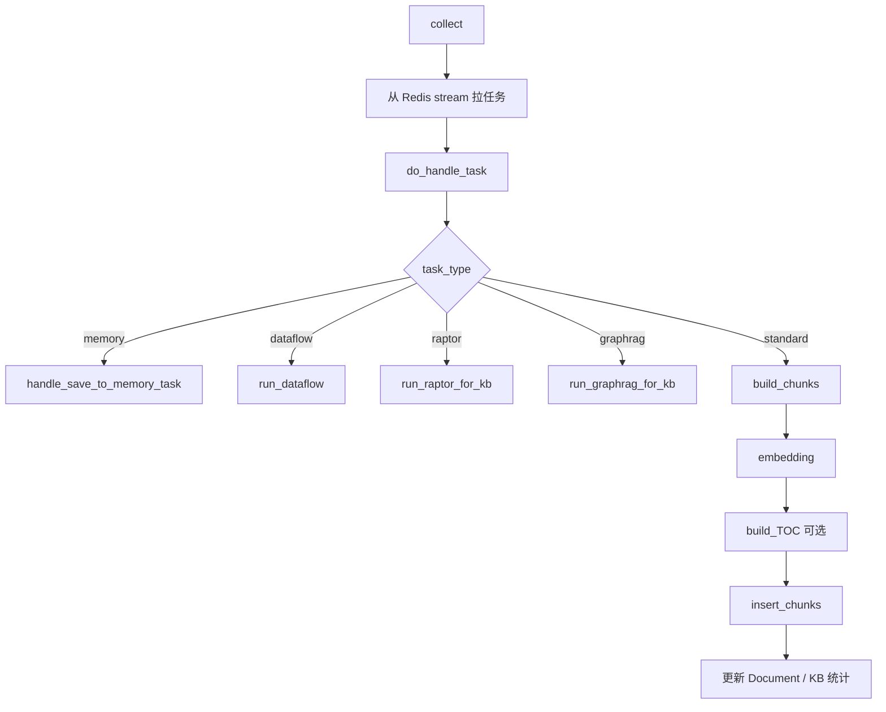
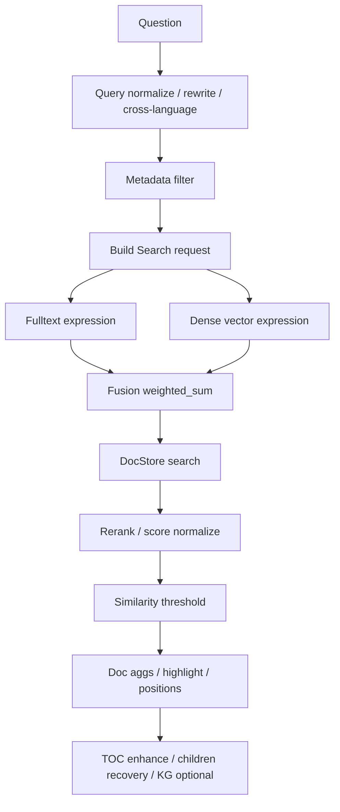
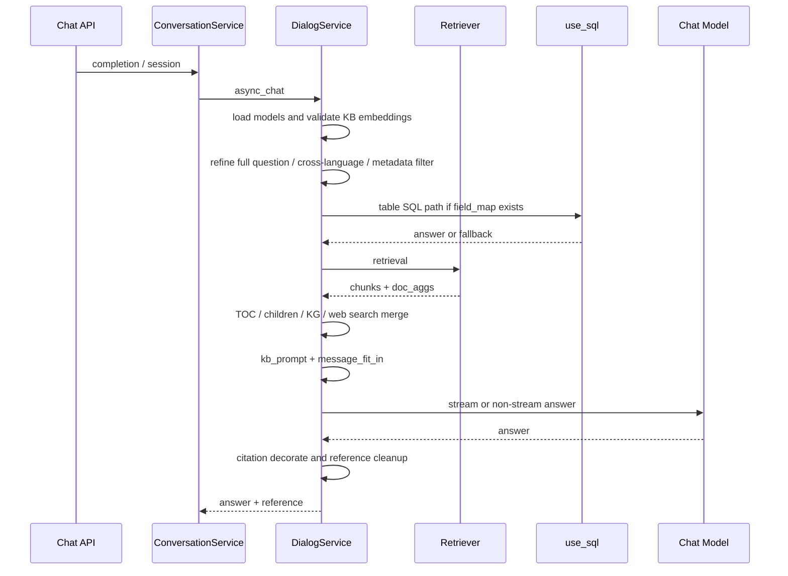

# RAGFlow 主链路源码级拆解：从文档入库到回答生成

## 阅读定位

这份文档聚焦 RAGFlow 最核心的 RAG 链路：

1. 文档如何进入知识库？
2. 如何被拆成任务？
3. 如何解析、分块、增强、embedding、写索引？
4. 检索如何融合全文、向量、重排、元数据、父子块、TOC、KG？
5. Chat 如何组装 prompt、处理引用、流式返回？

这条链路是 RAGFlow 最值得精读的部分。它体现了作者对“生产级 RAG”的理解。

## 总览：一条知识从文件到答案的路径

这条链路里有两个关键转折：

- 入库时，把“文件”变成“可检索的知识单元”。
- 问答时，把“用户问题”变成“证据上下文 + 可引用回答”。

## 第一段：知识库创建与配置

知识库创建主要经过 dataset API 和 dataset service。

### 核心职责

创建知识库时，不只是插入一条 name：

- 校验 embedding 模型是否可用。
- 设置 parser_id。
- 合并 parser_config。
- 处理自动元数据配置。
- 关联 connector。
- 设置 permission。
- 初始化统计字段。

### 关键配置

| 配置 | 作用 |
| --- | --- |
| `embd_id` | 知识库默认 embedding 模型 |
| `parser_id` | 默认解析/分块模板 |
| `parser_config` | 页面范围、chunk 大小、表格上下文、图片上下文、父子块、自动元数据等 |
| `similarity_threshold` | 检索结果过滤阈值 |
| `vector_similarity_weight` | 向量相似度在融合分数中的权重 |
| `pagerank` | 是否引入额外排序特征 |
| `connectors` | 外部数据源绑定 |

### 设计启发

RAGFlow 把知识库当成“知识生产配置”的载体，而不是一个简单 collection。你自己的系统也应该让知识库持有解析策略、索引策略、模型策略和权限策略。

## 第二段：文档进入知识库

文档链路主要由 Document API 和 DocumentService 管理。

### 文档状态

Document 保存了大量运行状态：

- 文件名、类型、来源、位置、大小。
- 所属知识库。
- parser_id 和 parser_config。
- token_num、chunk_num。
- progress、progress_msg。
- content_hash。
- run 状态。

这意味着 RAGFlow 的 Document 不是一个静态文件记录，而是一个“正在被知识化的对象”。

### 文档更新

文档更新时会处理：

- 名称变更：同步更新索引里的文档名字段。
- parser_config 变更：触发重新解析。
- metadata 变更：更新文档元数据。
- enabled/disabled：更新 chunk 的 available 状态。
- 删除：清理 DB、任务、Redis 取消标记、chunk 图片、缩略图、doc store 里的 chunk、metadata、KG 引用。

### 设计启发

文档生命周期必须完整：创建、解析、重建、禁用、删除、清理。很多 RAG demo 只做了创建，没有做删除清理，这会让知识库越来越脏。

## 第三段：任务拆分与入队

文档开始解析后，会进入任务系统。

### 标准路径

### PDF 分片

RAGFlow 会按页范围拆 PDF。默认每个任务一组页，论文等模板可以使用不同页数策略。

目的：

- 避免大 PDF 单任务过慢。
- 支持部分进度。
- 支持失败重试。
- 支持 digest 级别复用。

### 表格分片

表格按行拆分，例如每 3000 行一个任务。

目的：

- 防止大 Excel 单次解析/embedding 过重。
- 保持任务粒度稳定。

### digest 复用

Task digest 会结合：

- 文档内容。
- parser_config。
- 页范围或行范围。
- 相关任务参数。

如果旧任务 digest 相同且已完成，就可以复用 chunk，避免重复解析和 embedding。

### 设计启发

文档入库不应该是“一次性动作”，而应该是可分片、可复用、可重试的任务系统。

## 第四段：task_executor 任务执行器

`rag/svr/task_executor.py` 是入库链路的核心文件。

### 任务入口

主要流程：

### FACTORY 分发

task_executor 里有一个 `FACTORY`，把 parser_id 映射到不同 chunker：

- general / naive
- paper
- book
- presentation
- manual
- laws
- qa
- table
- resume
- picture
- one
- audio
- email
- tag

这个设计说明 RAGFlow 认为“分块模板”是核心业务策略。

### 设计启发

如果你自己的业务有多类资料，不要用一个全局 chunker。应该按文档类型选择策略，并把策略配置化。

## 第五段：解析与分块

解析和分块分散在 `deepdoc`、`rag/app`、`rag/flow`。

### DeepDoc

DeepDoc 主要解决复杂文档理解问题：

- OCR。
- layout 识别。
- 表格结构识别。
- 图片位置与裁剪。
- PDF 坐标。
- 多栏文档。
- 字体和版面问题。

业务意义：它让 RAGFlow 更适合合同、论文、扫描件、报告、PPT、表格这些复杂资料。

### naive chunker

`rag/app/naive.py` 是通用入口之一。它会根据文件类型和配置选择解析路径：

- PDF：DeepDoc、MinerU、Docling、OpenDataLoader、PaddleOCR、PlainText 等。
- DOCX：段落、表格、图片、标题层级。
- Markdown/HTML：保留结构、图片、表格。
- CSV/XLSX：表格解析。
- PPT、JSON、TXT、代码文件等。

### table chunker

表格不是简单文本。RAGFlow 的表格处理包括：

- 每行作为 chunk。
- 表头、合并单元格、多级表头处理。
- 列类型推断。
- 字段角色：索引、向量、两者、元数据。
- field_map 写回知识库配置。
- 可走 SQL 查询路径。

### picture chunker

图片/视频资料会走 OCR 或 VLM：

- OCR 能提取足够文本时，优先文本。
- OCR 不足时，用 image-to-text 模型描述。
- 图片上下文可和附近文本拼接。

### rag.flow pipeline

新版 `rag/flow` 把入库过程组件化：

- File
- Parser
- TokenChunker
- TitleChunker
- Tokenizer
- Extractor

这和 Agent Canvas 类似，都在向“可编排的数据处理图”演进。

### 设计启发

文档解析不是预处理小步骤，而是 RAG 质量的第一决定因素。解析要按格式分治，分块要按业务语义分治。

## 第六段：语义增强

RAGFlow 在写索引前，会对 chunk 做语义增强。

### 增强类型

| 类型 | 作用 |
| --- | --- |
| auto_keywords | 让 chunk 更容易被关键词召回 |
| auto_questions | 生成这个 chunk 可以回答的问题，提高问法匹配 |
| auto_metadata | 抽取业务字段，支持过滤和治理 |
| tag set labeling | 用标签参与排序和过滤 |
| TOC | 给长文档建立目录到 chunk 的映射 |

### 缓存与成本控制

LLM 增强通常成本高，所以 RAGFlow 会做缓存和任务级处理，避免每次重建都重复调用。

### 设计启发

好的 RAG 不只是检索时聪明，也要入库时把知识加工得更容易被找到。对高价值资料，生成问题、关键词、摘要、元数据非常值得。

## 第七段：embedding 与向量字段

embedding 逻辑也在 task_executor 中。

### 关键做法

1. 先对文件名/标题做 embedding。
2. 再对 chunk 正文或自动问题做 embedding。
3. 用文件名/标题向量和正文向量按权重融合。
4. 写入 `q_{dim}_vec` 字段。
5. 批量调用 embedding 模型。

### 为什么要融合标题向量

很多 chunk 正文本身没有完整上下文，标题能补充语义。例如“退款规则”章节下的某个段落可能只写“7 个工作日内处理”，没有出现“退款”这个词。

### 设计启发

embedding 的输入不是越原始越好。你可以把标题、章节路径、问题、关键词融合进向量表达。

## 第八段：父子块、TOC、RAPTOR、GraphRAG

### 父子块

RAGFlow 支持 child chunk 和 mother chunk。

典型逻辑：

- 小 chunk 用于召回。
- 命中后回填父 chunk，用于回答。

这解决了“小块召回准，大块回答全”的矛盾。

### TOC / PageIndex

RAGFlow 可以用 LLM 从文档中抽取目录结构，把目录作为特殊 chunk 存入索引。

检索时：

- 先常规召回。
- 根据 top 文档加载 TOC chunk。
- 让 LLM 判断相关章节。
- 扩展相关 chunks。

### RAPTOR

RAPTOR 用摘要树处理长文档和跨章节问题。

工程保护包括：

- scope 可以是文件级或知识库级。
- 有 checkpoint。
- 可跳过不适合的文档。
- 成功后再清理旧中间结果。

### GraphRAG

GraphRAG 面向实体关系、多跳问题。它不是基础 RAG 的替代，而是高级索引补充。

### 设计启发

高级索引应该分阶段上：

1. 先把基础解析、chunk、检索、引用做好。
2. 长文档先加父子块和 TOC。
3. 跨章节总结再加 RAPTOR。
4. 实体关系和多跳推理再加 GraphRAG。

## 第九段：写入 Doc Store

RAGFlow 通过 doc store 抽象屏蔽不同搜索/向量引擎。

### 抽象能力

`common/doc_store/doc_store_base.py` 定义了：

- index 创建。
- insert/update/delete。
- fulltext expression。
- dense vector expression。
- fusion expression。
- highlight。
- aggregation。
- SQL。

支持的底层包括 Elasticsearch、Infinity、OceanBase 等。

### 写入时的处理

`insert_chunks` 会：

- 创建 index。
- 插入 mother chunks。
- 插入普通 chunks。
- 检查取消。
- 更新 task chunk_ids。
- 失败时清理图片或回滚部分高级索引。
- 更新 Document 和 Knowledgebase 统计。

### 设计启发

向量库不是孤岛。生产 RAG 通常需要全文、向量、聚合、过滤、更新、删除、highlight。抽象层要覆盖完整生命周期。

## 第十段：检索链路

核心检索在 `rag/nlp/search.py`。

### 检索入口

常见入口有：

- Dataset search：用于知识库内测试搜索。
- Dialog chat：用于问答前检索。
- Agent Retrieval tool：用于 Agent 工具检索。
- Search API：独立搜索应用。

### 检索过程

### 分数构成

RAGFlow 检索不是只看 vector score。它会综合：

- term similarity
- vector similarity
- rerank score
- rank feature
- tag score
- pagerank

最终返回 chunk 的：

- similarity
- vector_similarity
- term_similarity
- doc_type
- positions
- image_id
- doc_aggs

### metadata filter

metadata filter 可以来自：

- Dialog 配置。
- Dataset search 请求。
- Retrieval component 参数。
- 自动或半自动元数据过滤逻辑。

业务意义：企业问答经常要限定部门、产品线、区域、日期、文档类型。不能完全靠语义猜。

### retrieval_by_children

当命中 child chunk 时，RAGFlow 可以用 `mom_id` 找回父块，把更完整上下文交给回答模型。

### retrieval_by_toc

TOC 增强用于长文档定位章节。

### KG retrieval

知识图谱检索用于补充实体关系型上下文。

### 设计启发

检索结果应该是可解释的。每个 chunk 为什么被召回，分数来自哪里，属于哪个文档，都要能追踪。

## 第十一段：Chat 回答链路

Chat 主链路主要在 `api/db/services/dialog_service.py`。

### 入口对象

Chat 会用到：

- Dialog：问答应用配置。
- Conversation：历史消息和引用。
- Knowledgebase：知识库配置。
- LLMBundle：chat、embedding、rerank。
- Retriever：检索器。

### 主流程

### 多轮问题改写

当历史消息较多时，RAGFlow 会把当前问题结合上下文改写为完整问题，避免用户说“那它呢？”时检索不到。

### 表格 SQL 路径

如果知识库存在 `field_map`，Chat 会先尝试 `use_sql`：

- 根据问题生成 SQL。
- 注入知识库过滤条件。
- 校验并执行。
- 生成表格回答和引用。
- 如果失败，再 fallback 到普通检索。

业务意义：表格类问题不能只靠向量检索，聚合、排序、筛选更适合结构化查询。

### prompt 组装

RAGFlow 会把检索结果格式化进 prompt，并通过 `message_fit_in` 控制 token 长度。

如果无知识且配置了 empty_response，会返回固定空答案。

### 引用处理

回答后会：

- 修复坏引用格式。
- 过滤未引用文档。
- 移除向量字段。
- 保留文档聚合信息。
- 记录耗时和 token。
- 可写入 Langfuse trace。

### 设计启发

回答不是 LLM 输出就结束。citation、空答案、token 裁剪、引用清理、结果结构化都是生产链路的一部分。

## 第十二段：生产治理细节

RAGFlow 里有不少容易被忽略但非常重要的工程设计。

### 取消

任务和 Canvas 都使用 Redis cancel key。长任务每个阶段检查取消状态。

业务意义：用户上传错文件或参数错了，必须能停。

### 重试

Task 有 retry_count 和最大重试限制。失败进度会写入 progress_msg。

业务意义：模型调用、OCR、外部存储都可能短暂失败。

### 删除清理

删除文档时不只删 DB，还要清理：

- Redis cancel key。
- Task。
- chunk 图片。
- 缩略图。
- doc store chunks。
- metadata。
- KG 引用。

业务意义：不清理就会出现“已删除文档仍被回答引用”。

### digest 复用

相同文件和相同配置可以复用旧 chunk。

业务意义：节省 embedding 和解析成本。

### 统计计数

Document 和 Knowledgebase 都维护 token/chunk/doc 统计。

业务意义：这是运营知识库和成本评估的基础。

## 可迁移的解决方案模式

把主链路拆开后，可以归纳出 10 个可迁移模式：

1. 把知识库当成业务产品，而不是向量表。
2. 文档解析要按资料类型分治。
3. 入库做成任务系统，而不是同步接口。
4. 索引前做语义增强。
5. 检索用多路融合，不迷信单向量。
6. 用父子块和 TOC 修复上下文断裂。
7. 表格走文本检索和结构化查询双通道。
8. 长文档和多跳问题再引入 RAPTOR/GraphRAG。
9. 答案生成要有引用、空答案、结构化输出等契约。
10. 从第一天记录任务、检索、prompt、引用和耗时。

## 不要盲目照搬的点

1. 不要第一版就上全部高级索引。
2. 不要给所有文档都开 LLM 自动增强。
3. 不要为了支持所有连接器拖慢核心场景。
4. 不要让不同 embedding 模型混入同一个知识库。
5. 不要忽略删除清理和权限过滤。
6. 不要先做 Agent，再补知识质量。

## 本篇参考代码

- `api/apps/restful_apis/dataset_api.py`
- `api/apps/services/dataset_api_service.py`
- `api/apps/restful_apis/document_api.py`
- `api/db/services/document_service.py`
- `api/db/services/task_service.py`
- `rag/svr/task_executor.py`
- `rag/app/naive.py`
- `rag/app/table.py`
- `rag/app/picture.py`
- `deepdoc/parser/pdf_parser.py`
- `rag/flow/parser/parser.py`
- `rag/flow/chunker/token_chunker.py`
- `rag/flow/tokenizer/tokenizer.py`
- `rag/flow/extractor/extractor.py`
- `rag/nlp/search.py`
- `common/doc_store/doc_store_base.py`
- `api/apps/restful_apis/chat_api.py`
- `api/db/services/conversation_service.py`
- `api/db/services/dialog_service.py`
- `rag/prompts/generator.py`
