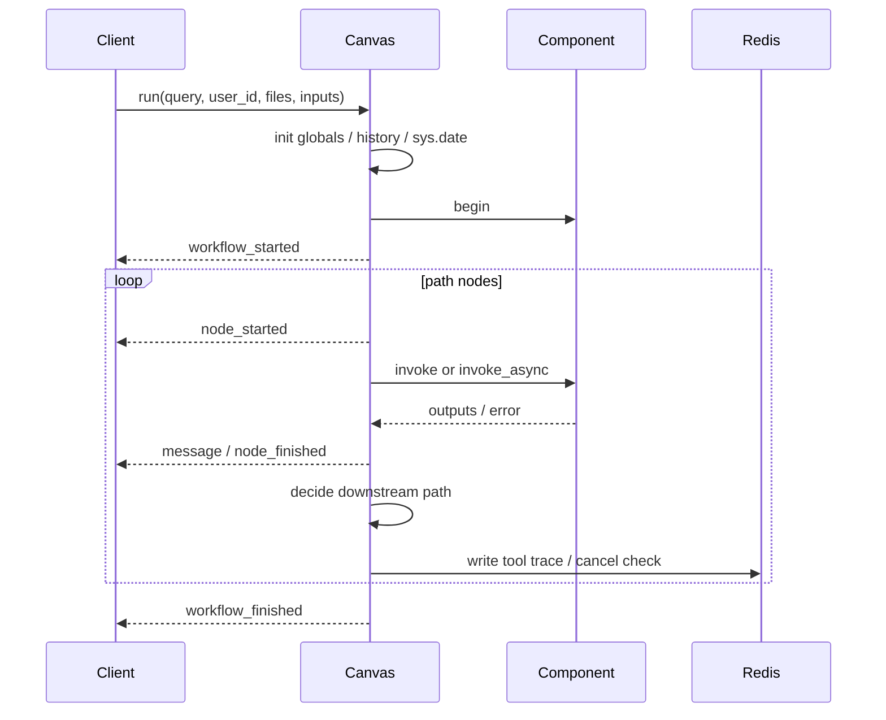
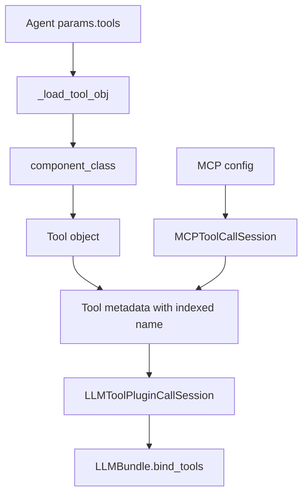
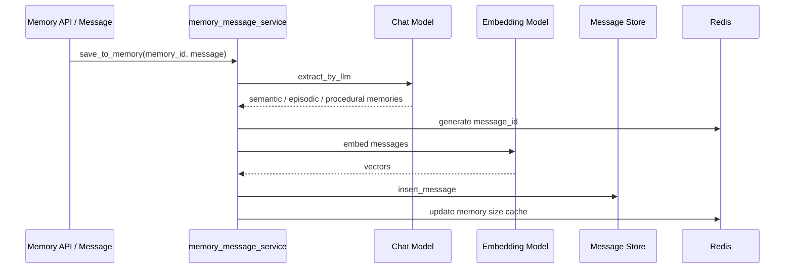
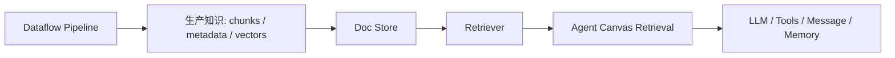

# RAGFlow Workflow / Agent 编排与业务迁移手册

## 阅读定位

这份文档聚焦 RAGFlow 的编排能力：

1. Agent Canvas 的 DSL 是什么结构？
2. Workflow 运行时如何调度组件？
3. Agent 如何绑定工具、MCP、Retrieval、Memory？
4. Dataflow Pipeline 和 Agent Canvas 有什么关系？
5. 这些设计如何迁移到自己的业务系统？

如果第二份文档讲“知识如何被生产和检索”，这一份讲“知识如何被组织成业务流程和 Agent 能力”。

## 两套编排：Agent Canvas 与 Dataflow Pipeline

RAGFlow 里有两类图式编排：

| 编排类型 | 主要目录 | 目标 | 运行时 |
| --- | --- | --- | --- |
| Agent Canvas | `agent/canvas.py`、`agent/component`、`agent/tools` | 面向用户请求的对话、工具调用、业务流程 | Canvas |
| Dataflow Pipeline | `rag/flow`、`rag/svr/task_executor.py` | 面向文档入库的数据处理流程 | Pipeline |

它们的共同点：

- 都是组件图。
- 都有 DSL。
- 都有参数对象和组件对象。
- 都有运行路径。
- 都会记录进度或事件。

不同点：

- Agent Canvas 面向在线交互。
- Dataflow Pipeline 面向离线或异步入库。

这说明 RAGFlow 的作者在抽象上有一个一致判断：复杂流程应该图式化、组件化、可观察，而不是堆成一个长函数。

## Canvas DSL 结构

Canvas 的 DSL 大致包含：

```json
{
  "components": {
    "begin": {
      "obj": {
        "component_name": "Begin",
        "params": {}
      },
      "downstream": ["retrieval_0"],
      "upstream": []
    },
    "retrieval_0": {
      "obj": {
        "component_name": "Retrieval",
        "params": {}
      },
      "downstream": ["llm_0"],
      "upstream": ["begin"]
    }
  },
  "history": [],
  "path": ["begin"],
  "retrieval": {"chunks": [], "doc_aggs": []},
  "globals": {
    "sys.query": "",
    "sys.user_id": "",
    "sys.files": [],
    "sys.history": []
  },
  "variables": {}
}
```

核心字段：

| 字段 | 作用 |
| --- | --- |
| `components` | 所有节点，每个节点包含组件类型、参数、上下游 |
| `path` | 当前执行路径 |
| `history` | 对话历史 |
| `retrieval` | 当前轮检索引用 |
| `globals` | 系统变量 |
| `variables` | 环境变量或用户配置变量 |
| `memory` | 当前画布运行产生的记忆信息 |

## Graph.load：组件如何实例化

Canvas 继承自 Graph。Graph 初始化时会：

1. 读取 DSL。
2. 迁移旧 DSL 到新结构。
3. 遍历 components。
4. 根据 `component_name + "Param"` 找到参数类。
5. 用 params 更新参数对象。
6. 调用 `param.check()` 校验配置。
7. 根据 component_name 实例化组件对象。

关键机制在 `agent/component/__init__.py`：

- 动态导入 `agent.component`
- 动态导入 `agent.tools`
- 动态导入 `rag.flow`
- 通过 `component_class` 统一查找组件类

业务启发：如果你要做自己的低代码 Agent/Workflow 平台，DSL 到组件对象的映射必须可扩展，不能写死在一个 if/else 里。

## 变量系统

Canvas 支持多类变量引用。

| 变量形式 | 含义 |
| --- | --- |
| `{sys.query}` | 当前用户问题 |
| `{sys.user_id}` | 当前用户 |
| `{sys.files}` | 用户上传文件解析结果 |
| `{sys.history}` | 对话历史 |
| `{env.xxx}` | 画布环境变量 |
| `{component_id@output}` | 某个组件的输出 |
| `{component_id@output.field}` | 某个组件输出对象里的字段 |

变量解析支持：

- 字符串替换。
- JSON 序列化。
- partial 流式输出。
- 嵌套字段访问。
- 列表索引访问。

业务启发：Agent 工作流真正难的是上下文传递。变量系统是组件解耦的核心。

## Canvas.run 执行流程

Canvas 的在线运行在 `Canvas.run`。

### 整体流程



### 运行时事件

Canvas 会向调用方持续 yield 事件：

| 事件 | 触发时机 | 内容 |
| --- | --- | --- |
| `workflow_started` | 工作流开始 | 输入信息 |
| `node_started` | 节点开始 | component_id、name、type、thoughts |
| `message` | Message 节点或流式输出 | 内容、音频、think 标记 |
| `message_end` | 消息结束 | reference、attachment、status |
| `node_finished` | 节点结束 | 输入、输出、错误、耗时 |
| `user_inputs` | 需要用户补充输入 | 表单字段和提示 |
| `workflow_finished` | 工作流结束 | 最终输出、耗时 |

业务启发：工作流要对前端友好，不能只返回最终结果。事件流能支撑进度、调试、流式输出和人机协作。

## 路径调度机制

Canvas 的执行不是简单线性链。它会根据组件类型调整 path。

| 组件类型 | 调度行为 |
| --- | --- |
| Begin | 起点 |
| Message | 产生流式消息，并带 reference |
| Switch / Categorize | 根据条件选择 `_next` |
| Iteration | 进入 IterationItem |
| Loop | 进入 LoopItem，直到退出 |
| ExitLoop | 跳出 Loop |
| UserFillUp | 暂停工作流，等待用户补充输入 |
| 普通组件 | 追加 downstream |
| 组件异常 | 根据 exception_goto 或 default_value 分支 |

业务启发：Agent 工作流不只是 DAG。真实业务需要分支、循环、人工补充、异常跳转。

## 组件模型

组件大多继承 ComponentBase，参数继承 ComponentParamBase。

### ComponentParamBase

参数对象负责：

- 保存 inputs/outputs。
- 校验参数。
- 更新配置。
- 处理废弃参数。
- 记录重试、异常默认值、异常跳转。

### ComponentBase

组件对象负责：

- 输入提取。
- 变量替换。
- 输出保存。
- 异常处理。
- 取消检查。
- thoughts。

### 设计启发

把“参数”和“执行”分开是很有价值的。参数适合存 DSL 和做校验，组件适合运行时逻辑。

## 关键组件拆解

### Begin

Begin 是工作流起点，负责接收用户输入、文件和预设参数。

业务作用：把用户请求标准化成 workflow 的 sys 变量。

### Retrieval

Retrieval 是 Agent 里的知识检索组件，也是 Tool。

它可以从两个地方检索：

- dataset
- memory

检索 dataset 时会：

1. 解析 dataset ids。
2. 校验知识库 embedding 模型一致。
3. 绑定 embedding 模型。
4. 可选绑定 rerank 模型。
5. 应用 metadata filter。
6. 可做跨语言改写。
7. 调用 `settings.retriever.retrieval`。
8. 可执行 TOC enhance。
9. 可执行 children recovery。
10. 可执行 KG retrieval。
11. 把结果写入 Canvas reference。
12. 输出 `formalized_content` 和 `json`。

业务作用：让 Agent 不直接依赖底层检索细节，而是通过标准工具获取上下文。

### LLM

LLM 组件负责：

- 根据 llm_id 绑定模型。
- 解析 sys_prompt 和 prompts。
- 处理视觉文件。
- 注入历史消息。
- 如果已有 retrieval reference，加入 citation prompt。
- 支持流式输出。
- 支持结构化输出提示。

业务作用：把模型调用封装成可配置节点。

### Message

Message 负责向用户输出内容。

它支持：

- 变量替换。
- partial 流式内容。
- async generator。
- 下载附件。
- Jinja2 sandbox。
- TTS auto_play。
- 将消息保存到 Memory。

业务作用：Message 不只是显示文本，它是工作流对外响应的边界。

### Switch

Switch 根据条件选择下一批组件。

支持：

- contains / not contains
- start with / end with
- empty / not empty
- = / ≠ / > / < / ≥ / ≤
- and / or

业务作用：做业务分支，例如“是否需要审批”“是否缺少参数”“是否进入人工确认”。

### Iteration / Loop

Iteration 用于遍历数组，Loop 用于循环执行并维护循环变量。

业务作用：处理批量文档、批量客户、批量工具调用、多轮修正等场景。

## Agent with Tools

`agent/component/agent_with_tools.py` 是 Agent 编排的重点。

Agent 同时继承：

- LLM
- ToolBase

这意味着它既可以作为一个可执行 LLM 节点，也可以作为上级 Agent 的工具。

### 工具加载

Agent 初始化时会：

1. 遍历参数里的 tools。
2. 根据 component_name 动态加载工具组件。
3. 给工具名加 index，避免重名。
4. 收集 OpenAI-style tool metadata。
5. 加载 MCP server 工具。
6. 创建 LLMToolPluginCallSession。
7. 如果模型支持 tool call，就 bind_tools。



### 结构化输出

Agent 支持输出 schema：

- 从 params.outputs 里取 structured schema。
- 生成 structured_output_prompt。
- 要求模型只输出 JSON。
- 用 json_repair 解析。
- 失败后再次要求格式化。

业务启发：业务 Agent 经常要返回结构化结果，例如合同风险点、客户分级、表单字段。schema 校验是必须的。

### 流式工具调用

Agent 如果下游有 Message，且没有结构化输出要求，会把内容设置成 partial，交给 Message 流式消费。

它还会：

- 多轮问题优化。
- 根据 reference 加 citation prompt。
- 收集工具产物。
- 把图片/文件 artifact 追加到答案。
- 通过 callback 记录工具调用轨迹。

业务启发：工具调用过程要能被追踪，否则业务排障时很难知道 Agent 做了什么。

## MCP 编排

Agent 支持 MCP server：

- 从 MCPServerService 读取 server 配置。
- 创建 MCPToolCallSession。
- 把 MCP 工具 metadata 转成模型可绑定的 tool schema。
- 按工具名绑定到 Agent。

业务启发：MCP 的价值是把外部系统能力标准化。对企业来说，这可以连接 CRM、工单系统、数据库、审批系统、内部 API。

## Retrieval 作为 Agent 工具

Retrieval 工具是 RAGFlow Agent 编排里最重要的工具之一。

它把第二份文档里讲的检索主链路包装成 Agent 可调用工具：

- Agent 不需要知道全文、向量、rerank、TOC、KG 细节。
- 工具输出既有格式化文本，也有 JSON chunks。
- 检索结果会进入 Canvas reference，最终 Message 可以带引用。

业务启发：在自己的 Agent 系统里，RAG 检索应作为标准上下文工具，而不是散落在 prompt 拼接里。

## Memory 编排

Memory 是 RAGFlow 面向长期上下文的重要能力。

### 保存流程



### 记忆类型

Memory 支持多种类型标记：

- raw
- semantic
- episodic
- procedural

如果是 raw 类型，只保存原始对话。如果是其他类型，会先让 LLM 从对话中抽取更稳定的记忆。

### 检索流程

Memory 检索会：

1. 根据 memory_id、agent_id、session_id、user_id 过滤。
2. 对 query 做 embedding。
3. 构造全文匹配。
4. 用 weighted_sum 融合全文和向量。
5. 返回 top_n 记忆。

### 遗忘策略

Memory 有 memory_size 限制和 forgetting_policy。目前可见策略中 FIFO 用于超限删除。

业务启发：长期记忆不是聊天历史。它应该可抽取、可检索、可过滤、可淘汰、可关闭。

## Dataflow Pipeline

Dataflow Pipeline 在 `rag/flow/pipeline.py`。

### 运行逻辑

Pipeline 也继承 Graph，但用于文档入库。

运行时：

1. 从 File 组件开始。
2. 根据 downstream 执行 Parser、Chunker、Tokenizer、Extractor 等组件。
3. 每个组件写 progress log。
4. 如果绑定 document，会更新 TaskService 进度。
5. 最后输出 chunks/json/markdown/text/html。
6. task_executor 的 `run_dataflow` 会把输出规范化并写入 doc store。

### 组件职责

| 组件 | 职责 |
| --- | --- |
| File | 获取文件名和文件对象 |
| Parser | 按格式解析 PDF、Word、表格、图片、音频等 |
| TokenChunker | 按 token、delimiter、children delimiter 分块 |
| TitleChunker | 按标题层级或分组分块 |
| Tokenizer | 生成全文检索字段和 embedding 向量 |
| Extractor | 用 LLM 抽取字段或 TOC |

业务启发：文档入库也应该可编排。不同业务资料需要不同数据流，而不是全走一条固定 pipeline。

## Agent Canvas 与 Dataflow 的关系



Dataflow 负责知识生产，Agent Canvas 负责知识消费。

如果把它迁移到自己的系统，可以理解为：

- 数据工程侧：负责把业务资料变成可检索知识。
- Agent 应用侧：负责把知识、工具、记忆编排成业务流程。

两者之间用 Retriever 和 DocStore 解耦。

## 工作流设计可以学什么

### 1. 组件要有明确输入输出

每个组件都通过 inputs/outputs 和变量系统交互，而不是互相直接调用内部状态。

### 2. 事件流要先设计

RAGFlow 的 Canvas 会持续输出 workflow、node、message 事件。这让前端能显示执行过程，也方便调试。

### 3. Retrieval 应该成为标准工具

Agent 应该通过标准 Retrieval tool 获取知识，而不是每个 Agent 自己拼检索逻辑。

### 4. Memory 应该独立成资产

记忆需要独立存储、检索、权限和淘汰策略。

### 5. MCP 是外部工具标准化入口

当业务系统很多时，MCP 可以成为 Agent 调用内部系统的统一接口。

### 6. Dataflow 和 Agent 要分层

入库质量不稳定时，Agent 再强也会失败。先稳定知识生产，再做复杂 Agent。

## 业务迁移路线

Workflow 和 Agent 的编排设计，最终需要落到业务迁移路线里。下面这部分把项目里的编排经验转成可执行的落地步骤。

### 第 0 步：定义业务问题

先明确：

- 谁使用？
- 查什么资料？
- 错答风险是什么？
- 是否需要引用？
- 是否需要执行动作？
- 是否需要人工确认？

不要从“我要做一个 Agent”开始，而要从业务流程中的上下文缺口开始。

### 第 1 步：盘点知识资产

建议建立知识资产表：

| 资产类型 | 来源 | 更新频率 | 权限要求 | 主要格式 | 业务价值 | 风险 |
| --- | --- | --- | --- | --- | --- | --- |
| 产品手册 | 网盘 / Confluence | 每周 | 全员 | PDF / DOCX | 高 | 中 |
| 售后工单 | Zendesk / DB | 实时 | 客服部门 | 文本 / 表格 | 高 | 高 |
| 合同模板 | 法务系统 | 月度 | 法务 / 销售 | DOCX / PDF | 高 | 高 |
| 运营报表 | 数据库 / Excel | 每日 | 部门隔离 | Excel / SQL | 中 | 中 |

### 第 2 步：先做 Context Layer

Context Layer 包括：

- 文档解析。
- chunk 和 metadata。
- 检索评测。
- 引用。
- 权限过滤。
- Memory。

只有 Context Layer 稳，Agent 才值得做。

### 第 3 步：再做 Action Layer

Action Layer 包括：

- CRM 查询。
- 工单创建。
- 邮件生成。
- 审批提交。
- SQL 查询。
- 报告生成。
- 文件导出。

这些动作可以通过 tool、MCP 或内部 API 暴露。

### 第 4 步：定义回答与行动契约

企业 Agent 要有明确契约：

- 引用来源。
- 找不到资料时不编造。
- 高风险动作必须人工确认。
- 结构化输出必须校验。
- 关键动作要记录日志。
- 工具失败要有 fallback。

### 第 5 步：分阶段建设

| 阶段 | 目标 | 能力 |
| --- | --- | --- |
| MVP | 可信问答 | 上传、解析、检索、引用、反馈 |
| 业务可用 | 部门真实使用 | 权限、元数据、异步任务、重试、删除清理 |
| 知识运营 | 持续提升质量 | 连接器、自动增强、评测集、观测 |
| Agent 化 | 从回答到动作 | Workflow、Memory、MCP、人工确认、结构化输出 |

## 四个可直接套用的业务蓝图

### 蓝图 A：企业制度助手

目标：员工问制度、流程、报销、假期、IT 支持等问题。

对应 RAGFlow 能力：

- Knowledgebase：按部门或制度类型组织。
- Document parser：标题层级和条款。
- Retrieval：全文 + 向量 + rerank。
- Dialog：empty_response 和引用。
- Metadata：部门、生效日期、版本。

优先事项：文档版本治理，不要让旧制度被召回。

### 蓝图 B：客服 Copilot

目标：客服根据产品手册、FAQ、售后政策、历史工单生成答复草稿。

对应 RAGFlow 能力：

- Connector：同步手册、FAQ、工单。
- Retrieval：多路召回和 query rewrite。
- Memory：保存客户偏好和已确认回复。
- Agent：检索知识后生成回复，必要时调用工单系统。
- Message：人工确认后再发送。

优先事项：答案一致性和人工确认闭环。

### 蓝图 C：合同审查助手

目标：定位条款、识别风险、生成审查摘要。

对应 RAGFlow 能力：

- DeepDoc：保留页码、条款、表格。
- Chunker：条款级 + 父子块。
- Extractor：结构化抽取付款、违约、续约、保密、排他。
- Citation：每个风险点引用原文。
- Agent：按审查清单逐项检查。

优先事项：引用和结构化输出优先于自动决策。

### 蓝图 D：运营表格问答

目标：用自然语言查询业务表格和报表。

对应 RAGFlow 能力：

- Table chunker：行级知识。
- field_map：字段和类型。
- use_sql：聚合、筛选、排序。
- Retrieval fallback：解释字段和口径。
- Metadata：时间、地区、业务线。

优先事项：表格要走结构化查询和文本检索双通道。

## 常见反模式

1. Agent 先行，知识上下文不稳。
2. 所有文档统一按固定 tokens 切分。
3. 没有检索评测集，只看聊天主观体验。
4. 文档删除后不清理索引。
5. 一个知识库混用不同 embedding 模型。
6. 表格只转 Markdown，不支持字段过滤和聚合。
7. 没有引用，用户无法信任答案。
8. 工具调用没有 trace。
9. Memory 直接等同于聊天历史。
10. 高风险动作没有人工确认。

## 自己实现时可以抽象哪些模块

| 模块 | 最小职责 |
| --- | --- |
| Knowledge Service | 管知识库、文档、元数据、权限 |
| Ingestion Worker | 解析、分块、增强、embedding、索引 |
| Retriever | 统一封装全文、向量、重排、过滤 |
| Prompt Service | 组装 prompt、裁剪 token、引用格式 |
| Agent Runtime | DSL、组件、变量、事件流 |
| Tool Registry | 工具元数据、调用、trace、鉴权 |
| Memory Service | 记忆抽取、embedding、检索、淘汰 |
| Evaluation Service | 问题集、召回评测、回答评测 |
| Observability | 任务、检索、prompt、工具、模型调用日志 |

## 本篇参考代码

- `agent/canvas.py`
- `agent/component/__init__.py`
- `agent/component/base.py`
- `agent/component/llm.py`
- `agent/component/message.py`
- `agent/component/switch.py`
- `agent/component/iteration.py`
- `agent/component/loop.py`
- `agent/component/agent_with_tools.py`
- `agent/tools/retrieval.py`
- `common/mcp_tool_call_conn.py`
- `api/db/services/mcp_server_service.py`
- `api/apps/restful_apis/memory_api.py`
- `api/db/joint_services/memory_message_service.py`
- `memory/services/messages.py`
- `rag/flow/pipeline.py`
- `rag/flow/file.py`
- `rag/flow/parser/parser.py`
- `rag/flow/chunker/token_chunker.py`
- `rag/flow/tokenizer/tokenizer.py`
- `rag/flow/extractor/extractor.py`
- `rag/svr/task_executor.py`
