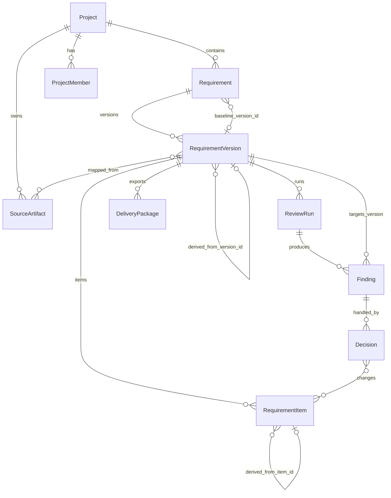
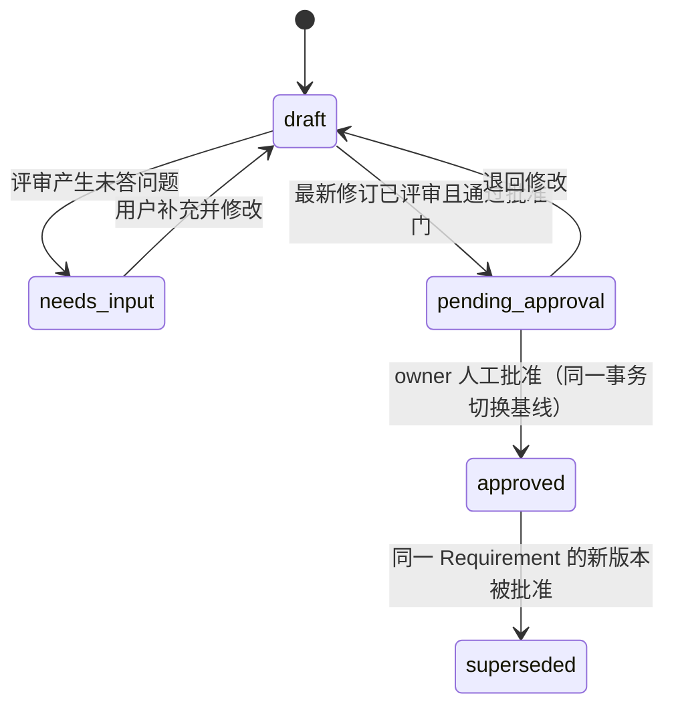

# 需求评审助手产品方向纠正计划

> 本文是产品方向纠正的唯一临时执行计划，不再复制第二份计划。A–D 组全部完成且真源、项目篇与课程骨架已验收后删除，不进入长期文档集。

## 0. 结论

- 技术路线（RAG → Agent → Multi-Agent）与第 1–16 节没有跑偏；本轮 A–D 文档纠偏不改 `source/` 现有代码，后续产品实现仍须按新真源对齐。
- 跑偏的是产品层：`SPEC.md`、两个项目篇、起草基准把产品收窄成 `ReviewRequest → ReviewReport` 一次性运行。
- 性质：中等规模重构。重写产品对象、领域 Schema、17 节之后的产品化路径和第二阶段领域场景；不重写机制。
- 现在正处于"通用 RAG 链 → 产品领域建模"的边界，是修改成本最低的时间点。

## 1. 产品目标（拟写入 SPEC §1）

需求评审助手是以需求基线为核心的需求定义、评审与交付工作台。它接收模糊想法、已有 PRD 或对已有需求的变更，结合内部业务规则、历史资料和项目内已批准的需求，把输入收敛为结构化、可追溯、经过逐项决策、可批准、可版本化的需求基线，并导出人和 Agent 都能读懂的需求交付包。

核心不变量（provenance / citation / decision 三分）：

- 每个 RequirementItem 都必须保留来源与形成过程（provenance：用户输入 / 导入 PRD / AI 建议 / 派生自旧版本）。
- 事实性主张及引用外部规则、历史资料或已批准需求的 Finding 必须回到合格 Citation。
- 基于当前需求内部缺失、结构或矛盾的 Finding 必须回到当前 RequirementVersion 的 item / section / document locator，不伪造外部 Citation。
- 用户提出或批准的产品意图由 Decision 提供权威来源（decision），不能伪装成外部 Citation，也不因缺少 Citation 而被拒绝。
- 每个 Finding 都必须有可定位依据，但“可定位依据”不等于“外部 Citation”。
- 评审贯穿全过程：证据不足时拒绝强事实结论并转成用户可回答的问题，不拒绝由人明确做出的产品选择。

第一阶段用固定 RAG 建立闭环；第二阶段在同一对象模型上让 Agent 在用户裁决下推动收敛，并分析变更影响。

## 2. 已锁定的决定

1. 对象主链：Project → Requirement → RequirementVersion → RequirementItem；一个 Project 有多个 Requirement。Requirement 是一个可独立版本化、批准和交付的稳定需求容器，可对应一个功能点或一个可独立交付的需求主题，不与单个 RequirementItem 混用。
2. 基线在 Requirement 粒度（`baseline_version_id`）。全产品基线是明确非目标：不预建对象、表、API 或目录。
3. 两个入口：从零创建（固定表单 + 固定步骤生成，不是对话式 Agent）、导入 PRD；都归一为条目。动态追问循环属于第二阶段。
4. Project Brief 是 Project 上的独立字段集合，不伪装成 Requirement；Project 维护单调递增的 `brief_revision`，ReviewRun 与 DeliveryPackage 都钉住实际使用的修订。第一阶段不建独立 ProjectBriefVersion 产品界面。
5. 导入的 PRD 保存为 SourceArtifact，至少包含文件名、格式、内容哈希、版本与 locator 契约；由它映射得到的 RequirementItem 保留 `source_artifact_id`、`source_locator` 与 `mapping_method`。
   导入 PRD 是待定义/评审对象的来源，可支持内部结构和矛盾 Finding 的 locator，不因被导入就自动成为外部 Citation Candidate。
6. Finding 目标：`item | section | document`，优先条目；固定到 `requirement_version_id`；目标成员资格校验属于产品层。Section 第一阶段使用固定规范枚举，项目自定义分区是后续非目标。
7. RequirementItem 保留 `statement_kind`，至少区分产品意图、外部事实、约束与验收条件；Finding 保留 `finding_kind`，以便应用以 target locator 为依据还是必须具备 Citation 的可执行校验规则。AI 生成条目还保留 `confirmation_state=proposed | confirmed`，只有经人 Decision 确认的活动条目才能进入已批准版本。
8. 已批准且作为当前基线的版本以 `approved_requirement` 来源角色进入同一 Project 的检索候选池；当前待评审版本不能把自身伪装成外部证据，被替代版本降为历史角色。`approved_requirement` 用于说明项目内已批准的产品决定，不自动覆盖更高资格的现行业务规则；二者冲突时产生可见 Finding。
9. RBAC：系统级 `admin / member` + 项目级 `owner / editor / viewer`；权限取两层交集，系统 admin 不自动获得项目批准权。批准、导出、成员管理只能由人触发；Agent 以发起者的项目角色行动，无独立角色，即使发起者是 owner 也不能代替人触发上述动作。
10. 第一阶段迭代 = 人手动从基线派生新版本；一个版本采用乐观修订号检测并发冲突，不建单编辑者锁。Agent 变更分析在第二阶段。
11. 旧版本 Finding 不自动迁移成新版本结论；历史 Finding 与 Decision 继续可回查，界面可通过 `item_key` 展示关联历史，新版本必须重新评审。
12. 交付包只能从已批准需求版本导出，按版本生成 Markdown + JSON，包含钉住的项目 Brief 修订、相对上一基线差异、决策、验收条件和证据。与具体下游系统的协作契约不进入本轮调整。
13. 产品名"需求评审助手"与 `review_assistant` 目录名不改。
14. 垂直切口不换：项目 = 电商 App，Requirement = “售后入口”需求主题，v1 导入现有 fixture，第二阶段 v2 = 售后接口 v2 与多端契约一致性。
15. 正式需求写入使用产品专用能力（propose → Diff → 人工确认 → apply），不是 File Write；File Write 只负责导出与暂存附件。
16. Requirement 归档/下线是第一阶段非目标，不预建 `archived` 状态。持久英文状态使用 `draft / needs_input / pending_approval / approved / superseded`。

## 3. 领域对象模型



稳定身份与来源：

- `Project.brief_revision`：当前 Project Brief 的单调递增修订；ReviewRun 与 DeliveryPackage 保留使用的修订及必要快照。
- `Requirement.baseline_version_id`：当前基线指针。新版本批准、基线指针切换、旧基线进入 `superseded` 与批准审计记录必须在同一数据库事务内完成，任一步失败则全部回滚。
- `RequirementVersion.derived_from_version_id`、用于乐观并发控制的单调 `revision`、批准时的 `approved_brief_revision` 与 `approval_review_run_id`；已批准版本内容不可修改。
- `RequirementItem.item_id`（当前版本实例）、`item_key`（跨版本稳定业务身份）、`derived_from_item_id`（可选谱系）、`provenance`、`statement_kind`、`confirmation_state`。
- Section 使用固定 `section_key`：`problem / target_users / goals / non_goals / scope / business_rules / functional_requirements / constraints / dependencies / acceptance_criteria / other`，因此 `target=section` 可做成员资格校验。
- `SourceArtifact` 保留导入原文的稳定身份、内容哈希和 locator 契约；来自导入文档的 Item 必须能回到原文位置，未映射内容也作为诊断保留。
- `Finding.requirement_version_id` 与 `requirement_version_revision` 必填；`target_kind + target_ref` 必须属于该版本当时修订的条目集合、分区枚举或版本本身。
- `Finding.finding_kind` 决定它由当前需求 locator 还是外部 Citation 支持；应用必须校验对应资格，不只靠 Prompt 提醒。
- `Decision` 指向 Finding，可选指向零个或多个被修改的 Item；记录操作人、时间、决策类型与理由，是条目级 Diff 的原因。AI 生成或由自动导入映射得到的未确认条目，只能通过人的 Decision 进入可批准内容。

## 4. 状态模型

持久状态只治理内容：



派生展示状态（不持久化）：

- "评审中" = 存在活跃 ReviewRun。
- "已交付" = 存在成功 DeliveryPackage。

独立状态机：

- ReviewRun：`submitted → retrieving → generating_unverified → validating → completed | failed | cancelled`（沿用起草基准）；`completed` 带 `evidence_decision`；ReviewRun 失败不改变版本状态；一个版本可跑多次。
- DeliveryPackage：只接受已批准版本，记录需求版本、该版本批准时钉住的 `approved_brief_revision`、`compared_to_version_id`、导出人、时间、格式、内容哈希、成功/失败；一个已批准版本可导出多次。

ReviewRun 证据快照：进入 `retrieving` 时同时钉住 `brief_revision`、`dataset_version` 和本轮可见的 `approved_requirement_version_ids` 集合，全部检索、校验与报告都在该快照内进行。这是运行证据快照，不是产品基线能力。

批准门不变量：

- ReviewRun 还必须钉住待评审 `requirement_version_id + revision`；Finding 只对该修订有效。
- 任何条目、分区或 Brief 变更都会使旧 ReviewRun 不再满足批准门，不删除旧运行和 Finding，但必须重新评审。
- 进入 `pending_approval` 要求：存在一次 `completed` ReviewRun，其需求修订与 Brief 修订均匹配当前内容；没有未处理的阻断 Finding；没有 `confirmation_state=proposed` 的活动条目。
- owner 批准时再次校验上述条件，并将 `approval_review_run_id` 和 `approved_brief_revision` 写入不可变版本。

RBAC 动作矩阵：

| 动作 | viewer | editor | owner | system admin |
| --- | --- | --- | --- | --- |
| 查看项目与需求 | 是 | 是 | 是 | 仅在成为项目成员后 |
| 编辑草稿、派生版本 | 否 | 是 | 是 | 按项目角色 |
| 运行评审、处理 Finding / Decision | 否 | 是 | 是 | 按项目角色 |
| 批准版本 | 否 | 否 | 是，且必须由人触发 | 不因系统 admin 身份自动获得 |
| 导出已批准版本 | 否 | 是，且必须由人触发 | 是，且必须由人触发 | 按项目角色 |
| 管理项目成员 | 否 | 否 | 是，且必须由人触发 | 不因系统 admin 身份自动获得 |
| 管理全局知识资料 | 否 | 否 | 否 | 是 |

系统 member 可创建 Project，创建后成为该项目 owner。权限判断在后端路由与动作层同时执行，前端隐藏按钮不是授权依据。

## 5. 分层归属

- `rag_core`：Citation Candidate 成员资格、Citation 支持性、证据充分性、Retriever、Context 适配——通用、领域无关。
- `llm_core`：Provider、Prompt 版本、Structured Output、Harness。
- `review_assistant`（产品层）：Project / Brief revision / Requirement / Version / Item / SourceArtifact / Finding / Decision / Package 的 Schema、migration、状态机；结构化需求草稿生成（组合 `llm_core` + `rag_core`，第二个 Prompt 族）；Finding 目标成员资格和依据资格校验；导入 PRD 到条目的映射与未映射诊断；RBAC；Review API；SSE；工作台。
- "集合成员检查"是编程技巧，不是共享业务能力；不为它在 `rag_core` 增加通用职责。

现有 `llm_core.schemas.review`、`parse_risk_list`、`build_review_context` 和 `rag_core.generate_trusted_review` 是第 1–16 节已存在的学习实现。本轮文档纠偏不立即迁移代码；进入第 20–21 节产品实现前必须做一次职责对齐：通用 Structured Output / Context / 成员检查机制保留在 package，需求领域 Schema、Prompt 与组合留在产品层。这是实现准入检查，不在长期 SPEC / PLAN 中记录迁移过程。

## 6. 两个阶段的产品形态

第一阶段（固定 RAG）：

- 入口：从零创建（固定表单 → 检索 → 固定生成结构化草稿，AI 条目标"未确认"并保留 provenance，只有外部事实或约束需要 Citation）；导入 PRD（保存 SourceArtifact，解析并映射到 `section_key`，Item 保留原文 locator，未映射内容进 `other` 且在诊断中可见）。
- 循环：运行评审 → Finding 挂条目/分区/版本 → 用户逐项 Decision（接受 / 拒绝 / 明确豁免 / 补充）→ 再评审 → 无未处理的阻断 Finding 后进入 `pending_approval` → owner 人工批准 → 人工触发导出交付包。豁免必须留理由，不删除原 Finding。
- 迭代：从基线手动派生新版本，条目级 Diff（按 `item_key` 对齐），批准后原子切换基线。
- 界面：项目列表 → 需求文档列表 → 需求工作区（左：版本与条目导航；中：分区表单式结构化正文；右：评审面板 + 决策面板；顶：运行评审 / 批准 / 导出；抽屉：诊断）。
- 保留：认证、两层 RBAC、知识管理与 `dataset_version`、SSE 增量流式与最终校验替换、Golden Set、四路对照。

第二阶段（需求 Agent）：

- 从零到一：模糊想法 → Agent 识别缺失信息并追问（Interrupt）→ 内部 RAG + MCP + Search/Browser（必要时 Deep Research）→ 产品 Brief → 草稿以 `propose_requirement_patch` 提出 → Diff 确认 → `apply` → 多角色评审 → 用户裁决 → 批准 → 交付。
- 迭代：选基线 → 输入变更 → Agent 产出条目级差异 → 影响分析（RAG 规则 / File Tool 读 OpenAPI 与客户端模型 / Code Tool 沙箱跑定向测试）→ Diff 确认 → 新版本 → 增量交付包。
- 铁律：Agent 修改正式需求前必须展示 Diff 并等待确认；主界面以需求文档和决策为中心，运行轨迹放可展开详情。

## 7. 课程编号调整（第一阶段）

```text
17  Citation 支持性校验                                    不变
18  证据充分性、Refusal 与补充问题                          机制不变；继续使用结构化 Claim 与 EvidenceDecision，不在第 19 节前提前使用产品 Finding 术语
19  需求对象模型：项目、需求文档、版本、条目与基线          新增 · 概念篇（含 provenance/citation/decision 三分、稳定身份）
20  结构化需求草稿：从固定表单或已有 PRD 到条目            新增 · 机制 + 实验（第二个 Prompt 族、导入映射、provenance；明确不是对话式 Agent）
21  Finding 定位、决策记录与条目级差异                      新增 · 机制 + 实验（目标成员资格校验、Decision、item_key 对齐）
22  AI Native 界面与不确定性表达                            原 19，改为以需求正文为中心
23  用户身份与认证                                          原 20，不变（Cookie Session）
24  系统角色与项目成员角色：产品 RBAC 与 Tool 权限的区别    原 21，加厚为两层
25  知识资料 API 与资料生命周期                             原 22，加 approved_requirement 来源角色
26  需求版本生命周期、人工批准、基线切换与交付语义          新增 · 机制篇（只跟踪“草稿 → 批准 → 基线 → 从不可变版本导出”一条主流；DeliveryPackage 只讲导出语义，不展开第二套独立生命周期）
27  ReviewRun、Review API 与 SSE 事件契约                   原 23，只跟踪 ReviewRun 一个生命周期；含证据快照
28  需求工作台集成检查点                                    原 24，重写
29–32  Harness / 成本 / Golden Set / 四路对照               原 25–28
33  第一阶段项目篇                                          原 29
```

第二阶段：原 30–103 顺移为 34–107，插入三节，精确位置在重写 `learning-path.md` 时定：

- 需求 Brief 形成与缺失信息追问（Interrupt / HITL 之后）。
- 正式需求写入的 propose / Diff / apply 确认门（Tool 权限与 Interrupt 之后，不依赖 File Write）。
- 变更影响分析：条目差异 × 规则 / 契约 / 客户端 / 测试（Code Tool 检查点之后）。

## 8. 第一阶段验收契约（均为确定性测试，不依赖 LLM Judge）

- 导入 PRD 后条目覆盖与未映射内容可见。
- 导入 Item 能回到 SourceArtifact 的内容哈希与原文 locator，原文改变后不能静默沿用旧映射。
- AI 生成或自动导入映射的条目保留 provenance 和 `proposed` 状态；用户直接提出的产品意图不因无 Citation 被拒，外部事实性条目缺 Citation 时不能伪装成已支持。
- Finding 不能指向当前 `requirement_version_id` 之外的 item / section；内部缺失/矛盾 Finding 能回到 target locator 且不伪造 Citation，外部事实 Finding 必须具备合格 Citation。
- Decision 能追踪到 Finding 与最终条目变化；条目级 Diff 能按 `item_key` 对齐并给出原因。
- 新版本批准前旧基线保持不变；批准时 `baseline_version_id` 原子切换，旧版本进入 `superseded`。
- 任何接口（含第二阶段 Agent）无法绕过人工批准、导出和成员管理门禁；系统 admin 不能仅凭系统角色批准项目需求。
- DeliveryPackage 的 Markdown / JSON 与固定的已批准版本和 `approved_brief_revision` 一致（哈希可验），草稿版本不能导出正式交付包。
- ReviewRun 固定 `requirement_version_id + revision`、`brief_revision`、`dataset_version` 与 `approved_requirement_version_ids`，并在运行记录和报告中可见；内容或 Brief 修改后旧运行不能用于批准。
- 批准门拒绝未处理的阻断 Finding、任何未确认的 `proposed` 条目、过期需求修订或过期 Brief 修订；批准记录能回到对应 ReviewRun。
- 乐观修订号能拒绝基于旧版本的覆盖写入，失败不留部分 Decision 或条目变更。
- 已有 Golden Set / 四路对照 / 检索指标契约不变，另加需求草稿引用正确性样例。

## 9. 修改文件清单

A 组 · 真源（顺序：strategy → SPEC → PLAN，完成后暂停审查）

- `docs/strategy.md`：唯一主项目定义；第 30 行"当前产品职责仍然是需求评审"改为需求定义、评审与交付；第一阶段交付加需求生命周期与交付包。
- `SPEC.md`：§1 目标重写；§2 用户与两层角色重写，并写入动作矩阵；§3 输入输出重写，加 SourceArtifact 与 Project Brief 修订；新增"核心业务对象、稳定身份、来源与状态"一节（持久/派生状态显式区分）；§4 第一阶段能力重写；§5 加 Brief 追问、变更影响、propose/apply 确认门；§6 File Write 限定为导出与暂存；§7 垂直场景映射到项目/需求/版本；§9 加 `approved_requirement` 来源、运行证据快照与 provenance/citation/decision 边界；§10 加"批准、导出与成员管理只能由人触发、Agent 以用户身份行动、正式需求写入不是文件写入"；§13 完成标准重写并纳入第 8 节验收契约；全产品基线写入明确非目标。批准门必须绑定最新需求修订、Brief 修订、ReviewRun 和未处理 Finding，任何内容变更都使旧评审失去批准资格。§8、§11、§12 不动。
- `PLAN.md`：§2 第一阶段顺序加对象模型与状态机、SourceArtifact 与 Brief 修订、结构化草稿、Finding 定位与决策、版本生命周期与交付包；§4 `rag_core` 保持领域无关（不加 Finding 校验）；§5 产品边界加领域 Schema、migration、RBAC、草稿生成、目标与依据资格校验、乐观并发控制、propose/apply 归属。

B 组 · 项目篇

- `course/project/stage-1-rag-application/rag-review-assistant.md`：业务场景、Definition of Ready、新增结果链、输入输出契约（替换 `ReviewRequest`/`ReviewReport` 段）、关键设计选择、状态流（三个状态机 + 派生状态）、分段实现顺序、完成标准、明确不做；检索参数语义、指标契约、实验前登记、质量通过条件不动。
- `course/project/stage-2-agent-system/agent-review-assistant.md`：业务目标与贯穿场景加两条线；File Write 产物改为导出与附件；正式写入改为 propose/apply；"状态与输出契约"沿用对象模型；新增三个检查点；设计选择与 bad case 各加数条。

C 组 · 课程骨架

- `course/learning-path.md`：第一阶段问题句、"完成可信 RAG 与产品交付"单元重写；17 以后重编号与新增条目；1–16 不动。
- `course/knowledge-map.md`：产品域新增对象模型与状态、结构化草稿、Finding 定位与决策、版本生命周期与交付包、已批准需求作为证据来源；改写 Review API、界面、RBAC 三个节点。
- `course/drafting-brief-17-24.md` → 删除，重建为 `course/drafting-brief-17-28.md`。
- `course/README.md`：首句与两阶段交付表。

D 组 · 收尾

- `README.md` 第 5 行产品定义。
- `source/apps/review_assistant/README.md`：产品目标段与能力链。
- `course/mechanisms/trusted-generation.md`：补向后指引（成员资格检查在 17 节扩展为 source_id + 逐字引文；Finding 目标校验为产品层同类技巧）。
- `AGENTS.md`：核对，预计不改。

不动

- 第 1–16 节全部正文、实验、图；`source/packages/`、`source/demos/`、fixtures、migrations；`docs/learning-guide.md`、`docs/ai-coding-mastery.md`、`docs/ai-collaboration.md`、两个 Skill。

## 10. 执行纪律

- 只按 A → 暂停 → B → 暂停 → C → D 推进；A 组完成前不重编号课程。
- 不创建 commit、tag。
- A 组审查前不并行编写依赖新产品真源的正文。若确需提前起草，只允许第 17、18 节使用通用 Claim / EvidenceDecision 术语，不写入未经 A 组审查的产品对象。第 23 节至少等待 A 组确认身份与角色边界，第 25 节等待 `approved_requirement` 真源确认。
- `project_scheme.md` 是唯一临时计划，不复制到 `docs/`。A–D 完成并验收后删除。
- 本轮文档纠偏不改 `source/`。进入第 20–21 节实现前，先执行第 5 节声明的职责对齐检查，不让新产品 Schema 继续下沉到通用 package。

## 11. 已关闭的建模问题

- Project Brief 位于 Project，通过 `brief_revision` 提供最小可复现性，不作为特殊 Requirement。
- 第一阶段使用固定 `section_key`，项目自定义分区不实现。
- 旧 Finding 不自动迁移；新版本重跑评审，历史只供回查。
- 第一阶段使用乐观修订号冲突检测。
- Requirement 归档/下线属于非目标，不预建 `archived`。
- 持久状态英文命名固定为 `draft / needs_input / pending_approval / approved / superseded`。
