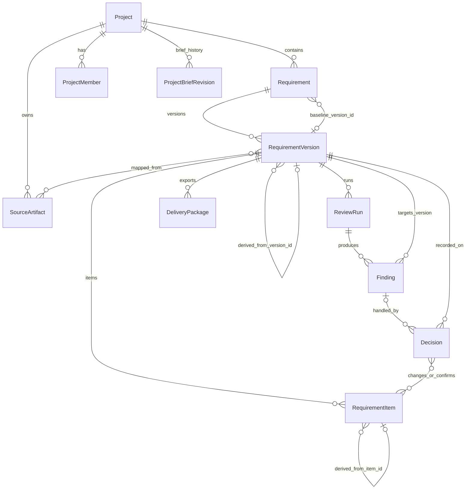
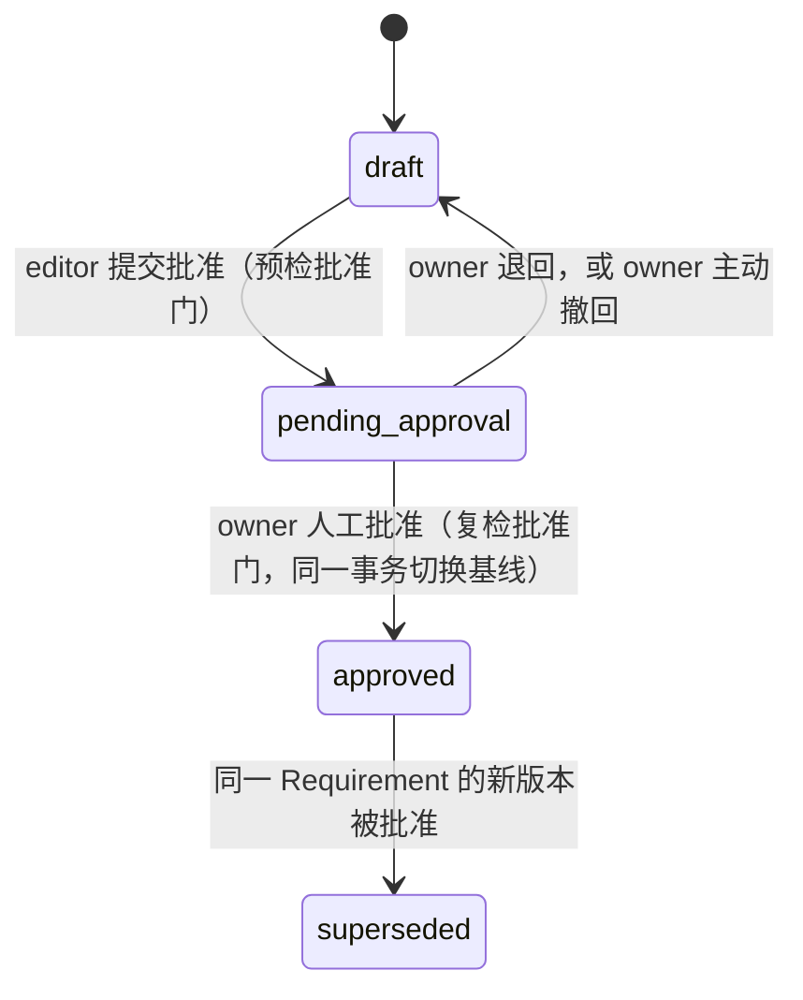

# 需求评审助手产品方向纠正计划

> 本文是产品方向纠正的唯一临时执行计划，不再复制第二份计划。A–D 组全部完成且真源、项目篇与课程骨架已验收后删除，不进入长期文档集。

## 0. 结论

- 技术路线（RAG → Agent → Multi-Agent）与第 1–16 节没有跑偏；本轮 A–D 文档纠偏不改 `source/` 现有代码，后续产品实现仍须按新真源对齐。
- 跑偏的是产品层：`SPEC.md`、两个项目篇、起草基准把产品收窄成 `ReviewRequest → ReviewReport` 一次性运行。
- 性质：中等规模重构。重写产品对象、领域 Schema、17 节之后的产品化路径和第二阶段领域场景；不重写机制。
- 现在正处于"通用 RAG 链 → 产品领域建模"的边界，是修改成本最低的时间点。

## 1. 产品目标（拟写入 SPEC §1）

需求评审助手是以需求基线为核心的需求定义、评审与交付工作台。它接收对需求的结构化输入、已有 PRD 或对已有需求的变更，结合内部业务规则、历史资料和项目内已批准的需求，把输入收敛为结构化、可追溯、经过逐项决策、可批准、可版本化的需求基线，并导出人和 Agent 都能读懂的需求交付包。第一阶段的输入只有固定表单和导入 PRD；接收模糊想法并动态追问是第二阶段能力，SPEC §1 不得把它写成第一阶段输入。

核心不变量（provenance / citation / decision 三分）：

- 每个 RequirementItem 都必须保留来源与形成过程（provenance：用户输入 / 导入 PRD / AI 建议 / 派生自旧版本）。
- 事实性主张及引用外部规则、历史资料或已批准需求的 Finding 必须回到合格 Citation。
- 基于当前需求内部缺失、结构或矛盾的 Finding 必须回到当前 RequirementVersion 的 item / section / document locator，不伪造外部 Citation。
- 用户提出或批准的产品意图由人的输入（`provenance=user_input`）或人的 Decision 提供权威来源，不能伪装成外部 Citation，也不因缺少 Citation 而被拒绝。
- 每个 Finding 都必须有可定位依据，但“可定位依据”不等于“外部 Citation”。依据资格由 `finding_kind` 决定：内部缺口与矛盾靠当前版本 locator；外部事实冲突靠合格 Citation；研发影响推断允许没有 Citation，但必须标为推断并由人做 Decision。
- 评审贯穿全过程：证据不足时拒绝强事实结论并转成用户可回答的问题，不拒绝由人明确做出的产品选择。

第一阶段用固定 RAG 建立闭环；第二阶段在同一对象模型上让 Agent 在用户裁决下推动收敛，并分析变更影响。

## 2. 已锁定的决定

1. 对象主链：Project → Requirement → RequirementVersion → RequirementItem；一个 Project 有多个 Requirement。Requirement 是一个可独立版本化、批准和交付的稳定需求容器，可对应一个功能点或一个可独立交付的需求主题，不与单个 RequirementItem 混用。
2. 基线在 Requirement 粒度（`baseline_version_id`）。全产品基线是明确非目标：不预建对象、表、API 或目录。
3. 两个入口：从零创建（固定表单 + 固定步骤生成，不是对话式 Agent）、导入 PRD；都归一为条目。动态追问循环属于第二阶段。
4. Project Brief 是 Project 上的独立字段集合，不伪装成 Requirement；Project 维护单调递增的 `brief_revision`，ReviewRun 与 DeliveryPackage 都钉住实际使用的修订。第一阶段不建独立 ProjectBriefVersion 产品界面。
5. 导入的 PRD（上传文件或粘贴文本）保存为 SourceArtifact，至少包含文件名或来源标识、格式、内容哈希、版本与 locator 契约；由它映射得到的 RequirementItem 保留 `source_artifact_id`、`source_locator` 与 `mapping_method`。
   导入 PRD 是待定义/评审对象的来源，可支持内部结构和矛盾 Finding 的 locator，不因被导入就自动成为外部 Citation Candidate。
6. Finding 目标：`item | section | document`，优先条目；固定到 `requirement_version_id`；目标成员资格校验属于产品层。Section 第一阶段使用固定规范枚举，项目自定义分区是后续非目标。
7. RequirementItem 保留 `statement_kind`（`product_intent / external_fact / constraint / acceptance_criterion`）、`confirmation_state`（`proposed | confirmed`）和 `citations`（已验证 Citation 列表）。三者的写入路径锁死如下，避免出现"门禁要求某字段、却没有动作能写它"的死锁：
   - **`external_fact` 只能由系统赋予**，来源只有两条：AI 草稿生成时携带并通过第 16/17 节校验的 Citation；或 `accept_suggestion` 把 Finding 的已验证 Citation 写回条目。导入映射器和人的直接输入一律不产生 `external_fact`——导入的条目默认 `product_intent`（按分区可为 `constraint` / `acceptance_criterion`），与外部规则的矛盾交给 `external_fact_conflict` Finding 去发现，不把"PRD 里的一句话"变成必须自带 Citation 的条目。人可以把 `external_fact` 降级为 `product_intent`（同时清空 `citations`），不能反向升级；人编辑 `external_fact` 条目的正文会自动降级并清空 Citation，由下一次评审重新检验。
   - AI 草稿生成出的 `external_fact` 若 Citation 未通过校验，条目保留为 `proposed` 且 `citation_state=unverified`；`confirm_items` 拒绝确认这类条目，用户只能改为 `product_intent` 或删除。
   - **`confirmation_state` 在创建时确定**：人直接写入的条目、从已批准基线派生且正文未改的条目，创建即 `confirmed`；只有 AI 生成和自动导入映射的条目是 `proposed`。不需要的导入条目直接删除（内容变更，递增 `revision`），不另设 `discarded`。
   - 权威来源规则：`external_fact` 靠 `citations`；`product_intent`、`acceptance_criterion` 与作为人的选择的 `constraint`，权威来源是 `provenance=user_input` 或一条人的 Decision（`confirm_items` / `accept_suggestion`）。
   - `confirm_items` 类 Decision 不指向 Finding，可一次指向多个 Item，只改 `confirmation_state`，不写 Citation、不递增 `revision`。
8. Finding 保留 `finding_kind`，第一阶段固定枚举：`internal_gap`（缺失，靶向 section）、`internal_conflict`（当前版本内部矛盾，靶向 item）、`external_fact_conflict`（与外部规则或已批准需求冲突，必须有合格 Citation）、`impact_inference`（Web / Flutter / 服务端影响推断，允许无 Citation，界面必须标为推断）、`evidence_gap`（证据不足转成的补充问题，靶向 item 或 section）。阻断规则：`internal_conflict` 与 `external_fact_conflict` 为阻断；其余为非阻断，但每条都必须有 Decision 才能进入批准门。应用按 `finding_kind` 校验依据资格，不只靠 Prompt。
9. 已批准且作为当前基线的版本以 `approved_requirement` 来源角色进入同一 Project 的检索候选池。项目池的可见性由 ReviewRun 快照中的 `approved_requirement_version_ids` 按版本身份过滤决定，不依赖批准后再去改写旧版本 Chunk 的角色标签：`superseded` 版本因不在集合内而自然离开池子，不需要一次可能失败的"降级重标"步骤；把被替代版本作为历史材料参与检索是第一阶段非目标。当前待评审版本不能把自身伪装成外部证据。派生版本的 ReviewRun 从可见集合中排除本 Requirement 自己的基线——版本间差异由 Diff 负责，不由检索制造“与旧版本冲突”的噪声。`approved_requirement` 用于说明项目内已批准的产品决定，不自动覆盖更高资格的现行业务规则；二者冲突时产生可见 Finding。
10. 已批准版本的索引是批准事务之后的独立步骤：批准事务只写数据库；索引（Chunk、Embedding、写入项目检索池）随后执行，版本上保留 `index_state=pending | indexed | index_failed`，失败真实暴露、可重试、不回滚批准。ReviewRun 的 `approved_requirement_version_ids` 只收 `indexed` 的版本，并在诊断中列出因 `index_failed` 而不可见的已批准需求。项目检索池与全局知识库是两个池子、两个快照身份（`approved_requirement_version_ids` 与 `dataset_version`），互不替代；“发布是产生新 `dataset_version` 的唯一动作”这条规则只约束全局知识库。
11. RBAC：系统级 `admin / member` + 项目级 `owner / editor / viewer`；权限取两层交集，系统 admin 不自动获得项目批准权。批准、导出、成员管理、编辑 Project Brief 只能由人触发；Agent 以发起者的项目角色行动，无独立角色，即使发起者是 owner 也不能代替人触发上述动作。
12. 第一阶段迭代 = 人手动从基线派生新版本；同一 Requirement 同时最多只有一个处于 `draft` 或 `pending_approval` 的版本，没有开放版本时才能派生，避免两个草案先后批准互相替代。一个版本采用乐观修订号 `revision` 检测并发冲突，不建单编辑者锁。`revision` 只随条目与分区内容变化递增（含增删条目、改正文、改 `statement_kind`、改分区归属）；Decision 不递增 `revision`。Agent 变更分析在第二阶段。
13. Decision 的并发与改主意：同一 Finding 同时只有一条活动 Decision，但活动 Decision 可以被替换——旧记录置为 `deactivated` 保留审计，唯一约束只保证"当前活动的那一条"。Decision 可以作用于本版本任何已完成运行的 Finding，条件是 `target_ref` 仍能解析到当前修订的条目、分区或版本（`reject` / `waive` 不依赖目标，始终允许；`accept_suggestion` / `supplement` 要求目标条目仍存在）；目标已被删除的 Finding 只读。这样用户可以在一轮评审后连续接受多条建议（每条递增 `revision`），再跑最后一轮，而不是每接受一条就重跑一次。批准门只统计门禁运行自己的 Finding；新一轮运行产生新的 Finding 对象，界面可按 `(finding_kind, item_key)` 匹配上一轮的 Decision 供一键沿用，但沿用仍是一条新的、由人确认的 Decision，不自动迁移。
14. 旧版本 Finding 不自动迁移成新版本结论；历史 Finding 与 Decision 继续可回查，界面可通过 `item_key` 展示关联历史，新版本必须重新评审。
15. 交付包只能从 `approved` 或 `superseded` 版本导出（后者用于回溯历史交付），按版本生成 Markdown + JSON，包含钉住的项目 Brief 修订、相对上一基线差异、决策、验收条件和证据。草稿只能生成明确标记为“非正式预览”的导出，不产生 DeliveryPackage 记录。与具体下游系统的协作契约不进入本轮调整。
16. 产品名"需求评审助手"与 `review_assistant` 目录名不改。
17. 垂直切口不换：项目 = 电商 App，Requirement = “售后入口”需求主题，v1 由导入现有 Target Requirement fixture 得到；第二阶段的“售后接口 v2 与多端契约一致性”是**同一 Requirement 的新 RequirementVersion**，不是新 Requirement，否则与“不换基线案例”冲突。
18. 正式需求写入使用产品专用能力（`propose_requirement_patch` → Diff → 人工确认 → `apply_requirement_patch`），不是 File Write。File Write 只能向运行级暂存区写附件和中间产物，不能创建 DeliveryPackage；正式交付包只由人触发的导出动作产生。SPEC §6 中 File Write 的职责相应改写，去掉“负责导出”。
19. Requirement 归档/下线是第一阶段非目标，不预建 `archived` 状态。持久英文状态只有四个：`draft / pending_approval / approved / superseded`；“待补充”“评审中”“已交付”都是派生展示状态。
20. Project Brief 不建独立版本界面，但必须持久化 append-only 的 Brief 修订历史（`brief_revision` → 内容快照），否则 ReviewRun 与 DeliveryPackage 钉住的修订无法复现。
21. 唯一预期会触碰的通用代码：`rag_core` 的 Retriever Metadata pre-filter 需要支持按 `document_version` 集合过滤（通用能力，供项目池按 `approved_requirement_version_ids` 过滤），以及 `SourceRole` 枚举增加 `approved_requirement`。二者都是领域无关扩展，不把任何需求对象带进 `rag_core`。本轮文档纠偏不实施，进入第 25 节实现时落地。

## 3. 领域对象模型



稳定身份与来源：

- `Project.brief_revision`：当前 Project Brief 的单调递增修订；每次修订的内容以 append-only 历史持久化，ReviewRun 与 DeliveryPackage 钉住修订号即可复现当时的 Brief。
- `Requirement.baseline_version_id`：当前基线指针。新版本批准、基线指针切换、旧基线进入 `superseded` 与批准审计记录必须在同一数据库事务内完成，任一步失败则全部回滚。索引不在该事务内，见 `index_state`。
- `RequirementVersion.derived_from_version_id`、只随内容变化递增的 `revision`、批准时的 `approved_brief_revision` 与 `approval_review_run_id`、批准后的 `index_state`；已批准版本内容不可修改。
- `RequirementItem.item_id`（当前版本实例）、`item_key`（跨版本稳定业务身份）、`derived_from_item_id`（可选谱系）、`provenance`、`statement_kind`、`confirmation_state`、`citations`（已验证 Citation，只有 `external_fact` 非空）、`citation_state`（`verified | unverified | none`）。写入规则见决定 7。
- Section 使用固定 `section_key`：`problem / target_users / goals / non_goals / scope / business_rules / functional_requirements / constraints / dependencies / acceptance_criteria / other`，因此 `target=section` 可做成员资格校验。
- `SourceArtifact` 保留导入原文的稳定身份、内容哈希和 locator 契约；来自导入文档的 Item 必须能回到原文位置，未映射内容也作为诊断保留。
- `Finding.requirement_version_id` 与 `requirement_version_revision` 必填；`target_kind + target_ref` 必须属于该版本当时修订的条目集合、分区枚举或版本本身。
- `Finding.finding_kind`（枚举与阻断规则见决定 8）决定它由当前需求 locator、外部 Citation 支持，还是允许作为标注的推断；应用必须校验对应资格，不只靠 Prompt 提醒。
- `Decision.decision_type`：`accept_suggestion`（采纳建议并修改条目，把 Finding 的已验证 Citation 写回条目，递增 `revision`）、`reject`（判定 Finding 不成立，内容不变）、`waive`（Finding 成立但接受风险，必须留理由，内容不变，原 Finding 保留）、`supplement`（回答补充问题并新增或修改条目，递增 `revision`）、`confirm_items`（确认 `proposed` 条目，不指向 Finding，不递增 `revision`）。前四类必须指向本版本某次已完成运行的 Finding，且目标仍可解析（见决定 13）；`accept_suggestion` 只在 Finding 携带已验证 Citation 时写回 Citation，否则条目保持原 `statement_kind`；`Decision.state=active | deactivated`，同一 Finding 同时只有一条 `active`，替换时旧记录置 `deactivated`；所有 Decision 记录操作人、时间、理由和零个或多个受影响的 Item，是条目级 Diff 的原因。

## 4. 状态模型

持久状态只治理内容：



每个迁移都由人的显式动作触发，没有任何迁移由 ReviewRun 结果自动驱动。

派生展示状态（不持久化，由查询得出）：

- "评审中" = 该版本存在活跃 ReviewRun。
- "待补充" = 门禁运行（当前 `revision` 上最近一次 `completed` 运行）存在未处理的 `evidence_gap` 或 `internal_gap` Finding。
- "已交付" = 存在成功 DeliveryPackage。
- 界面上用户仍看到"草稿、待补充、评审中、待批准、已批准、已交付、被替代"七个词；后端只持久化四个。

编辑规则：

- `draft` 可写；`pending_approval`、`approved`、`superseded` 拒绝任何内容写入。要修改 `pending_approval` 的版本必须先退回 `draft`。
- 该版本存在活跃 ReviewRun 时拒绝内容写入，必须先取消运行；避免一次评审刚开始就对过期修订失效。
- 每次内容写入携带客户端持有的 `revision`，不匹配则整个请求拒绝，不留部分变更。
- 同一 Requirement 同时最多一个 `draft | pending_approval` 版本；派生新版本的前提是没有开放版本。
- Decision 可作用于本版本任何已完成运行的 Finding，只要目标仍可解析；目标已删除的 Finding 只读。门禁只看门禁运行的 Finding。
- owner 编辑 Brief 不会自动改变任何版本的持久状态，但会让项目内所有匹配旧 `brief_revision` 的 ReviewRun 失去批准资格；处于 `pending_approval` 的版本在界面上显示"评审已过期"，owner 只能退回或在重新评审后批准。

独立状态机：

- ReviewRun：`submitted → retrieving → generating_unverified → validating → completed | failed | cancelled`（沿用起草基准）；`completed` 带 `evidence_decision`；ReviewRun 失败不改变版本状态；一个版本可跑多次。
- 已批准版本索引：`pending → indexed | index_failed`，`index_failed` 可重试；只影响该版本能否作为 `approved_requirement` 被检索，不影响基线身份。
- DeliveryPackage：只接受 `approved` 或 `superseded` 版本，记录需求版本、该版本批准时钉住的 `approved_brief_revision`、`compared_to_version_id`、导出人、时间、格式、内容哈希、成功/失败；一个版本可导出多次。

ReviewRun 证据快照：进入 `retrieving` 时同时钉住 `requirement_version_id + revision`、`brief_revision`、`dataset_version`、本轮可见的 `approved_requirement_version_ids`（只含 `indexed` 版本，排除本 Requirement 自身基线）以及启动时的 `proposed_count_at_start`，全部检索、校验与报告都在该快照内进行。这是运行证据快照，不是产品基线能力。

批准门不变量（提交时预检、批准时复检，两次使用同一规则）：

- 门禁运行 = 当前 `revision` 上最近一次 `completed` 的 ReviewRun，且其 `brief_revision` 匹配当前 Brief。任何条目、分区或 Brief 变更都使旧 ReviewRun 失去批准资格；旧运行与 Finding 不删除，只是不再满足门禁。
- 门禁运行的 `proposed_count_at_start` 为 0。`confirm_items` 不递增 `revision`，若允许"先评审再确认"，旧运行审的就是 `proposed` 时的内容；这条把时序钉死为"先确认、再评审"。
- 任何 Finding 上的 `accept_suggestion` / `supplement` 都会递增 `revision`，使当次 ReviewRun 不能再用于批准。通过批准门时，门禁运行产生的每条 Finding 都有 `active` Decision，且这些 Decision 只能是 `reject` 或 `waive`。因此最后一轮评审必然是"零内容变更"的一轮，循环有限收敛。阻断与非阻断的区别只在严重度展示和 `waive` 时要求的理由强度，不另开一套合法 Decision 列表。
- 没有 `confirmation_state=proposed` 的活动条目。
- 每条 `statement_kind=external_fact` 的活动条目 `citation_state=verified`（按决定 7 的写入规则，这在构造上恒成立，门禁只做一致性断言）。
- owner 批准时将 `approval_review_run_id` 和 `approved_brief_revision` 写入不可变版本。

RBAC 动作矩阵：

| 动作 | viewer | editor | owner | system admin |
| --- | --- | --- | --- | --- |
| 查看项目、需求、版本、Finding、Decision、诊断 | 是 | 是 | 是 | 仅在成为项目成员后 |
| 创建 Requirement、导入 PRD | 否 | 是 | 是 | 按项目角色 |
| 编辑草稿、派生版本、确认 `proposed` 条目 | 否 | 是 | 是 | 按项目角色 |
| 运行评审、取消自己发起的 ReviewRun | 否 | 是 | 是 | 按项目角色 |
| 取消任何 ReviewRun | 否 | 否 | 是 | 按项目角色 |
| 处理 Finding，形成 Decision | 否 | 是 | 是 | 按项目角色 |
| 提交批准（`draft → pending_approval`） | 否 | 是 | 是 | 按项目角色 |
| 退回 / 撤回（`pending_approval → draft`） | 否 | 否 | 是 | 按项目角色 |
| 批准版本 | 否 | 否 | 是，且必须由人触发 | 不因系统 admin 身份自动获得 |
| 编辑 Project Brief | 否 | 否 | 是，且必须由人触发 | 不因系统 admin 身份自动获得 |
| 导出 `approved` / `superseded` 版本 | 否 | 是，且必须由人触发 | 是，且必须由人触发 | 按项目角色 |
| 生成草稿的非正式预览 | 否 | 是 | 是 | 按项目角色 |
| 管理项目成员 | 否 | 否 | 是，且必须由人触发 | 不因系统 admin 身份自动获得 |
| 重试已批准版本索引 | 否 | 是 | 是 | 按项目角色 |
| 管理全局知识资料 | 否 | 否 | 否 | 是 |

系统 member 可创建 Project，创建后成为该项目 owner。编辑 Brief 限 owner，因为它会让全项目所有待批准的评审失去资格。权限判断在后端路由与动作层同时执行，前端隐藏按钮不是授权依据。

## 5. 分层归属

- `rag_core`：Citation Candidate 成员资格、Citation 支持性、证据充分性、Retriever、Context 适配——通用、领域无关。
- `llm_core`：Provider、Prompt 版本、Structured Output、Harness。
- `review_assistant`（产品层）：Project / Brief 修订历史 / Requirement / Version / Item / SourceArtifact / Finding / Decision / Package 的 Schema、migration、状态机与批准门；已批准版本的事务后索引与 `index_state`；结构化需求草稿生成（组合 `llm_core` + `rag_core`，第二个 Prompt 族）；Finding 目标成员资格和按 `finding_kind` 的依据资格校验；导入 PRD 到条目的映射与未映射诊断；RBAC；Review API；SSE；工作台。
- "集合成员检查"是编程技巧，不是共享业务能力；不为它在 `rag_core` 增加通用职责。

现有 `llm_core.schemas.review`、`parse_risk_list`、`build_review_context` 和 `rag_core.generate_trusted_review` 是第 1–16 节已存在的学习实现。本轮文档纠偏不立即迁移代码；进入第 20–21 节产品实现前必须做一次职责对齐：通用 Structured Output / Context / 成员检查机制保留在 package，需求领域 Schema、Prompt 与组合留在产品层。这是实现准入检查，不在长期 SPEC / PLAN 中记录迁移过程。

## 6. 两个阶段的产品形态

第一阶段（固定 RAG）：

- 入口：从零创建（固定表单 → 人写的条目创建即 `confirmed` → 检索 → 固定生成补全草稿，AI 条目标 `proposed` 并保留 provenance，只有携带已校验 Citation 的条目才成为 `external_fact`）；导入 PRD（保存 SourceArtifact，解析并映射到 `section_key`，条目一律 `proposed` 且默认 `product_intent` / 按分区为 `constraint` / `acceptance_criterion`，绝不产生 `external_fact`，保留原文 locator，未映射内容进 `other` 且在诊断中可见）。
- 循环：先处理 `proposed`（`confirm_items` 或删除；含 `proposed` 条目时也允许运行评审作为参考，但该运行 `proposed_count_at_start>0`，不具备批准资格）→ 运行评审 → Finding 挂条目/分区/版本 → 用户逐项 Decision（`accept_suggestion` / `reject` / `waive` / `supplement`，可替换改主意）→ 改了内容就再评审 → 最后一轮评审的所有 Finding 都只剩 `reject` 或 `waive` → editor 提交批准 → owner 人工批准 → 人工触发导出交付包。`reject` 表示 Finding 不成立，`waive` 表示成立但接受风险，二者都不改内容、都保留原 Finding、`waive` 必须留理由。
- 迭代：从基线手动派生新版本，条目级 Diff（按 `item_key` 对齐），评审时不检索本 Requirement 自身基线，批准后原子切换基线，随后异步索引新基线。
- 界面：项目列表 → 需求文档列表 → 需求工作区（左：版本与条目导航；中：分区表单式结构化正文；右：评审面板 + 决策面板；顶：运行评审 / 批准 / 导出；抽屉：诊断）。
- 保留：认证、两层 RBAC、知识管理与 `dataset_version`、SSE 增量流式与最终校验替换、Golden Set、四路对照。

第二阶段（需求 Agent）：

- 从零到一：模糊想法 → Agent 识别缺失信息并追问（Interrupt）→ 内部 RAG + MCP + Search/Browser（必要时 Deep Research）→ 产品 Brief → 草稿以 `propose_requirement_patch` 提出 → Diff 确认 → `apply` → 多角色评审 → 用户裁决 → 批准 → 交付。
- 迭代：选基线 → 输入变更 → Agent 产出条目级差异 → 影响分析（RAG 规则 / File Tool 读 OpenAPI 与客户端模型 / Code Tool 沙箱跑定向测试）→ Diff 确认 → 新版本 → 增量交付包。
- 铁律：Agent 修改正式需求前必须展示 Diff 并等待确认；主界面以需求文档和决策为中心，运行轨迹放可展开详情。
- 与第一阶段对象的衔接：`apply_requirement_patch` 只作用于 `draft` 版本，是一次内容写入（递增 `revision`），人对 Diff 的确认同时记录为一条 Decision，使写入的条目直接成为 `confirmed`；Agent 携带已校验 Citation 的条目走 `external_fact` 路径，其余为 `product_intent`。批准、导出、成员管理仍只能由人触发。

## 7. 课程编号调整（第一阶段）

```text
17  Citation 支持性校验                                    不变
18  证据充分性、Refusal 与补充问题                          机制不变；继续使用结构化 Claim 与 EvidenceDecision，不在第 19 节前提前使用产品 Finding 术语
19  需求对象模型：项目、需求文档、版本、条目与基线          新增 · 概念篇（含 provenance/citation/decision 三分、稳定身份）
20  结构化需求草稿：从固定表单或已有 PRD 到条目            新增 · 机制 + 实验（第二个 Prompt 族、导入映射、provenance；明确不是对话式 Agent）
21  Finding 定位、决策记录与条目级差异                      新增 · 机制 + 实验（把第 18 节的 gap 落成 evidence_gap 等 Finding；目标成员资格校验；Decision 与 item_key 对齐。实验必须覆盖：无 Finding 的 confirm_items、有 Finding 的四类 Decision、替换活动 Decision、accept_suggestion 递增 revision 并写回 Citation、同一轮连续接受多条建议后一次重跑、对目标已删除的 Finding 做 Decision 被拒绝、门禁只统计门禁运行的 Finding）
22  AI Native 界面与不确定性表达                            原 19，改为以需求正文为中心
23  用户身份与认证                                          原 20，不变（Cookie Session）
24  系统角色与项目成员角色：产品 RBAC 与 Tool 权限的区别    原 21，加厚为两层
25  知识资料 API 与资料生命周期                             原 22，加 approved_requirement 来源角色，并说明项目检索池与全局知识库是两个池子、两个快照身份；已批准版本的索引状态在此定义，触发时机在 26
26  需求版本生命周期、人工批准、基线切换与交付语义          新增 · 机制篇（只跟踪“草稿 → 提交 → 批准 → 基线切换 → 事务后索引 → 从不可变版本导出”一条主流；派生状态、批准门、编辑规则在此定义；DeliveryPackage 只讲导出语义，不展开第二套独立生命周期）
27  ReviewRun、Review API 与 SSE 事件契约                   原 23，只跟踪 ReviewRun 一个生命周期；含证据快照
28  需求工作台集成检查点                                    原 24，重写
29–32  Harness / 成本 / Golden Set / 四路对照               原 25–28。对照物是 ReviewRun 的已校验 Finding 与 evidence_decision，不再有 ReviewReport；Target Requirement fixture 经导入成为 RequirementVersion 后作为固定评审对象，检索路线仍是唯一主要变量
33  第一阶段项目篇                                          原 29
```

第二阶段：原 30–103 顺移为 34–107，插入三节，精确位置在重写 `learning-path.md` 时定：

- 需求 Brief 形成与缺失信息追问（Interrupt / HITL 之后）。
- 正式需求写入的 propose / Diff / apply 确认门（Tool 权限与 Interrupt 之后，不依赖 File Write）。
- 变更影响分析：条目差异 × 规则 / 契约 / 客户端 / 测试（Code Tool 检查点之后）。

## 8. 第一阶段验收契约（均为确定性测试，不依赖 LLM Judge）

- 导入 PRD 后条目覆盖与未映射内容可见。
- 导入 Item 能回到 SourceArtifact 的内容哈希与原文 locator，原文改变后不能静默沿用旧映射。
- AI 生成或自动导入映射的条目保留 provenance 和 `proposed` 状态；用户直接提出的产品意图不因无 Citation 被拒，外部事实性条目缺 Citation 时不能伪装成已支持。
- Finding 不能指向当前 `requirement_version_id` 之外的 item / section；内部缺失/矛盾 Finding 能回到 target locator 且不伪造 Citation，外部事实 Finding 必须具备合格 Citation。
- Decision 能追踪到 Finding 与最终条目变化；条目级 Diff 能按 `item_key` 对齐并给出原因。
- 新版本批准前旧基线保持不变；批准时 `baseline_version_id` 原子切换，旧版本进入 `superseded`。
- 任何接口（含第二阶段 Agent）无法绕过人工批准、导出和成员管理门禁；系统 admin 不能仅凭系统角色批准项目需求。
- DeliveryPackage 的 Markdown / JSON 与固定的已批准版本和 `approved_brief_revision` 一致（哈希可验），草稿版本不能导出正式交付包。
- ReviewRun 固定 `requirement_version_id + revision`、`brief_revision`、`dataset_version` 与 `approved_requirement_version_ids`，并在运行记录和报告中可见；内容或 Brief 修改后旧运行不能用于批准。
- 批准门拒绝未处理的阻断 Finding、任何未确认的 `proposed` 条目、缺 Citation 的 `external_fact` 条目、过期需求修订或过期 Brief 修订；提交时预检与批准时复检使用同一规则；批准记录能回到对应 ReviewRun。
- 导入映射与人的直接输入永不产生 `external_fact`；人试图把条目升级为 `external_fact` 被拒绝；人编辑 `external_fact` 正文后条目自动降级为 `product_intent` 且 `citations` 清空。
- AI 草稿的 `external_fact` 条目：Citation 通过校验则 `citation_state=verified`；未通过则 `confirm_items` 拒绝确认，只能改类或删除。
- `accept_suggestion` 把 Finding 的已验证 Citation 写回条目；写回后条目 `citation_state=verified`。
- 人直接写入和从基线原样派生的条目创建即 `confirmed`；AI 生成与导入映射的条目创建即 `proposed`。
- `confirm_items` 类 Decision 不要求 Finding，能一次确认多个导入条目，不递增 `revision`；其余四类 Decision 缺少 Finding 时被拒绝。
- 替换活动 Decision：旧记录变为 `deactivated` 且可查，同一 Finding 任一时刻只有一条 `active`。
- 一轮评审后连续 `accept_suggestion` 多条 Finding：每条递增 `revision`，其余 Finding 仍可处理；目标条目被删除后该 Finding 的 `accept_suggestion` / `supplement` 被拒绝，`reject` / `waive` 仍允许。
- 新一轮运行的 Finding 没有 Decision 即不能通过门禁，即使上一轮同目标同类 Finding 已有 Decision；"沿用"产生新的 Decision 记录。
- 任何 Finding 上的 `accept_suggestion` / `supplement` 都递增 `revision` 并使当前 ReviewRun 失去批准资格；`reject` / `waive` 不递增 `revision`。
- 门禁运行的 `proposed_count_at_start` 必须为 0：先评审再 `confirm_items` 的顺序无法通过批准门。
- 同一 Requirement 存在 `draft | pending_approval` 版本时，派生新版本被拒绝。
- `superseded` 版本的 Chunk 不出现在任何新 ReviewRun 的项目池候选中，无需重标角色。
- `impact_inference` Finding 允许无 Citation，但输出中必须带推断标记，且未处理时阻止提交批准；`external_fact_conflict` 缺 Citation 时被应用拒绝写入，而不是降级为推断。
- 派生版本的 ReviewRun 快照不包含本 Requirement 自身基线；包含同项目其他 Requirement 的 `indexed` 基线；`index_failed` 的基线不在快照内且在诊断中列出。
- 批准事务成功而索引失败时：基线已切换、`index_state=index_failed`、可重试、批准不回滚；重试成功后新 ReviewRun 的快照才包含它。
- `pending_approval` 状态下的内容写入被拒绝；存在活跃 ReviewRun 时的内容写入被拒绝。
- 乐观修订号能拒绝基于旧 `revision` 的覆盖写入，失败不留部分条目变更。
- Brief 修订历史 append-only：任一 ReviewRun 或 DeliveryPackage 钉住的 `brief_revision` 都能取回当时内容。
- 草稿的非正式预览带明确标记且不产生 DeliveryPackage 记录；`superseded` 版本可重新导出并标明已被替代。
- 已有 Golden Set / 四路对照 / 检索指标契约不变，另加需求草稿引用正确性样例。

## 9. 修改文件清单

A 组 · 真源（顺序：strategy → SPEC → PLAN，完成后暂停审查）

- `docs/strategy.md`：唯一主项目定义；第 30 行"当前产品职责仍然是需求评审"改为需求定义、评审与交付；第一阶段交付加需求生命周期与交付包。
- `SPEC.md`：§1 目标重写；§2 用户与两层角色重写，并写入动作矩阵；§3 输入输出重写，加 SourceArtifact 与 Project Brief 修订；新增"核心业务对象、稳定身份、来源与状态"一节（持久/派生状态显式区分）；§4 第一阶段能力重写；§5 加 Brief 追问、变更影响、propose/apply 确认门；§6 File Write 限定为运行级暂存与附件，不创建 DeliveryPackage；§7 垂直场景映射到项目/需求/版本；§9 加 `approved_requirement` 来源、运行证据快照与 provenance/citation/decision 边界；§10 加"批准、导出与成员管理只能由人触发、Agent 以用户身份行动、正式需求写入不是文件写入"；§13 完成标准重写并纳入第 8 节验收契约；全产品基线写入明确非目标。批准门必须绑定最新需求修订、Brief 修订、ReviewRun 和未处理 Finding，任何内容变更都使旧评审失去批准资格。SPEC 还必须写明：持久状态只有四个、三个派生状态的定义；`finding_kind` 枚举与阻断规则；`decision_type` 枚举、`confirm_items` 的无 Finding 路径与活动 Decision 可替换；`statement_kind` / `confirmation_state` / `citations` 三个字段的写入路径（`external_fact` 只由系统赋予）；`revision` 只随内容递增；批准门的统一 Decision 规则与 `proposed_count_at_start`；同一 Requirement 最多一个开放版本；已批准版本索引独立于批准事务及 `index_state`；两个检索池与两个快照身份、按版本身份过滤；派生版本排除自身基线；`pending_approval` 与活跃 ReviewRun 期间拒绝写入；Brief 修订历史 append-only；§1 不把模糊想法写成第一阶段输入；§6 File Write 不负责导出。§8、§11、§12 不动。
- `PLAN.md`：§2 第一阶段顺序加对象模型与状态机、SourceArtifact 与 Brief 修订历史、结构化草稿、Finding 定位与决策、版本生命周期、事务后索引与交付包，并点明 `review_assistant` 的领域模块与 migration 在第 20 节实现时首次落地（早于 API 与认证，由脚本和测试驱动）；§4 `rag_core` 保持领域无关（不加 Finding 校验），只允许两处通用扩展：`SourceRole` 增加 `approved_requirement`，Metadata pre-filter 支持按 `document_version` 集合过滤；§5 产品边界加领域 Schema、migration、RBAC、草稿生成、目标与依据资格校验、`external_fact` 赋予规则、乐观并发控制、索引状态与重试、propose/apply 归属；§8 验证要求补一句：第一阶段固定数据集的对照物是 ReviewRun 的已校验 Finding 与 evidence_decision。

B 组 · 项目篇

- `course/project/stage-1-rag-application/rag-review-assistant.md`：业务场景、Definition of Ready、新增结果链、输入输出契约（替换 `ReviewRequest`/`ReviewReport` 段）、关键设计选择、状态流（三个状态机：版本持久态、ReviewRun、`index_state`，加三个派生状态；DeliveryPackage 是导出记录，不写成第四套生命周期）、分段实现顺序、完成标准、明确不做；检索参数语义、指标契约、实验前登记、质量通过条件不动，但"对照物"改为 ReviewRun 的已校验 Finding 与 evidence_decision。
- `course/project/stage-2-agent-system/agent-review-assistant.md`：业务目标与贯穿场景加两条线，v2 明确为同一 Requirement 的新版本；File Write 产物改为暂存附件，不创建 DeliveryPackage；正式写入改为 propose/apply 并说明与 Decision / `confirmed` 的衔接；"状态与输出契约"沿用对象模型；新增三个检查点；设计选择与 bad case 各加数条。

C 组 · 课程骨架

- `course/learning-path.md`：第一阶段问题句、"完成可信 RAG 与产品交付"单元重写；17 以后重编号与新增条目；1–16 不动。
- `course/knowledge-map.md`：产品域新增对象模型与状态、结构化草稿、Finding 定位与决策、版本生命周期与交付包、已批准需求作为证据来源；改写 Review API、界面、RBAC 三个节点。
- `course/drafting-brief-17-24.md` → 删除，重建为 `course/drafting-brief-17-28.md`。
- `course/README.md`：首句与两阶段交付表。

D 组 · 收尾

- `README.md` 第 5 行产品定义。
- `source/apps/review_assistant/README.md`：产品目标段与能力链。
- `course/mechanisms/trusted-generation.md`：补向后指引（成员资格检查在 17 节扩展为 source_id + 逐字引文；Finding 目标校验为产品层同类技巧）。
- `AGENTS.md`：核对，预计不改。

不动

- 第 1–16 节全部正文、实验、图；`source/packages/`、`source/demos/`、fixtures、migrations；`docs/learning-guide.md`、`docs/ai-coding-mastery.md`、`docs/ai-collaboration.md`、两个 Skill。

## 10. 执行纪律

- 只按 A → 暂停 → B → 暂停 → C → D 推进；A 组完成前不重编号课程。
- 不创建 commit、tag。
- A 组审查前不并行编写依赖新产品真源的正文。若确需提前起草，只允许第 17、18 节使用通用 Claim / EvidenceDecision 术语，不写入未经 A 组审查的产品对象。第 23 节至少等待 A 组确认身份与角色边界，第 25 节等待 `approved_requirement` 真源确认。
- `project_scheme.md` 是唯一临时计划，不复制到 `docs/`。A–D 完成并验收后删除。
- 本轮文档纠偏不改 `source/`。进入第 20–21 节实现前，先执行第 5 节声明的职责对齐检查，不让新产品 Schema 继续下沉到通用 package。

## 11. 已关闭的建模问题

- Project Brief 位于 Project，通过 `brief_revision` 与 append-only 修订历史提供可复现性，不作为特殊 Requirement，不建版本界面。
- 第一阶段使用固定 `section_key`，项目自定义分区不实现。
- 旧 Finding 不自动迁移；新版本重跑评审，历史只供回查。
- 第一阶段使用乐观修订号冲突检测；`revision` 只随内容递增，Decision 由每 Finding 唯一活动 Decision 约束保护。
- Requirement 归档/下线属于非目标，不预建 `archived`。
- 持久状态只有 `draft / pending_approval / approved / superseded`；"待补充""评审中""已交付"为派生状态；所有持久迁移由人的显式动作触发。
- `proposed` 条目通过 `decision_type=confirm_items` 确认，该类 Decision 不指向 Finding。
- `finding_kind` 五类固定枚举；`internal_conflict` 与 `external_fact_conflict` 阻断；`impact_inference` 允许无 Citation 但必须标为推断。
- 已批准版本索引独立于批准事务；`index_failed` 不回滚批准、可重试、不进入 ReviewRun 快照。
- 派生版本的评审排除本 Requirement 自身基线。
- 项目检索池（`approved_requirement_version_ids`）与全局知识库（`dataset_version`）是两个池子，"发布产生 `dataset_version`"只约束后者。
- `pending_approval` 与活跃 ReviewRun 期间拒绝内容写入。
- 编辑 Brief 限 owner；创建 Requirement、提交批准、取消自己的 ReviewRun 归 editor；退回、取消任意 ReviewRun 归 owner。
- `superseded` 版本可重新导出；草稿只能生成非正式预览。
- `external_fact` 只由系统赋予（AI 草稿带已校验 Citation，或 `accept_suggestion` 写回）；导入与人写默认 `product_intent`；人只能降级不能升级；编辑正文自动降级。
- 人写与原样派生的条目创建即 `confirmed`；AI 生成与导入映射为 `proposed`；不要的导入条目删除，不设 `discarded`。
- 活动 Decision 可替换，旧记录 `deactivated`；Decision 可作用于本版本任何已完成运行中目标仍可解析的 Finding，门禁只统计门禁运行；上一轮 Decision 不自动迁移，可由人一键沿用为新记录。
- 批准门统一规则：门禁运行 = 当前 `revision` 上最近一次 `completed` 运行；其 `proposed_count_at_start=0`；其全部 Finding 的活动 Decision 只能是 `reject` / `waive`。
- 同一 Requirement 最多一个 `draft | pending_approval` 版本。
- 项目池按版本身份集合过滤，`superseded` 自然离开，不做角色重标；被替代版本作为历史材料检索是非目标。
- 第二阶段 v2 是同一 Requirement 的新 RequirementVersion。
- File Write 不创建 DeliveryPackage；正式包只由人触发的导出产生。
- 第一阶段输入只有固定表单与导入 PRD；模糊想法是第二阶段输入。
- 唯一预期触碰的通用代码：`SourceRole` 加 `approved_requirement`、Metadata pre-filter 支持 `document_version` 集合过滤。
